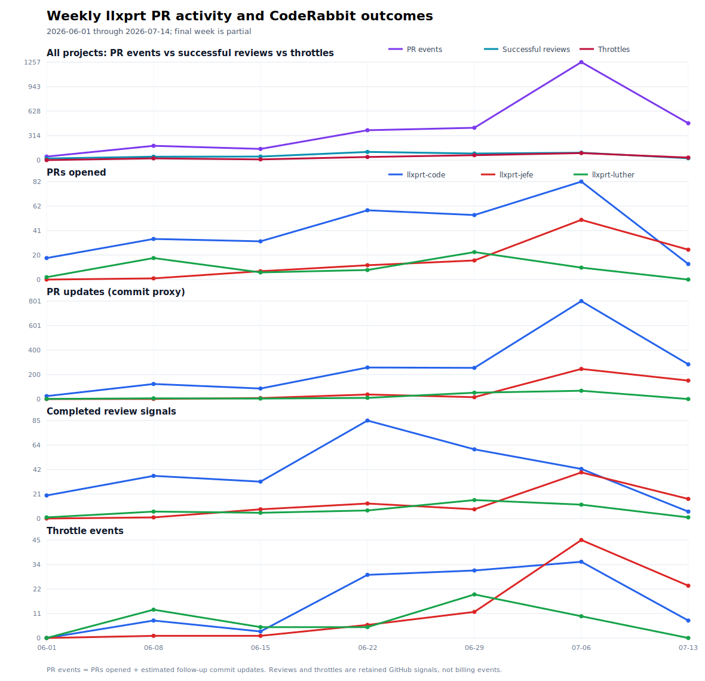

# CodeRabbit throttling and workflow demand across llxprt

**Historical window:** first retained activity (2025-11-12) through 2026-07-14 UTC
**Focus:** `vybestack/llxprt-code`, `vybestack/llxprt-jefe`, `vybestack/llxprt-luther`
**GitHub acquisition:** authenticated `gh` only; external policy verified from official live/archived pages
**Canonical evidence:** [evidence index](evidence-index.md), [methodology](methodology.md), and linked CSVs

## Executive summary

Across the three llxprt repositories, CodeRabbit touched **1,024 PRs**—834 code, 123 Jefe, and 67 Luther—out of **1,166 total PRs** through the cutoff. Those touched PRs carried **7,600 commits** and an estimated **6,576 follow-up commit updates**.[G1][G4]

The union of two independent same-day snapshots contains **256 explicit `Review limit reached` comments on 256 PRs**: 114 code, 89 Jefe, and 53 Luther. There are **zero retained exact `Free tier rate limit reached` strings**. Current-body retrieval alone produces 255 because one code comment lost the heading after the prior capture while Jefe #303 gained a new limit comment; this directly demonstrates that retained comments and current wording are mutable lower bounds, not request-attempt counts.[G2][G8]

**Demand is the strongest empirical explanation.** The first block appeared on 2026-06-09, after activity accelerated and two younger repositories joined the same dominant developer identity. By P4, touched PR creation rates were 76.1/week in code and 60.7/week in Jefe, with 12.89 and 6.52 commits/touched PR. The blocked-comment share of observed outcomes was 48.9% and 55.0%. CodeRabbit’s archived and current policy says automatic incremental reviews and manual reruns share a per-developer allowance; current comments explicitly say limits are per developer “for each organization.”[G4][G6][P4][P6][G8]

**Policy change also matters.** Official archived documentation moved from a simple per-developer refill model (May 2) to explicit adaptive fair-use language by June 13 and numeric seven-day bands by June 24/28. The Pro+ one-review/hour floor tightened from 130+ seven-day reviews in the June 28 archive to 90+ by July 14. This aligns temporally with worsening late-period blocks, but does not isolate causality from the simultaneous activity surge.[P3–P6]

**Repository config helped only briefly and incompletely.** Code added root `.coderabbit.yaml` on July 4 with incremental auto-review disabled. In its 47-hour P3 window, code retained **0 blocked comments**, compared with 49 in P2. But follow-up commits went unreviewed, so July 6 restored incremental review with `auto_pause_after_reviewed_commits: 3`. P4 then saw 43 code blocks amid much higher demand. The discrepancy follow-up found that Luther directly added a materially similar but **nested** `workflow/.coderabbit.yaml` on July 13; its last retained PR had already merged, and git does not prove CodeRabbit ingested that path. Jefe has no verifiable config event. The original code-only causal interpretation therefore remains, but the prior claim that Luther had no YAML was wrong.[G6][G7][G8]

**Plan-upgrade conclusion:** mutable bot bodies identify **Pro** on 22 comments last created June 12 and **Pro Plus** on 233 comments first created June 15. That supports an **operational plan-state transition interval of 2026-06-12 21:07 to 2026-06-15 14:07 UTC**, but not an exact paid upgrade. Alternatives include a trial/OSS entitlement, vendor migration, retroactive body edits, or bot display change. No billing record, explicit announcement, issue, or commit proves a purchase date. Confidence: **medium that displayed plan changed; low that this was a paid subscription upgrade**.[G2][G8][P9]

## Answers to the research questions

1. **When was CodeRabbit first retained in each project?** Code began November 12, 2025; Jefe March 27, 2026; Luther June 5, 2026.[G1]
2. **How much throttling occurred?** 256 union-snapshot exact headings, June 9–July 14; 98 in June and 158 in July. Current-body-only is 255. No PR retains two separate limit comments, but edited comments can fold repeated attempts.[G2]
3. **What changed?** Bot wording evolved from “couldn’t start” to fair-use/adaptive language; official policy gained disclosed adaptive bands; code configured automatic review on July 4 and revised it July 6; Luther committed a nested capped-incremental config on July 13. No equivalent Jefe change is git-verifiable.[G7][G8][P3–P6]
4. **Was there a plan upgrade?** A Pro→Pro Plus displayed-state interval is inferable; an exact subscription upgrade is not.[G2][G8]
5. **What best explains blocks?** High-volume per-developer activity plus adaptive policy is best supported. Config altered exposure but did not remove the shared identity’s organization-level demand.[G4][G6][P4–P7]
6. **Per developer, repository, or organization?** Documented policy is per developer identity inside an organization; plan/seat attaches to a developer; optional credits are organization-shared. Same-author cross-repository clustering supports, but does not prove, shared per-developer accounting.[P6][P8][G2]
7. **How much updating responded to CodeRabbit?** The conservative ledger records 357 high-confidence, 914 medium-confidence, and 97 temporal-only update actions. Only the first category should be described as directly attributed; medium is plausible and temporal-only is not causal evidence.[G5]

## Methods and denominator discipline

Definitions, source weighting, collection boundaries, period construction, and attribution rules are in [methodology.md](methodology.md). Key cautions:

- a comment is not every attempted review;
- a commit is not necessarily one push;
- completed-review signals are grouped immutable inline roots/original SHAs plus explicit completion replies, not vendor billing events;
- block rate denominator is retained `blocks + conservative completion signals`;
- current plan fields can be retroactively edited;
- all human-looking remediation comments are treated as LLM-authored actions per instruction.

## Repository inventory

| Repository | Total PRs | CR-touched PRs | First retained use | Explicit union blocks | root / nested config commits |
|---|---:|---:|---|---:|---:|
| llxprt-code | 974 | 834 | [#559](https://github.com/vybestack/llxprt-code/pull/559), 2025-11-12 | 114 | 3 / 0 |
| llxprt-jefe | 125 | 123 | [#10](https://github.com/vybestack/llxprt-jefe/pull/10), 2026-03-27 | 89 | 0 / 0 |
| llxprt-luther | 67 | 67 | [#27](https://github.com/vybestack/llxprt-luther/pull/27), 2026-06-05 | 53 | 0 / 1 |

The config columns separate conventional root history from the Luther nested path. Full repository metadata is in [repository-inventory.csv](repository-inventory.csv).[G1][G7]

Jefe [#304](https://github.com/vybestack/llxprt-jefe/pull/304), created at 18:38:40 UTC after the original extraction, raised the live PR total from 1,166 to 1,167 but introduced no config path. Outcome ledgers and denominators remain frozen to the internally consistent original snapshot rather than receiving a partial refresh.[G8]

## Historical timeline

| Date | Observation/policy/config | Evidence and interpretation |
|---|---|---|
| 2023-12-22 | Official engineering blog documents per-user hourly OSS throttling, example 3/hour with burst 2 | Historical mechanism; not back-projected numerically to 2026.[P1] |
| 2025-11-05 | Archived pricing advertises Lite/Pro and “unlimited” OSS reviews | Marketing did not disclose fair-use throughput.[P2] |
| 2025-11-12 | First retained VybeStack use, code #559 | Successful walkthrough/review period begins.[G8] |
| 2026-03-27 | First Jefe use | Second active repository enters identity demand.[G1] |
| 2026-05-02 | Official archived table: per developer; Trial 4, OSS 2, Pro 5, Pro+ 10/hour | Closest archived policy before observed blocks.[P3] |
| 2026-06-05 | First Luther use | Third active repository enters demand.[G1] |
| 2026-06-08 | Vendor retired Lite and Pro Legacy; affected customers moved to Pro | Possible plan-side confounder; no proof VybeStack was affected.[P9] |
| 2026-06-09 20:36 | First retained block, code #1979 | P1 begins.[G2] |
| 2026-06-12–15 | Last retained Pro-created comment, then first Pro Plus-created comment | Probable displayed-plan transition interval; not exact billing date.[G2] |
| 2026-06-13 | Archived docs explicitly describe adaptive, per-developer behavior | Policy disclosure follows first block by four days.[P4] |
| 2026-06-24/28 | Numeric adaptive bands disclosed; Pro+ floor at 130+ seven-day reviews | Bot-side policy is now explicit.[P5] |
| 2026-07-04 20:40 | code config disables auto-incremental review | P3 starts; zero code blocks in short window, but review coverage loss.[G7] |
| 2026-07-06 19:33 | code restores incremental review, pauses after 3 reviewed commits | P4 starts.[G7] |
| 2026-07-06 23:18 | issue auto-labeling disabled | No expected review-demand effect.[G7] |
| 2026-07-13 15:31 | Luther directly adds nested `workflow/.coderabbit.yaml` | Incrementals on with pause after 3; issue auto-labeling off. No retained Luther PR followed it; ingestion of the nested path is unproven.[G7][G8] |
| 2026-07-14 | Current Pro+ adaptive floor is 90+ seven-day reviews | Tighter than June 28 archive; 14 cutoff-day blocks.[P6][G2] |
| 2026-07-14 17:37 | Latest retained event, Jefe #303 | Pro Plus, 8-minute wait, adaptive per-developer wording.[G8] |

## Policy history

| Evidence date | Free/trial | OSS | Paid | Scope/semantics |
|---|---|---|---|---|
| 2023-12-22 blog | Free private = summary | example 3 reviews/hour; commit/file limits | less aggressive than OSS | per user; burst 2; hourly |
| 2025-11-05 pricing | 14-day Pro trial | Pro free, “unlimited reviews” | Lite/Pro advertised unlimited PR count | per PR creator/seat; throughput omitted |
| 2026-05-02 docs | Free 3 summary; Trial 4 | 2 | Pro 5; Pro+ 10; Enterprise 12 | per developer, refill bucket |
| 2026-06-13 docs | Free 3 summary | 1–10 | 5/10/12 | each incremental/manual/full run consumes allowance; adaptive sustained/burst behavior |
| 2026-06-28 docs | Free 1 summary | 1–10 | Pro floor 60+; Pro+ floor 130+ weekly | rolling windows, per developer identity in org |
| 2026-07-14 docs | Free 1 summary | 1–10 | Pro floor 60+; Pro+ floor **90+** weekly | 95th-percentile adaptive availability; org-shared overflow credits |

“Unlimited PRs/repositories” is not unlimited instantaneous review throughput. Historical policy evidence before May 2026 is incomplete, so the report does not apply current bands to 2025.[P1–P9]

## Configuration history

| Effective UTC | Repo/path/class | Change | Material review controls | Observed intent |
|---|---|---|---|---|
| 2025-11-21 20:07 | code `.github/workflows/luther.yml`; workflow, not config | [modify](https://github.com/vybestack/llxprt-code/commit/cf3ecbe180077eb308621888a34ec1044edb4fb0) | post `@coderabbit review` after workflow pushes | add manual review demand; three later direct commits refine targeting/token identity |
| 2026-07-04 20:40 | code root `.coderabbit.yaml`; default branch | [add](https://github.com/vybestack/llxprt-code/commit/f78597dd098b8519af34659db080262dacb63e5e) | chill; path exclusions; diagrams off; incrementals off | reduce rate-limit hits |
| 2026-07-06 19:33 | code root `.coderabbit.yaml`; default branch | [modify](https://github.com/vybestack/llxprt-code/commit/6acf50fa7dcb34ddfde8ddcba5437717d7e78e95) | incrementals on; pause after 3 | restore follow-up coverage with cap |
| 2026-07-06 23:18 | code root `.coderabbit.yaml`; default branch | [modify](https://github.com/vybestack/llxprt-code/commit/8833ddcb9c4c359152c3cc1d94c7d72dd6567bc9) | issue labels off | no review-demand effect |
| 2026-07-13 15:31 | Luther nested `workflow/.coderabbit.yaml`; default branch | [add](https://github.com/vybestack/llxprt-luther/commit/259fa5d4919abe33265db93a29f99e18a88088f8) | assertive; incrementals on; pause after 3; Rust instructions; issue labels off | cap follow-ups and prevent workflow labels; vendor ingestion unproven |
| cutoff | Jefe; all advertised refs and complete PR diffs | absent | no git-verifiable repository controls | UI/local-only history remains possible |

**Discrepancy resolution.** The user recollection is proven for code and Luther, but not Jefe. The initial root/default-path query missed Luther because its file is nested. Exhaustive advertised-ref history and all 1,167 current PR file lists found no Jefe config, no config introduced only by an unmerged PR, and no deleted or renamed config in any of the three repos. Code branch precursor commits in merged PRs #2363/#2396/#2400 were squash-merged; Luther was committed directly to `main`. Organization/UI changes, local unpushed files, and force-pushed-away objects cannot be established from repository evidence.

Exact event dates, branch/PR states, paths, and material diffs—including the four code PR precursors and all four workflow events—are in [github-extracts.md](github-extracts.md) and [config-history.csv](config-history.csv).[G7][G8]

## Demand and outcomes

### Lifetime aggregates

| Repo | Touched PRs | Commits | Follow-up update proxy | Completion signals* | Explicit blocks |
|---|---:|---:|---:|---:|---:|
| code | 834 | 6,747 | 5,913 | 284 | 114 |
| Jefe | 123 | 645 | 522 | 127 | 89 |
| Luther | 67 | 208 | 141 | 48 | 53 |
| **Total** | **1,024** | **7,600** | **6,576** | **459** | **256** |

\*Completion extraction is complete for Jefe/Luther and code inline data updated since June (earliest retained code inline row in that collection is May 8). It is conservative and unsuitable as an all-time billing count.[G3][G4]

### Weekly line-chart comparison



The four aligned panels use the same weekly x-axis and separate y-scales so repository trajectories remain visible. The plotted source is [chart-timeseries.csv](chart-timeseries.csv), generated from [pr-activity-by-week.csv](pr-activity-by-week.csv). `PR updates` is a commit-based proxy: commits after the first commit on CodeRabbit-touched PRs. It is not an exact push-event count. The week beginning July 13 contains only two days through the evidence cutoff.

Key comparisons visible in the chart:

- **PR creation:** code led through June; Jefe rose sharply in July and exceeded code in the partial final week.
- **PR updates:** code's update proxy accelerated much more steeply than PR count, especially after incremental review was restored, indicating deeper review/fix/review cycles and larger PR histories.
- **Completed reviews:** review signals increased with demand but did not keep pace with PR updates in the highest-activity weeks.
- **Throttle events:** blocks appeared across all three projects after June 9, rose with aggregate activity, and became especially concentrated in Jefe during July. Luther's early-June launch produced a high block share despite lower absolute PR volume.

The chart supports an interaction between shared per-developer demand and changing vendor policy. It does not identify a causal effect for the plan or repository configuration because activity, policy, and configuration changed together.

### Weekly source table

```text
Week start     code touched/complete/block   Jefe touched/complete/block   Luther touched/complete/block
2026-06-01       18 / 20 /  0                    0 /  0 /  0                   2 /  1 /  0
2026-06-08       34 / 37 /  8                    1 /  1 /  1                  18 /  6 / 13
2026-06-15       32 / 32 /  3                    6 /  8 /  1                   6 /  5 /  5
2026-06-22       58 / 85 / 29                   12 / 13 /  6                   8 /  7 /  5
2026-06-29       54 / 60 / 31                   15 /  8 / 12                  23 / 16 / 20
2026-07-06       82 / 43 / 35                   50 / 40 / 45                  10 / 12 / 10
2026-07-13*      13 /  6 /  8                   25 / 17 / 24                   0 /  1 /  0
```

`*` partial two-day week. Completed signals can exceed newly opened PRs because incremental reviews run on older PRs.[G4]

```text
Explicit blocks by month
2026-06  98 | #################################################
2026-07 158 | ###############################################################################

Peak days
2026-07-12  26 | ##########################
2026-07-13  18 | ##################
2026-06-30  16 | ################
2026-07-01  16 | ################
```

All 26 active dates and every object URL are in [rate-limit-events.csv](rate-limit-events.csv).[G2]

## Segmented period analysis

### llxprt-code

| Period | Touched PR/wk | Commits/PR | Update proxy | Complete | Blocks | Block/observed outcome | High / medium / temporal response updates |
|---|---:|---:|---:|---:|---:|---:|---:|
| P0 pre-limit | 19.0 | 8.27 | 4,134 | 28* | 0 | 0.0% | 18 / 33 / 0 |
| P1 first blocks | 38.8 | 4.71 | 312 | 107 | 22 | 17.1% | 90 / 152 / 10 |
| P2 adaptive/pre-config | 55.4 | 5.47 | 349 | 94 | 49 | 34.3% | 99 / 193 / 17 |
| P3 incrementals off | 50.2 | 5.29 | 60 | 10 | 0 | 0.0% | 11 / 30 / 2 |
| P4 cap 3 | 76.1 | 12.89 | 1,058 | 45 | 43 | 48.9% | 30 / 210 / 55 |

\*P0 completion coverage is incomplete for early code history; blocks are exact union snapshots.[G3][G6]

### llxprt-jefe

| Period | Touched PR/wk | Commits/PR | Update proxy | Complete | Blocks | Block/observed outcome | High / medium / temporal |
|---|---:|---:|---:|---:|---:|---:|---:|
| P0 | 0.5 | 5.57 | 64 | 40 | 0 | 0.0% | 28 / 38 / 0 |
| P1 | 8.3 | 1.94 | 17 | 21 | 7 | 25.0% | 21 / 9 / 0 |
| P2 | 9.2 | 3.62 | 34 | 4 | 12 | 75.0% | 3 / 7 / 1 |
| P3 | 25.1 | 3.14 | 15 | 8 | 4 | 33.3% | 2 / 8 / 0 |
| P4 | 60.7 | 6.52 | 392 | 54 | 66 | 55.0% | 32 / 158 / 1 |

### llxprt-luther

| Period | Touched PR/wk | Commits/PR | Update proxy | Complete | Blocks | Block/observed outcome | High / medium / temporal |
|---|---:|---:|---:|---:|---:|---:|---:|
| P0 | 0.1 | 1.33 | 1 | 1 | 0 | 0.0% | 0 / 1 / 0 |
| P1 | 12.0 | 1.46 | 12 | 13 | 19 | 59.4% | 6 / 6 / 0 |
| P2 | 18.5 | 2.42 | 37 | 19 | 22 | 53.7% | 4 / 15 / 0 |
| P3 | 10.8 | 11.67 | 32 | 5 | 3 | 37.5% | 7 / 15 / 0 |
| P4 | 7.7 | 7.56 | 59 | 10 | 9 | 47.4% | 6 / 39 / 11 |

Short P3 is unstable; zero code blocks cannot be interpreted as a long-run treatment estimate. P4 combines restored incrementals, a major activity surge, and tighter vendor policy.[G6]

## Cross-check against the earlier rate-limit audit

The earlier [`coderabbit/report.md`](../report.md) is preserved unchanged. It reported **255** current-body exact headings: code 114, Jefe 88, Luther 53; message coding was 72 `could_not_start` and 183 `temporary_limit`. Independent later retrieval also found **255 current headings**, but composition had changed to code 113, Jefe 89, Luther 53. The URL union is **256**. Current bodies now code as 3 `could_not_start`, 252 adaptive/fair-use, plus the edited-away code URL preserved from the earlier snapshot. Thus:

- exact `Free tier rate limit reached` strings: 0 in both captures;
- exact `Review limit reached` URLs: 255 per individual snapshot, 256 in the union;
- unique comments = unique affected PRs = 256 in the union;
- retained blocked iterations are **at least** 256, not exactly 256 attempts;
- the 72/183 old wording split and the later 3/252 split are both valid for their retrieval-time bodies, not immutable historical event attributes.

The one-for-one replacement—code #2567 edited away while Jefe #303 appeared—shows why silently overwriting the earlier table would be incorrect.[G2][G8]

## Timing, repeats, and concentration

- Median PR-open-to-retained-limit was **0.1 minutes** (~6 seconds), consistent with automatic review demand at opening; later edits can obscure the actual failed iteration.[G2]
- Median time to the next conservative successful-review signal anywhere in the same repository was **42.95 minutes** (all 256 had a later signal by the data cutoff). This is ecosystem recovery, not same-PR retry latency.[G2][G3]
- 216/256 union events had `updated_at != created_at`; mutability is pervasive.[G2]
- 256 comments map to 256 PRs; retained repeat comments per PR = 0. Repeated attempts folded into one mutable summary remain unobservable.[G2]
- 253/256 affected PRs were authored by `acoliver`; three by `AteebNoOne`. Touched PR concentration was likewise high: code 782/834, Jefe 119/123, Luther 67/67 for `acoliver`.[G1][G2]
- Cross-repository clustering: 25 cross-repo event pairs occurred within 15 minutes; five within 5 minutes, including code #2336 and Luther #102 nine seconds apart. This is compatible with shared per-developer accounting but also with synchronized multi-agent work. It is not proof of an organization-global bucket.[G2]

## Review-response update attribution

| Class | Actions | What it means |
|---|---:|---|
| High confidence | 357 | explicit fixed/addressed reply with commit, or direct CodeRabbit/review commit message |
| Medium confidence | 914 | commit within 24h after a retained finding, no direct causal wording |
| Temporal only | 97 | later commit after finding; weak association only |
| **Total coded actions** | **1,368** | not unique findings or necessarily unique causal changes |

By repository: code 248/618/84; Jefe 86/220/2; Luther 23/76/11 (high/medium/temporal).[G5]

**Inference:** CodeRabbit clearly generated substantial remediation work because 357 actions contain direct textual/commit evidence. The 914 medium actions define an upper plausible pool, not additional proven causation. The matched [OCR–CodeRabbit report](../../comparison/report.md) independently shows that both reviewers produced unique validated fixes in a six-PR exact-head cohort; its quality comparison should not be recreated or conflated with availability metrics here.

## Cases

1. **Plan/message semantics:** [Jefe #303](https://github.com/vybestack/llxprt-jefe/pull/303#issuecomment-4972172300) states Pro Plus, eight-minute wait, adaptive 95th-percentile behavior, per-developer limits “for each organization,” and usage billing.[G8]
2. **Mutable survivorship:** [code #2567](https://github.com/vybestack/llxprt-code/pull/2567#issuecomment-4970341889) contained the heading in the earlier snapshot and lost it later the same day.[G8]
3. **Config tradeoff:** code disabled incrementals, observed no short-window blocks, then restored them because follow-ups were unreviewed.[G7]
4. **Cross-repo clustering:** code #2336 and Luther #102 blocked nine seconds apart; several Jefe/code/Luther pairs cluster within minutes.[G2]
5. **Direct remediation:** commits such as [97a7132](https://github.com/vybestack/llxprt-code/commit/97a71324535061372d844bd817d65117b2ab65da) explicitly say they address CodeRabbit feedback.[G5][G8]

## Demand vs policy vs configuration

### Observations

- Blocks began only after three-repository demand accumulated around one identity.[G1][G2]
- Vendor policy explicitly became adaptive and later disclosed tighter Pro+ bands.[P4–P6]
- Config suppression coincided with a short code-only block hiatus but caused review-coverage loss.[G6][G7]
- Luther added a nested cap-3 config only after its final retained PR; neither ingestion nor an outcome effect can be measured.[G7][G8]
- Jefe blocks rose sharply without a git-verifiable repository config change, tracking its PR/update surge.[G4][G6][G7]

### Inference and weighted judgment

| Candidate explanation | Evidence fit | Confounders | Judgment |
|---|---|---|---|
| User/agent activity surge | high: PR/week, commits/PR, dominant identity, cross-repo clusters | burst timing and commit≠push | **Primary, high confidence** |
| Adaptive policy change | high temporal/documentary fit; Pro+ floor tightened | unknown rollout and exact account state | **Co-primary/modifier, medium-high confidence** |
| Repository config | short code interruption, explicit intent; later nested Luther file | P3 very short; activity changed; no post-config Luther outcome; nested ingestion unknown | **Local modifier, medium confidence for code only** |
| Paid plan upgrade | mutable Pro→Pro Plus display | no billing/announcement; trial/OSS/vendor migration alternatives | **Not established; low confidence as paid upgrade** |

The most defensible model is interaction: high per-developer automated demand consumed a rolling allowance; vendor adaptive policy reduced refill availability at sustained volume; code root config changed how quickly one repository consumed that allowance. The Luther nested config landed too late for an observed outcome, and Jefe had no git-verifiable equivalent. No single factor is independently identified.

## Operational recommendations

1. **Measure immutable review runs.** Persist run ID, PR, triggering identity, requested/reviewed SHA, trigger type, plan display, wait, and outcome outside mutable GitHub summaries.
2. **Use developer-organization accounting.** Aggregate all repositories for each author identity; repository-only dashboards miss the documented scope.
3. **Set `auto_pause_after_reviewed_commits` to 1–2**, matching official guidance, unless evidence shows the review-fix-review loop needs 3. Compare completion coverage and blocks for at least complete rolling weeks.[P7]
4. **Adopt ready-for-review opt-in** for agent-created/WIP PRs; drafts, labels, and title filters should prevent review spend before checks stabilize.[P7]
5. **Batch fixes before reruns.** Automatic, `@review`, and `@full review` all consume allowance.[P4][P6]
6. **Apply equivalent config to Jefe and verify Luther ingestion.** Luther already has materially similar controls at a nested path, but git does not prove the vendor loads that location; code-only confirmed controls cannot bound cross-repo identity demand.
7. **Choose overflow deliberately.** For intentional bursts, usage credits remove interruption at $0.25/file; set spend caps and keep it distinct from included allowance.[P8]
8. **Track coverage as well as blocks.** The July experiment shows that minimizing blocks by disabling reviews can silently lower protection.
9. **Separate reviewer quality from availability.** Continue the exact-head quality methodology in the [comparison report](../../comparison/report.md); do not count blocked runs as zero-quality reviews.

## Confidence and limitations

- **High:** organization inventory, first retained use, exact URLs, reachable config commits/diffs, union of observed headings, and frozen-snapshot PR/commit totals.[G1][G2][G4][G7] Config-file existence is high confidence; Luther nested-path ingestion and irrecoverable Jefe UI/local/force-push history are not established.
- **High for current policy; medium historically:** archived May/June official pages directly document policy changes, but captures are discrete.[P3–P6]
- **Medium:** conservative completion groups and timing; code inline collection does not cover every early immutable finding.[G3]
- **Medium:** activity/policy interaction explains throttling; changes are simultaneous and nonrandom.[G6]
- **Low:** exact subscription-upgrade date or whether Pro Plus was paid, trial, OSS entitlement, or vendor migration.

Principal gaps: no billing/account audit log; no historical organization UI configuration; no immutable webhook/run log; current comment bodies only; force-push and exact push events unavailable; GitHub Search indexing can lag; completion grouping is not CodeRabbit billing semantics; P3 is only 47 hours; identity concentration and multi-worktree/agent behavior confound repository comparisons.

## Source references

- **[G1]** [repository-inventory.csv](repository-inventory.csv)
- **[G2]** [rate-limit-events.csv](rate-limit-events.csv)
- **[G3]** [review-events.csv](review-events.csv)
- **[G4]** [pr-activity-by-week.csv](pr-activity-by-week.csv), [chart-timeseries.csv](chart-timeseries.csv), and [activity-over-time.svg](activity-over-time.svg)
- **[G5]** [review-response-updates.csv](review-response-updates.csv)
- **[G6]** [period-summary.csv](period-summary.csv)
- **[G7]** [config-history.csv](config-history.csv)
- **[G8]** [github-extracts.md](github-extracts.md)
- **[P1–P9]** [policy-extracts.md](policy-extracts.md) and [policy-timeline.csv](policy-timeline.csv)
- **Methods:** [methodology.md](methodology.md)
- **Reproduction:** [commands.md](commands.md)
