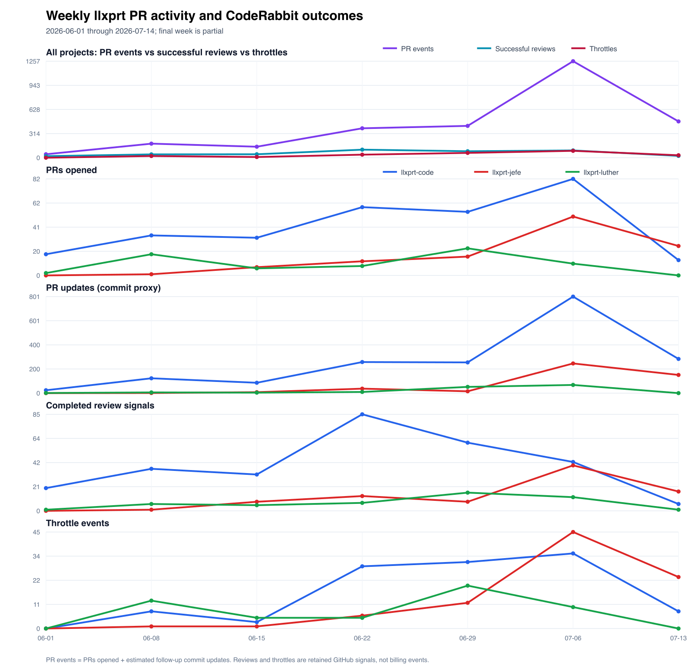
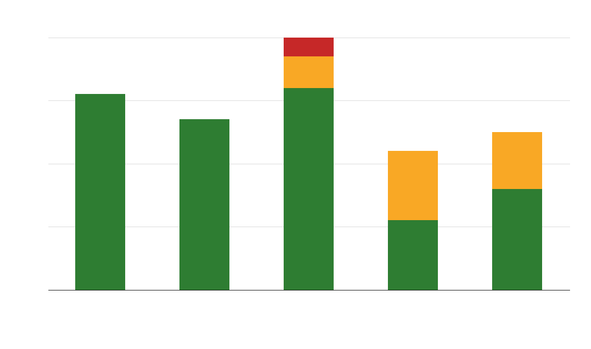
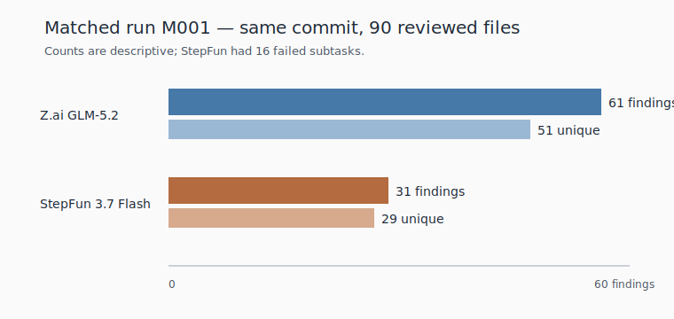

<!--
  Compiled Anthology: AI Code Review Research Reports
  Compiled 2026-07-14.
  Contains the full substantive text of seven canonical reports.
  Image and relative paths rewritten to resolve from research/reviews/compiled-reports.md.
  Do not edit source reports. This file is the compilation only.
-->

<div align="center">

# AI Code Review at VybeStack

## Compiled Research Anthology

**CodeRabbit · OpenCodeReview · Matched Comparison · Throttling · Reliability · Provider Quality · Duplicates**

</div>

<br/>

**Repositories:** `vybestack/llxprt-code` · `vybestack/llxprt-jefe` · `vybestack/llxprt-luther`
**Evidence window:** 2025-11-12 through 2026-07-14
**Compilation date:** 2026-07-14

---

<!-- pandoc: TOC marker -->
\tableofcontents

---

## Contents

1. [Selective exact-head matched comparison: Alibaba OCR and CodeRabbit](#1-selective-exact-head-matched-comparison)
   - *Original path:* `comparison/report.md`
2. [CodeRabbit PR-review retrospective](#2-coderabbit-pr-review-retrospective)
   - *Original path:* `coderabbit/report.md`
3. [CodeRabbit throttling and workflow demand across llxprt](#3-coderabbit-throttling-and-workflow-demand)
   - *Original path:* `coderabbit/throttling/report.md`
4. [Alibaba OpenCodeReview retrospective: PR and local review evidence](#4-alibaba-opencodereview-retrospective)
   - *Original path:* `ocr/report.md`
5. [OpenCodeReview operational reliability and provider transitions](#5-opencodereview-operational-reliability)
   - *Original path:* `ocr/reliability/report.md`
6. [OCR provider-period finding quality](#6-ocr-provider-period-finding-quality)
   - *Original path:* `ocr/provider-quality/report.md`
7. [OCR duplicate mechanisms and mitigations](#7-ocr-duplicate-mechanisms-and-mitigations)
   - *Original path:* `ocr/duplicates/report.md`

---

\newpage

---

## 1. Selective exact-head matched comparison: Alibaba OCR and CodeRabbit

> **Original path:** `research/reviews/comparison/report.md`
> **Repositories:** `vybestack/llxprt-code`, `vybestack/llxprt-jefe`, `vybestack/llxprt-luther`
> **GitHub evidence retrieved:** 2026-07-14 with authenticated `gh` only
> **Canonical sources:** [matched PRs](comparison/sources/matched-prs.csv), [classified findings](comparison/sources/matched-findings.csv), [semantic overlaps](comparison/sources/semantic-overlap.csv), [excluded iterations](comparison/sources/excluded-review-iterations.csv)

### Executive summary

This analysis corrects the earlier reports' principal comparison weakness: **OCR and CodeRabbit are compared on the same six pull requests, two per repository, and on the same reviewed head SHA in every pair**. No near-head or PR-only pair is pooled into the results.[S1]

The six selected exact-head iterations emitted **85 raw OCR findings and 32 raw CodeRabbit findings**. After within-review semantic deduplication, that was **74 OCR and 31 CodeRabbit normalized findings**. OCR's selected iterations therefore emitted 2.39 times as many normalized findings, but also had a higher duplicate rate: **11/85 (12.9%) versus 1/32 (3.1%)**.[S1]

A transparent selective classification took up to six normalized findings per reviewer per PR, retaining all findings where fewer existed. This produced **56 classified findings: OCR 33 and CodeRabbit 23**. Ten cross-review semantic overlap groups were found in that sample: **8 exact and 2 semantic**. Relative to the 46-finding semantic union, overlap was **10/46 (21.7%)**; OCR had **23/33 (69.7%)** sample findings outside an overlap group and CodeRabbit had **13/23 (56.5%)**.[S2][S3]

The adjudicated subsets were strikingly similar, not evidence of one reviewer dominating:

- OCR: 11 valid, 2 partial, 3 invalid, 17 unadjudicated. Among adjudicated rows, valid-or-partial was **13/16 (81.3%)**.
- CodeRabbit: 8 valid, 2 partial, 2 invalid, 11 unadjudicated. Among adjudicated rows, valid-or-partial was **10/12 (83.3%)**.

Those are **paired descriptive observations from a selective sample**, not population precision estimates and not a causal model comparison. The raw difference in finding volume cannot establish reviewer superiority because prompts, models, review timing, reruns, PR size, file selection, and action visibility differ. Half the classified rows were unadjudicated (**28/56, 50.0%**).[S2]

**Decision conclusion:** use the reviewers as complementary hypothesis generators, preserve technical adjudication, and deduplicate across them. On exact same-head inputs they frequently converged on the same material invariant, but each also produced useful unique findings. Neither existing report should retain wording that readers could interpret as a head-to-head superiority claim.

### Research question

On the same PRs and, where possible, the same head SHA, how did Alibaba OpenCodeReview (OCR) and CodeRabbit differ in finding volume, duplication, semantic overlap, validity, action, and usefulness?

### Methodology

#### Cohort selection

1. Candidate PRs were inspected through GitHub's API with `gh` only.
2. OCR was identified by `github-actions[bot]` inline comments carrying repository markers such as `llxprt-code-ocr-inline`, `jefe-ocr-inline`, or `luther-ocr-inline`, plus the corresponding OpenCodeReview summary.
3. CodeRabbit was identified only as `coderabbitai[bot]`.
4. A PR was eligible only when both reviewers had completed substantive root inline findings.
5. The original reviewed SHA came from each review comment's `original_commit_id`, not the mutable current `commit_id`.
6. The chosen iteration minimized timing distance while requiring an exact reviewed-head match. All six pairs are therefore `exact-head`; no unlike match-quality strata are pooled.[S1][S5]
7. Explicit `Review limit reached` iterations were excluded, while completed inline reviews on those PRs were retained. Mutable `Review skipped` and `Reviews paused` summary states were also logged as noncompleted states but did not erase an already completed exact-head review.[S4]

#### Finding extraction and normalization

- **Raw finding:** a root inline comment in the selected exact-head iteration.
- **Normalized finding:** a semantic issue unit after collapsing repeated or semantically equivalent comments within one reviewer iteration. Examples include three repeated registry-cleanup comments in code #2547, repeated line-index boilerplate in Jefe #181, and duplicate missing-resume reports in Luther #110.
- **Classified sample:** up to six normalized findings per reviewer per PR, retaining all when fewer than six existed. Selection prioritized traceability, overlap detection, substantive breadth, and disconfirming cases. This cap prevents the very large OCR batches from dominating classification labor, but it also means validity/usefulness percentages describe the selected rows only—not all 105 normalized emitted findings.[S1][S2]
- **Overlap:** `exact` when both comments state the same defect/invariant; `semantic` when the factual core is shared but scope or proposed remedy differs.[S3]
- **Validity:** `valid`, `partial`, `invalid`, or `unadjudicated`. Missing linked disposition remains unknown.
- **Action:** `fixed`, `dismissed`, `deferred`, or `no-action`.
- **Action quality:** `appropriate` only when the linked response matches the classified validity and scope; otherwise `unverifiable` where no disposition exists.
- **Usefulness:** high for material correctness/security/concurrency/test protection, medium for worthwhile robustness or maintainability, and low for cosmetic, speculative, duplicate, or marginal feedback.
- Per instruction, comments posted under human-looking identities are treated as **LLM-authored actions**, not personal human adjudications.

#### Source quality and weighting

| Evidence | Authority | Directness | Rigor | Relevance | Weight |
|---|---:|---:|---:|---:|---|
| GitHub root comments, replies, PR metadata via `gh` | 5/5 | 5/5 | 4/5 | 5/5 | Primary |
| `original_commit_id` and timestamps | 5/5 | 5/5 | 5/5 | 5/5 | Controls matching |
| Explicit fix/dismiss/withdraw replies | 5/5 | 5/5 | 4/5 | 5/5 | Controls disposition |
| Analyst normalization and usefulness coding | 2/5 | 4/5 | 3/5 | 5/5 | Transparent derived layer |

The primary GitHub record controls factual observations. Analyst coding cannot convert an unanswered finding into a success or failure.

### Cohort inventory

| ID | Repository PR | State | Selected SHA | Quality | OCR time | CR time | Gap | PR size (add/del/files) | Raw OCR/CR | Normalized OCR/CR |
|---|---|---|---|---|---|---|---:|---:|---:|---:|
| P01 | code [#2462](https://github.com/vybestack/llxprt-code/pull/2462) | merged | `66b27be6` | exact-head | 14:45:57Z | 14:50:38Z | 281s | 731/131/15 | 4/1 | 4/1 |
| P02 | code [#2547](https://github.com/vybestack/llxprt-code/pull/2547) | open at retrieval | `4a50e2b7` | exact-head | 07:32:59Z | 07:36:52Z | 233s | 11063/1050/100 | 21/1 | 17/1 |
| P03 | Jefe [#181](https://github.com/vybestack/llxprt-jefe/pull/181) | merged | `f2409b7f` | exact-head | 19:52:02Z | 20:02:40Z | 638s | 2174/376/25 | 22/8 | 18/8 |
| P04 | Jefe [#288](https://github.com/vybestack/llxprt-jefe/pull/288) | merged | `4e4a43c0` | exact-head | 01:25:24Z | 01:32:14Z | 410s | 878/85/19 | 5/7 | 5/7 |
| P05 | Luther [#110](https://github.com/vybestack/llxprt-luther/pull/110) | merged | `af9922e6` | exact-head | 18:58:40Z | 16:36:12Z | 8548s | 8434/709/69 | 23/12 | 21/11 |
| P06 | Luther [#133](https://github.com/vybestack/llxprt-luther/pull/133) | merged | `2b7d7576` | exact-head | 07:30:23Z | 07:30:50Z | 27s | 6255/1109/20 | 10/3 | 9/3 |

The size columns are retrieval-time PR totals, not necessarily the exact selected-head diff. This is a confounder, not a covariate-adjusted model.[S1]

### Results

#### Full selected-iteration volume and duplication

```text
Normalized findings emitted (selected exact-head iterations)
OCR         74 | ##########################################################################
CodeRabbit  31 | ###############################

Duplicate source comments removed
OCR         11/85 | ########### 12.9%
CodeRabbit   1/32 | #            3.1%
```

The six within-PR normalized count differences (`OCR - CodeRabbit`) were `+3, +16, +10, -2, +10, +6`; mean `+7.17`, median `+8`. This is a **yield description**, not evidence that more findings were more correct or more useful. P02 and P05 were much larger PRs; OCR and CodeRabbit also used different review systems and likely different prompts/models.[S1]

#### Classified-sample overlap

| Measure | Raw n | Percentage |
|---|---:|---:|
| Exact overlap groups | 8/10 | 80.0% of overlap groups |
| Semantic overlap groups | 2/10 | 20.0% of overlap groups |
| Semantic union | 46 | `33 + 23 - 10` |
| Overlap / union | 10/46 | 21.7% |
| OCR rows in overlap | 10/33 | 30.3% |
| CodeRabbit rows in overlap | 10/23 | 43.5% |
| OCR-only sample rows | 23/33 | 69.7% |
| CodeRabbit-only sample rows | 13/23 | 56.5% |

```text
Classified semantic union (n=46)
Shared groups       10 | ########## 21.7%
OCR-only units      23 | ####################### 50.0%
CodeRabbit-only     13 | ############# 28.3%
```

Because the classified rows were selected rather than randomly sampled, these overlap percentages must not be generalized to all findings.[S2][S3]

#### Validity

| Reviewer | Valid | Partial | Invalid | Unadjudicated | Adjudicated valid-or-partial |
|---|---:|---:|---:|---:|---:|
| OCR | 11/33 (33.3%) | 2/33 (6.1%) | 3/33 (9.1%) | 17/33 (51.5%) | 13/16 (81.3%) |
| CodeRabbit | 8/23 (34.8%) | 2/23 (8.7%) | 2/23 (8.7%) | 11/23 (47.8%) | 10/12 (83.3%) |

```text
OCR (n=33)          CR (n=23)
valid        11     valid         8
partial       2     partial       2
invalid       3     invalid       2
unknown      17     unknown      11
```

The 81.3% and 83.3% values differ by one adjudicated finding and are selection-sensitive. They are not estimates of reviewer precision. If `partial` is excluded from the numerator, strict valid shares are OCR **11/16 (68.8%)** and CodeRabbit **8/12 (66.7%)**.[S2]

#### Usefulness

| Reviewer | High | Medium | Low |
|---|---:|---:|---:|
| OCR | 14/33 (42.4%) | 9/33 (27.3%) | 10/33 (30.3%) |
| CodeRabbit | 8/23 (34.8%) | 7/23 (30.4%) | 8/23 (34.8%) |

```text
High usefulness
OCR         14/33 | ############## 42.4%
CodeRabbit   8/23 | ########       34.8%

Low usefulness
OCR         10/33 | ##########     30.3%
CodeRabbit   8/23 | ########       34.8%
```

Usefulness is analyst-coded even when validity is unknown. Therefore a high/unadjudicated row means "potentially material if correct," not "confirmed material defect."[S2]

#### Actions and action quality

| Reviewer | Fixed | Dismissed | Deferred | No action | Appropriate | Unverifiable |
|---|---:|---:|---:|---:|---:|---:|
| OCR | 12/33 (36.4%) | 4/33 (12.1%) | 0/33 (0%) | 17/33 (51.5%) | 16/33 (48.5%) | 17/33 (51.5%) |
| CodeRabbit | 8/23 (34.8%) | 4/23 (17.4%) | 0/23 (0%) | 11/23 (47.8%) | 12/23 (52.2%) | 11/23 (47.8%) |

All 28 rows with observable dispositions had action quality coded appropriate. This reflects the selected traceable actions and cannot be generalized to every LLM-authored response.[S2]

### Per-PR paired tables

#### P01 — code #2462

| Metric | OCR | CodeRabbit |
|---|---:|---:|
| Raw / normalized / classified | 4 / 4 / 4 | 1 / 1 / 1 |
| Exact / semantic overlap rows | 0 / 0 | 0 / 0 |
| Reviewer-only classified rows | 4 | 1 |
| Valid / partial / invalid / unknown | 3 / 1 / 0 / 0 | 1 / 0 / 0 / 0 |
| High / medium / low | 2 / 2 / 0 | 0 / 1 / 0 |
| Fixed / dismissed / deferred / no-action | 4 / 0 / 0 / 0 | 1 / 0 / 0 / 0 |
| Duplicate rate | 0/4 (0%) | 0/1 (0%) |

**Material unique defects:** both. OCR found OAuth guard contamination and wrong URL selection; CodeRabbit uniquely identified unsafe copy-paste `trust: true` documentation. All were fixed in the same disposition summary.[E1]

#### P02 — code #2547

| Metric | OCR | CodeRabbit |
|---|---:|---:|
| Raw / normalized / classified | 21 / 17 / 6 | 1 / 1 / 1 |
| Exact / semantic overlap rows | 0 / 1 | 0 / 1 |
| Reviewer-only classified rows | 5 | 0 |
| Valid / partial / invalid / unknown | 4 / 0 / 2 / 0 | 0 / 1 / 0 / 0 |
| High / medium / low | 1 / 3 / 2 | 0 / 0 / 1 |
| Fixed / dismissed / deferred / no-action | 4 / 2 / 0 / 0 | 0 / 1 / 0 / 0 |
| Duplicate rate | 4/21 (19.0%) | 0/1 (0%) |

**Material unique defects:** OCR had several unique validated fixes, but the only high-usefulness row overlapped CodeRabbit's broader test-cleanup concern. The CodeRabbit finding was partially grounded but withdrawn after the stronger black-box cleanup assertion; this is not a CodeRabbit-only defect.[E2]

#### P03 — Jefe #181

| Metric | OCR | CodeRabbit |
|---|---:|---:|
| Raw / normalized / classified | 22 / 18 / 6 | 8 / 8 / 6 |
| Exact / semantic overlap rows | 3 / 1 | 3 / 1 |
| Reviewer-only classified rows | 2 | 2 |
| Valid / partial / invalid / unknown | 0 / 0 / 0 / 6 | 0 / 0 / 0 / 6 |
| High / medium / low | 3 / 1 / 2 | 1 / 3 / 2 |
| Fixed / dismissed / deferred / no-action | 0 / 0 / 0 / 6 | 0 / 0 / 0 / 6 |
| Duplicate rate | 4/22 (18.2%) | 0/8 (0%) |

**Material unique defects:** not adjudicable. Both raised unique potentially material UI/PTY concerns, but the selected final-head comments have no linked disposition. No superiority claim is permitted.[E3]

#### P04 — Jefe #288

| Metric | OCR | CodeRabbit |
|---|---:|---:|
| Raw / normalized / classified | 5 / 5 / 5 | 7 / 7 / 6 |
| Exact / semantic overlap rows | 2 / 0 | 2 / 0 |
| Reviewer-only classified rows | 3 | 4 |
| Valid / partial / invalid / unknown | 0 / 1 / 1 / 3 | 1 / 1 / 2 / 2 |
| High / medium / low | 1 / 0 / 4 | 1 / 2 / 3 |
| Fixed / dismissed / deferred / no-action | 0 / 2 / 0 / 3 | 1 / 3 / 0 / 2 |
| Duplicate rate | 0/5 (0%) | 0/7 (0%) |

**Material unique defects:** CodeRabbit uniquely produced one validated medium-usefulness case-insensitive metadata-directory fix. Both found the potentially critical sibling-parent `NotFound` defect, and both proposed the same rejected process-batching optimization. Each reviewer also produced a technically rejected filesystem recommendation.[E4][E5]

#### P05 — Luther #110

| Metric | OCR | CodeRabbit |
|---|---:|---:|
| Raw / normalized / classified | 23 / 21 / 6 | 12 / 11 / 6 |
| Exact / semantic overlap rows | 3 / 0 | 3 / 0 |
| Reviewer-only classified rows | 3 | 3 |
| Valid / partial / invalid / unknown | 4 / 0 / 0 / 2 | 6 / 0 / 0 / 0 |
| High / medium / low | 5 / 1 / 0 | 5 / 1 / 0 |
| Fixed / dismissed / deferred / no-action | 4 / 0 / 0 / 2 | 6 / 0 / 0 / 0 |
| Duplicate rate | 2/23 (8.7%) | 1/12 (8.3%) |

**Material unique defects:** yes. CodeRabbit uniquely found and drove fixes for sub-issue pagination and API fallback. OCR uniquely raised high-impact capacity and auto-merge concerns, but those selected threads were unadjudicated, so they remain potential rather than confirmed misses. The reviewers independently converged on active-parent label semantics, missing resume metadata, and SQLite contention.[E6]

#### P06 — Luther #133

| Metric | OCR | CodeRabbit |
|---|---:|---:|
| Raw / normalized / classified | 10 / 9 / 6 | 3 / 3 / 3 |
| Exact / semantic overlap rows | 0 / 0 | 0 / 0 |
| Reviewer-only classified rows | 6 | 3 |
| Valid / partial / invalid / unknown | 0 / 0 / 0 / 6 | 0 / 0 / 0 / 3 |
| High / medium / low | 2 / 2 / 2 | 1 / 0 / 2 |
| Fixed / dismissed / deferred / no-action | 0 / 0 / 0 / 6 | 0 / 0 / 0 / 3 |
| Duplicate rate | 1/10 (10.0%) | 0/3 (0%) |

**Material unique defects:** not adjudicable. OCR raised warning aggregation and concurrency-classification risks; CodeRabbit raised process-global test environment locking. No selected-head row has a linked disposition.[E7]

### Representative overlaps

1. **Listener cleanup test — semantic overlap.** OCR said post-unmount state did not prove the listener was removed; CodeRabbit listed several private listener-removal assertions. The LLM-authored response implemented an exact listener-count test. CodeRabbit agreed this black-box assertion was stronger and withdrew the extra choreography requests.[G01]
2. **Jefe selection line indices — exact overlap.** Both flagged repeated inline post-increment blocks as fragile. No selected-head action was observed.[G02]
3. **Sibling parent removal — exact overlap.** Both traced `NotFound` when a second untracked sibling revisits an already removed parent.[G06]
4. **SQLite contention — exact overlap.** Both identified the missing poller `busy_timeout`; linked replies validate and fix it.[G10]
5. **Per-path restore optimization — exact overlap and shared dismissal.** Both proposed batching `git restore`; the LLM-authored response retained per-path execution for argv safety and exact path handling, and CodeRabbit explicitly withdrew.[G07]

### Representative unique cases

#### OCR-only in the classified sample

- OAuth dedup guard cross-contamination and signal-anchored URL selection in code #2462; both fixed.[O001][O002]
- Trust working-directory normalization mismatch in code #2547; fixed.[O010]
- Theme-picker mouse forwarding and selected merge-method highlight in Jefe #181; potentially material but unadjudicated.[O015][O016]
- Fatal transition unreachable in Luther #110; validated and fixed.[O027]
- Multiple artifact warnings collapsed to one in Luther #133; potentially material but unadjudicated.[O028]

#### CodeRabbit-only in the classified sample

- Canonical MCP docs enabled `trust: true`; fixed with examples and a security caveat.[C001]
- Case-sensitive owned metadata-directory check on a case-insensitive host; fixed.[C011]
- Sub-issue pagination and native-API fallback in Luther #110; both fixed and verified.[C018][C019]
- Hardcoded squash merge method; fixed by selecting an allowed method.[C020]
- Cross-module process-global environment lock in Luther #133; potentially material but unadjudicated.[C022]

### Interpretation

#### Observations

- Exact-head matching was achievable for all six PRs.[S1]
- OCR emitted more findings in five of six selected pairs, but also more duplicates.[S1]
- Cross-review overlap was real but limited in the selective sample: 10 shared semantic groups versus 36 reviewer-only union units.[S3]
- The two reviewers had nearly identical adjudicated valid-or-partial shares in this sample, with large unknown fractions.[S2]
- Both reviewers generated valuable unique fixes and technically rejected suggestions.[S2][E1-E7]

#### Inferences

- **Complementarity is better supported than superiority.** Low overlap plus unique validated fixes on both sides supports using both when review cost permits.
- **A deduplication layer has high leverage.** Exact repeated findings appeared within OCR reruns and across reviewers.
- **Volume is not precision.** OCR's larger batches increased coverage opportunities and duplicate/noise exposure simultaneously.
- **Technical challenge is safety-critical.** The Jefe #288 Windows suggestion shows that plausible automated remediation can be unsafe; the correct workflow is verify, fix, defer, or reject with evidence.

#### What this study does not establish

It does not estimate causal reviewer quality. The following remain confounders:

- exact prompt, rules, model, provider, temperature, and tool access;
- review timing and which reviewer ran first;
- mutable summaries and repeated reruns;
- PR size and exact selected-head diff size;
- file-selection and context-window policies;
- differing severity and comment-emission thresholds;
- response-selection bias in which comments received a disposition;
- selective classification rather than a probability sample.

### Recommendations

1. Retain both reviewers only with cross-review semantic deduplication keyed by head SHA, path/symbol, and normalized invariant.
2. Show immutable run manifests with reviewer, exact head/base, prompt/rules/model hashes, selected files, finding IDs, and failures.
3. Track three metrics separately: availability/blocked iterations, normalized finding yield, and adjudicated validity/usefulness.
4. Never treat unadjudicated findings as valid, invalid, or material misses.
5. Prioritize shared high-impact findings first; independent convergence is a useful triage signal, not proof.
6. Require runtime/source verification for filesystem, platform, destructive-operation, and security recommendations.
7. Prefer delta-oriented reruns and suppress unchanged normalized claims to reduce OCR's observed duplicate accumulation.
8. For a future causal comparison, randomize reviewer order, hold prompt/model/context constant where possible, classify all findings blind to reviewer, and use an independent adjudicator.

### Required revisions to the existing reports

#### OCR report

**Revision required:** yes. Its 75.0% fully-valid and 91.7% fixed headline came from a response-rich OCR-only sample and must not be read as evidence that OCR is better than CodeRabbit.

**Exact replacement/addendum:**

> **Matched-cohort addendum (2026-07-14):** In a selective exact-head cohort of six same PRs, OCR emitted 74 normalized findings versus CodeRabbit's 31 and had a higher duplicate rate (11/85, 12.9%, versus 1/32, 3.1%). In the 56-row classified sample, OCR had 13 valid-or-partial findings among 16 adjudicated (81.3%), while CodeRabbit had 10/12 (83.3%); 28/56 rows were unadjudicated. Ten semantic overlap groups were identified, and both reviewers produced unique validated fixes. These are paired descriptive results, not causal evidence of OCR superiority; the earlier OCR-only 75.0% validity and 91.7% fix figures remain sample-specific and are not cross-review benchmarks.

#### CodeRabbit report

**Revision required:** yes. Its 88.0% adjudicated precision remains valid for its own unmatched purposive sample, but it must not be used as a head-to-head advantage over OCR.

**Exact replacement/addendum:**

> **Matched-cohort addendum (2026-07-14):** On six exact-head same-PR pairs, the selective classified sample yielded valid-or-partial shares of 10/12 (83.3%) for adjudicated CodeRabbit rows and 13/16 (81.3%) for adjudicated OCR rows, with 11/23 and 17/33 rows respectively unadjudicated. CodeRabbit emitted fewer normalized findings in the selected iterations (31 versus 74) and fewer duplicate source comments (1/32, 3.1%, versus 11/85, 12.9%). Ten shared semantic groups and unique validated fixes from both reviewers support complementarity, not reviewer superiority. The report's earlier 88.0% precision remains an unmatched CodeRabbit-only sample statistic and must not be compared directly with OCR's separate sample.

### Confidence

- **High:** all six review pairs inspected the same original head SHA; direct GitHub metadata supports this.[S1]
- **High:** linked fixes, dismissals, withdrawals, and explicit rate-limit states occurred.[S2][S4][E1-E7]
- **Medium:** semantic normalization and overlap assignments; they are auditable but analyst-coded.[S2][S3]
- **Low-to-medium:** any generalization beyond these six PRs; selection, unadjudicated rows, and workflow confounders dominate.
- **No supported confidence:** causal claims that one reviewer is intrinsically superior.

### Limitations

- Six PRs are a selective cohort, not a random sample.
- The classified sample is capped at six normalized findings per reviewer per PR; raw/normalized volume covers complete selected iterations, while validity/usefulness does not.
- Twenty-eight of 56 rows are unadjudicated.
- P02 was still open at retrieval; later actions can change its record.
- GitHub issue summaries are mutable. `original_commit_id` and immutable inline URLs were used to control reviewed-head matching.
- Exact-head does not mean exact context: reviewer prompts, selected files, tools, and model configurations may differ.
- Review gaps ranged from 27 seconds to 8,548 seconds; same SHA prevents code drift but not external-context drift.
- PR total size is not necessarily the selected-head diff size.
- No application tests or runtime reproductions were run for this documentary audit.

### Evidence references

- **[S1]** [matched-prs.csv](comparison/sources/matched-prs.csv)
- **[S2]** [matched-findings.csv](comparison/sources/matched-findings.csv)
- **[S3]** [semantic-overlap.csv](comparison/sources/semantic-overlap.csv)
- **[S4]** [excluded-review-iterations.csv](comparison/sources/excluded-review-iterations.csv)
- **[S5]** [evidence-index.md](comparison/sources/evidence-index.md)
- **[E1-E7]** [thread-extracts.md](comparison/sources/thread-extracts.md)
- **[commands]** [commands.md](comparison/sources/commands.md)
- **[inventory]** [file-inventory.txt](comparison/sources/file-inventory.txt)
- **[O001-O033, C001-C023]** row IDs in [matched-findings.csv](comparison/sources/matched-findings.csv)
- **[G01-G10]** row IDs in [semantic-overlap.csv](comparison/sources/semantic-overlap.csv)

### Validation record

- CSV shape: 6 matched-PR rows, 56 classified-finding rows, 10 overlap rows, and 5 excluded-state rows; every row matched its header width.
- Aggregate recomputation: OCR raw/normalized 85/74; CodeRabbit raw/normalized 32/31; reviewer sample totals 33/23; validity, action, usefulness, and overlap totals recomputed from the CSV and matched the report.
- Match quality: all six rows are `exact-head`; no mixed-quality pooling.
- Relative Markdown links: all resolved after final inventory creation.
- Exact GitHub objects: all 89 unique PR, issue-comment, and review-comment URLs in the canonical CSVs returned successfully through `gh api` in four validation batches.
- Inventory: 9 files and zero `raw` snapshot directories.
- Application tests were not run, as required.

---

\newpage

---

## 2. CodeRabbit PR-review retrospective

> **Original path:** `research/reviews/coderabbit/report.md`
> **Repositories:** `vybestack/llxprt-code`, `vybestack/llxprt-jefe`, `vybestack/llxprt-luther`
> **Evidence cutoff and retrieval date:** 2026-07-14
> **Scope:** pull requests only; CodeRabbit only; OCR findings excluded

### Executive summary

CodeRabbit was materially useful on the reviewed sample, especially for test efficacy, state/data integrity, Git parsing, UI geometry, API fallbacks, and database concurrency. Of 36 sampled completed inline findings, 25 had an observable LLM-authored adjudication: 22 were validated and 3 were rejected with CodeRabbit subsequently withdrawing or accepting the challenge. Thus the **adjudicated precision was 88.0% (22/25)**. The **observed useful-action lower bound was 61.1% (22/36)**: 20 fixes and 2 reasoned deferrals. Eleven findings had no recorded adjudication and remain undetermined; they are not counted as errors or successes.[S4][S5]

Rate limiting was operationally significant. The retained GitHub comments contained **255 explicit blocked-review messages on 255 PRs**: 114 in llxprt-code, 88 in llxprt-jefe, and 53 in llxprt-luther.[S2][S3] Relative to 1,023 CodeRabbit-touched PRs, this is a **24.9% retained-message incidence** overall, but the repositories differ sharply: 13.7%, 72.1%, and 79.1%, respectively.[S1][S2] This is not a request-attempt rate: GitHub comments can be edited in place and silent limits are intentionally not inferred.

Every blocked iteration is excluded from quality denominators. A completed review on the same PR remains included. Ninety-two rate-limited PRs also had at least one completed root inline CodeRabbit finding, demonstrating why PR-level wholesale exclusion would discard valid review evidence.[S2][S3]

**Bottom line:** retain CodeRabbit as a PR reviewer, but measure it with thread-level adjudication and report rate availability separately. Treat unadjudicated findings as unknown, not automatically valid. Require technical challenge where recommendations are environment-sensitive or safety-sensitive.

#### Matched OCR–CodeRabbit addendum

A more selective [same-PR, exact-head comparison](comparison/report.md) was subsequently constructed from six PRs, two per repository. The selective classified sample yielded valid-or-partial shares of **10/12 (83.3%)** for adjudicated CodeRabbit rows and **13/16 (81.3%)** for adjudicated OCR rows, with **11/23** and **17/33** rows respectively unadjudicated. CodeRabbit emitted fewer normalized findings in the selected iterations (**31 versus 74**) and fewer duplicate source comments: **1/32 (3.1%)** versus **11/85 (12.9%)**. Ten shared semantic groups and unique validated fixes from both reviewers support complementarity, not reviewer superiority.

The **88.0% adjudicated precision** in this report remains an unmatched CodeRabbit-only sample statistic and must not be compared directly with OCR's separate sample.

### Research question

How useful and accurate was PR-only CodeRabbit review across the three repositories, what actions did the LLM-authored development workflow take, and how often did explicit CodeRabbit review limits block an iteration?

### Methodology

#### Evidence acquisition

All GitHub evidence was retrieved with authenticated `gh` commands. The population frame used GitHub Search for PRs commented on by `coderabbitai[bot]`. Conversation comments were scanned for the exact heading `## Review limit reached`; review comments were used to identify completed root inline findings. Exact commands are in [S7]. URLs and retrieval dates are retained in the CSVs and extracts.[S1][S2][S4][S5]

#### Units and rules

1. **Touched PR:** a PR returned by `is:pr commenter:coderabbitai[bot]`.
2. **Completed finding:** a root inline review comment authored by `coderabbitai[bot]`.
3. **Rate-limit event:** a retained CodeRabbit PR conversation comment containing the explicit heading `## Review limit reached`. Generic words such as "quota" in a review, a successful "Full review finished" response that merely mentions future rate status, and inferred missing reviews do not count.
4. **Blocked iteration exclusion:** only the explicit blocked iteration is excluded. Completed reviews on the same PR remain eligible.
5. **Adjudication:** an LLM-authored reply/commit outcome that accepts, defers, or rejects the finding, plus the subsequent CodeRabbit response where present. Per the task attribution rule, comments that look human-authored are classified as **LLM-authored actions**.
6. **Validated:** fixed or explicitly accepted/deferred as a real observation. **Invalid:** technically challenged and withdrawn/accepted as invalid. **No adjudication:** no linked action was observed; no quality judgment is imputed.
7. **Useful:** validated and either fixed or rationally deferred. This is an outcome definition, not a severity judgment.

#### Sampling

The 16-PR purposive, stratified sample spans all three repositories, June–July 2026, small and very large changes, rate-limited and non-rate-limited PRs, completed findings and no-finding reviews. Findings were then balanced to 12 per repository (36 total), emphasizing substantive major/critical items while retaining minor/trivial, deferrals, withdrawals, and unadjudicated threads. It is an audit sample, not a probability sample; uncertainty is therefore described rather than assigned survey confidence intervals.[S1][S4]

#### Source weighting

| Source | Authority | Directness | Rigor | Recency | Relevance | Use |
|---|---:|---:|---:|---:|---:|---|
| GitHub PR comments/replies via `gh` | 5/5 | 5/5 | 4/5 | 3/3 | 5/5 | Primary findings, actions, limits |
| GitHub Search/API counts via `gh` | 5/5 | 5/5 | 4/5 | 3/3 | 5/5 | Population and incidence |
| Analyst classifications | 2/5 | 4/5 | 3/5 | 3/3 | 5/5 | Transparent coded synthesis |

The direct GitHub evidence controls factual outcomes. Analyst classification never turns a thread with no recorded action into a "valid" or "invalid" result.

### Population and sample inventory

#### Population frame

| Repository | CodeRabbit-touched PRs | Earliest touched PR in frame | Earliest date |
|---|---:|---|---|
| llxprt-code | 834 | [#559](https://github.com/vybestack/llxprt-code/pull/559) | 2025-11-12 |
| llxprt-jefe | 122 | [#10](https://github.com/vybestack/llxprt-jefe/pull/10) | 2026-03-27 |
| llxprt-luther | 67 | [#27](https://github.com/vybestack/llxprt-luther/pull/27) | 2026-06-05 |
| **Total** | **1,023** | — | — |

GitHub Search returned `incomplete_results=false` for each query.[S1]

#### Sample inventory

| Repo | PR | State | Files | Commits | Completed root findings | Explicit blocked iterations | Role in sample |
|---|---:|---|---:|---:|---:|---:|---|
| code | [1980](https://github.com/vybestack/llxprt-code/pull/1980) | merged | 100 | 8 | 18 | 0 | large extraction; many accepted findings |
| code | [2383](https://github.com/vybestack/llxprt-code/pull/2383) | merged | 14 | 4 | 1 | reasoned deferral |
| code | [2440](https://github.com/vybestack/llxprt-code/pull/2440) | merged | 100 | 63 | 14 | large migration; fixed + false positive |
| code | [2499](https://github.com/vybestack/llxprt-code/pull/2499) | merged | 9 | 8 | 0 | completed no-actionable review |
| code | [2565](https://github.com/vybestack/llxprt-code/pull/2565) | merged | 23 | 2 | 0 | blocked-only case |
| jefe | [89](https://github.com/vybestack/llxprt-jefe/pull/89) | merged | 3 | 2 | 1 | small PR; limit + completion |
| jefe | [147](https://github.com/vybestack/llxprt-jefe/pull/147) | merged | 28 | 7 | 17 | UI/clipboard; limit + completion |
| jefe | [251](https://github.com/vybestack/llxprt-jefe/pull/251) | merged | 11 | 4 | 0 | blocked-only case |
| jefe | [288](https://github.com/vybestack/llxprt-jefe/pull/288) | merged | 19 | 13 | 8 | Windows; valid concerns + withdrawals |
| jefe | [299](https://github.com/vybestack/llxprt-jefe/pull/299) | open at cutoff | 48 | 4 | 4 | current fixes; limit + completion |
| luther | [36](https://github.com/vybestack/llxprt-luther/pull/36) | merged | 6 | 1 | 0 | blocked-only case |
| luther | [67](https://github.com/vybestack/llxprt-luther/pull/67) | merged | 12 | 2 | 6 | dogfood of review remediation |
| luther | [92](https://github.com/vybestack/llxprt-luther/pull/92) | merged | 13 | 1 | 14 | critical finding + deferral + limit |
| luther | [98](https://github.com/vybestack/llxprt-luther/pull/98) | merged | 45 | 7 | 0 | blocked-only case |
| luther | [110](https://github.com/vybestack/llxprt-luther/pull/110) | merged | 69 | 23 | 19 | API/DB fixes; limit + completion |
| luther | [134](https://github.com/vybestack/llxprt-luther/pull/134) | merged | 28 | 1 | 2 | late-period rate-limited completion |

The inventory uses direct PR metadata and root-comment counts; full sampled finding records are in [S4].

### Classified findings

#### Disposition and action

| Repository | Findings | Validated | Invalid | No adjudication | Fixed | Deferred | Dismissed | No recorded action |
|---|---:|---:|---:|---:|---:|---:|---:|---:|
| llxprt-code | 12 | 10 | 1 | 1 | 9 | 1 | 1 | 1 |
| llxprt-jefe | 12 | 7 | 2 | 3 | 7 | 0 | 2 | 3 |
| llxprt-luther | 12 | 5 | 0 | 7 | 4 | 1 | 0 | 7 |
| **Total** | **36** | **22** | **3** | **11** | **20** | **2** | **3** | **11** |

Severity mix: 2 critical, 23 major, 10 minor, and 1 trivial.[S4]

#### Finding domains

The sample is deliberately heterogeneous. Validated fixes included failure-safe test cleanup, actual-module export tests, UI coordinate/selection handling, Git porcelain parsing, review-thread mutation safeguards, full-output status parsing, GitHub sub-issue fallback, and SQLite contention handling.[S4][S5] The three rejected findings involved a mistaken thought-part path assumption and two cleanup/Windows recommendations whose premises or proposed remedy did not hold.[S4][S5]

#### LLM actions

All apparently human replies are treated as LLM-authored. The observed action distribution was:

```text
fixed                20 | #################### 55.6%
deferred              2 | ##                    5.6%
dismissed             3 | ###                   8.3%
no recorded action   11 | ###########          30.6%
```

The LLM did not blindly implement every suggestion. It challenged false positives with code-path or platform reasoning, scoped two valid concerns into deferred follow-ups, and implemented 20 fixes. The strongest workflow pattern was: concise technical reply → concrete commit/change → CodeRabbit re-check/acknowledgment.[S5]

### Quality and usefulness

#### Metrics

Let:

- `A = validated + invalid = 22 + 3 = 25` adjudicated findings;
- `precision_adjudicated = validated / A = 22 / 25 = 88.0%`;
- `useful_lower_bound = useful / all sampled findings = 22 / 36 = 61.1%`;
- `fix_rate_all = fixed / all = 20 / 36 = 55.6%`;
- `fix_rate_validated = fixed / validated = 20 / 22 = 90.9%`.

| Metric | Result | Interpretation |
|---|---:|---|
| Adjudicated precision | 88.0% | Strong, but based on observable adjudications only |
| Useful-action lower bound | 61.1% | Conservative; unadjudicated findings are unknown |
| Fix rate among all sampled | 55.6% | Direct change-producing yield |
| Fix rate among validated | 90.9% | Most accepted findings were fixed |
| Unadjudicated share | 30.6% | Main uncertainty source |

```text
Disposition (n=36)
validated       22 | ###################### 61.1%
invalid          3 | ###                     8.3%
no adjudication 11 | ###########            30.6%

Among adjudicated (n=25)
validated       22 | ###################### 88.0%
invalid          3 | ###                     12.0%
```

#### Sensitivity bounds

Because 11 findings are unadjudicated, overall precision cannot be estimated without assumptions. A transparent bound is:

- pessimistic: only the 22 validated are correct → `22/36 = 61.1%`;
- optimistic: all 11 unknowns are correct → `33/36 = 91.7%`.

These are logical bounds, not confidence intervals. The 88.0% adjudicated result lies within them but may be affected by selection: easy-to-fix or easy-to-refute findings are more likely to receive explicit replies.

#### Confidence

- **High confidence** that the 20 recorded fixes and 3 withdrawals/dismissals occurred: direct thread evidence.
- **Medium confidence** that 88.0% describes CodeRabbit quality for explicitly adjudicated substantive findings: direct evidence, but purposive sample and response-selection bias.
- **Low-to-medium confidence** in extrapolating 61.1% usefulness to all CodeRabbit findings across the repositories: the sample overrepresents substantive findings and 30.6% are unadjudicated.

### Rate-limit analysis

#### Incidence

| Repository | Touched PRs | Explicit blocked events/PRs | Incidence | Same PR also had completed findings |
|---|---:|---:|---:|---:|
| llxprt-code | 834 | 114 | 13.7% | 34 |
| llxprt-jefe | 122 | 88 | 72.1% | 35 |
| llxprt-luther | 67 | 53 | 79.1% | 23 |
| **Total** | **1,023** | **255** | **24.9%** | **92** |

Each retained event occurred on a distinct PR, so event and affected-PR counts are equal in the captured data.[S2] Signal wording split into 183 `temporary_limit` messages and 72 older `could_not_start` messages.[S2]

```text
Explicit blocked PR incidence
llxprt-code    13.7% | #######
llxprt-jefe    72.1% | ####################################
llxprt-luther  79.1% | ########################################
overall        24.9% | ############
```

#### Exclusion policy in practice

- All 255 explicit blocked iterations are listed and excluded in [S3].
- They contribute **zero** observations to finding-quality denominators.
- The 92 PRs that also contain completed root findings are not excluded wholesale. For example, jefe [#147](https://github.com/vybestack/llxprt-jefe/pull/147) has an explicit blocked message and later completed inline findings; its blocked iteration is excluded while its completed threads remain.[S2][S5]
- Code [#2565](https://github.com/vybestack/llxprt-code/pull/2565) is a blocked-only sample and is not misclassified as a zero-finding successful review.[S5]

#### Interpretation

The cross-repository difference is large, but this evidence cannot identify causation. Activity cadence, plan state, adaptive limits, and comment retention may differ. The exact conclusion supported by the evidence is narrower: **retained explicit limit messages are common in jefe and luther's touched-PR populations during their shorter observed histories.**

### Cases and lessons

1. **High-value correctness:** Luther #92's truncated porcelain-status finding led to full-output parsing and CodeRabbit verification.[S5:E8]
2. **High-value integration:** Jefe #299's two-column rename/copy parsing finding produced targeted regression tests.[S5:E6]
3. **Test quality:** Code #1980 generated multiple accepted improvements where tests had looked plausible but did not actually protect the contract.[S5:E1]
4. **Healthy dissent:** Code #2440's thought mapping report was challenged with call-path evidence and withdrawn.[S5:E3]
5. **Safety-sensitive dissent:** Jefe #288's speculative Windows removal recommendation was rejected because the suggested remedy could traverse a reparse target; CodeRabbit agreed.[S5:E5]
6. **Scope discipline:** Two valid observations were deferred with explicit reasoning rather than silently ignored.[S5:E2][S5:E9]
7. **Availability is not quality:** explicit blocked iterations were frequent, but 92 affected PRs also had completed findings; combining these states at PR level would bias quality downward.[S2][S3]

### Conclusions and recommendations

#### Observations

- CodeRabbit produced actionable, often substantive findings across TypeScript and Rust repositories.[S4][S5]
- The adjudicated sample contains a nontrivial false-positive rate (12.0%), including one safety-sensitive recommendation.[S4][S5]
- LLM-authored remediation showed selective judgment: 20 fixes, 2 reasoned deferrals, 3 dismissals, and 11 threads without recorded action.[S4]
- Explicit rate limits were a major availability constraint, especially in jefe and luther.[S1][S2]

#### Inferences

- **CodeRabbit adds net value when paired with technical adjudication.** The 20 observed fixes and 2 accepted deferrals outweigh the 3 rejected findings in this audit sample.
- **Automatic acceptance would be unsafe.** The withdrawn Windows suggestion demonstrates that plausible review prose can recommend an unsafe direction.
- **Rate availability should be tracked separately from precision.** A blocked review says nothing about the quality of completed reviews.

#### Recommendations

1. Keep CodeRabbit enabled for PR review, prioritizing major/critical data-integrity, test-efficacy, concurrency, and parsing findings.
2. Continue requiring a reply that records `fixed`, `deferred`, or `invalid` with technical evidence; this makes quality measurable and prevents silent over-acceptance.
3. Do not compute "precision" by treating unanswered findings as valid. Report adjudicated precision and unknown share together.
4. Maintain an explicit rate-limit dashboard using the exact marker, with blocked iteration and completed review as separate states.
5. For platform/filesystem and destructive-operation suggestions, require source/runtime verification before implementation.
6. Reduce low-value noise by tuning trivial/nitpick categories if review volume contributes to limited availability; this report cannot prove that tuning would alter limits, so treat it as an experiment.

### Limitations

- The 36 findings and 16 PRs are purposively sampled, not randomly selected; no population confidence interval is justified.
- GitHub stores the current comment body. Edited-away historic limit states are not recoverable from these endpoints; 255 is a count of retained explicit messages, likely a lower bound on attempted blocked iterations.
- One explicit comment is treated as one event. Repeated attempts folded into one edited comment are not separately countable.
- Search count semantics depend on GitHub indexing; all three responses reported `incomplete_results=false`, but indexing lag is still possible.
- "No adjudication" means no linked reply was observed; a fix could exist without a thread response.
- The task requires human-looking comments to be treated as LLM-authored. This is an analytical attribution rule, not an independently verified identity claim.
- Rate-limit incidence uses touched PRs as the denominator, not total review attempts. It must not be interpreted as the probability that an arbitrary review request was blocked.
- OCR findings were intentionally excluded. Non-CodeRabbit inline comments were used only when they were direct replies/actions in a sampled CodeRabbit thread.
- PR #299 was open at the evidence cutoff; later outcomes may change.

### Evidence references

- **[S1]** [`sources/evidence-index.md`](coderabbit/sources/evidence-index.md) — population frame, sample inventory, exact endpoint URLs, retrieval metadata.
- **[S2]** [`sources/rate-limit-events.csv`](coderabbit/sources/rate-limit-events.csv) — 255 retained explicit limit events.
- **[S3]** [`sources/excluded-rate-limited-reviews.csv`](coderabbit/sources/excluded-rate-limited-reviews.csv) — iteration-level exclusion ledger.
- **[S4]** [`sources/sampled-findings.csv`](coderabbit/sources/sampled-findings.csv) — 36 classified findings and action evidence.
- **[S5]** [`sources/sampled-thread-extracts.md`](coderabbit/sources/sampled-thread-extracts.md) — compact sanitized thread cases.
- **[S6]** [`sources/file-inventory.txt`](coderabbit/sources/file-inventory.txt) — final artifact inventory.
- **[S7]** [`sources/commands.md`](coderabbit/sources/commands.md) — reproducible `gh` and validation commands.

---

\newpage

---

## 3. CodeRabbit throttling and workflow demand across llxprt

> **Original path:** `research/reviews/coderabbit/throttling/report.md`
> **Historical window:** first retained activity (2025-11-12) through 2026-07-14 UTC
> **Focus:** `vybestack/llxprt-code`, `vybestack/llxprt-jefe`, `vybestack/llxprt-luther`
> **GitHub acquisition:** authenticated `gh` only; external policy verified from official live/archived pages
> **Canonical evidence:** [evidence index](coderabbit/throttling/evidence-index.md), [methodology](coderabbit/throttling/methodology.md), and linked CSVs

### Executive summary

Across the three llxprt repositories, CodeRabbit touched **1,024 PRs**—834 code, 123 Jefe, and 67 Luther—out of **1,166 total PRs** through the cutoff. Those touched PRs carried **7,600 commits** and an estimated **6,576 follow-up commit updates**.[G1][G4]

The union of two independent same-day snapshots contains **256 explicit `Review limit reached` comments on 256 PRs**: 114 code, 89 Jefe, and 53 Luther. There are **zero retained exact `Free tier rate limit reached` strings**. Current-body retrieval alone produces 255 because one code comment lost the heading after the prior capture while Jefe #303 gained a new limit comment; this directly demonstrates that retained comments and current wording are mutable lower bounds, not request-attempt counts.[G2][G8]

**Demand is the strongest empirical explanation.** The first block appeared on 2026-06-09, after activity accelerated and two younger repositories joined the same dominant developer identity. By P4, touched PR creation rates were 76.1/week in code and 60.7/week in Jefe, with 12.89 and 6.52 commits/touched PR. The blocked-comment share of observed outcomes was 48.9% and 55.0%. CodeRabbit's archived and current policy says automatic incremental reviews and manual reruns share a per-developer allowance; current comments explicitly say limits are per developer "for each organization."[G4][G6][P4][P6][G8]

**Policy change also matters.** Official archived documentation moved from a simple per-developer refill model (May 2) to explicit adaptive fair-use language by June 13 and numeric seven-day bands by June 24/28. The Pro+ one-review/hour floor tightened from 130+ seven-day reviews in the June 28 archive to 90+ by July 14. This aligns temporally with worsening late-period blocks, but does not isolate causality from the simultaneous activity surge.[P3–P6]

**Repository config helped only briefly and incompletely.** Code added root `.coderabbit.yaml` on July 4 with incremental auto-review disabled. In its 47-hour P3 window, code retained **0 blocked comments**, compared with 49 in P2. But follow-up commits went unreviewed, so July 6 restored incremental review with `auto_pause_after_reviewed_commits: 3`. P4 then saw 43 code blocks amid much higher demand. The discrepancy follow-up found that Luther directly added a materially similar but **nested** `workflow/.coderabbit.yaml` on July 13; its last retained PR had already merged, and git does not prove CodeRabbit ingested that path. Jefe has no verifiable config event. The original code-only causal interpretation therefore remains, but the prior claim that Luther had no YAML was wrong.[G6][G7][G8]

**Plan-upgrade conclusion:** mutable bot bodies identify **Pro** on 22 comments last created June 12 and **Pro Plus** on 233 comments first created June 15. That supports an **operational plan-state transition interval of 2026-06-12 21:07 to 2026-06-15 14:07 UTC**, but not an exact paid upgrade. Alternatives include a trial/OSS entitlement, vendor migration, retroactive body edits, or bot display change. No billing record, explicit announcement, issue, or commit proves a purchase date. Confidence: **medium that displayed plan changed; low that this was a paid subscription upgrade**.[G2][G8][P9]

### Answers to the research questions

1. **When was CodeRabbit first retained in each project?** Code began November 12, 2025; Jefe March 27, 2026; Luther June 5, 2026.[G1]
2. **How much throttling occurred?** 256 union-snapshot exact headings, June 9–July 14; 98 in June and 158 in July. Current-body-only is 255. No PR retains two separate limit comments, but edited comments can fold repeated attempts.[G2]
3. **What changed?** Bot wording evolved from "couldn't start" to fair-use/adaptive language; official policy gained disclosed adaptive bands; code configured automatic review on July 4 and revised it July 6; Luther committed a nested capped-incremental config on July 13. No equivalent Jefe change is git-verifiable.[G7][G8][P3–P6]
4. **Was there a plan upgrade?** A Pro→Pro Plus displayed-state interval is inferable; an exact subscription upgrade is not.[G2][G8]
5. **What best explains blocks?** High-volume per-developer activity plus adaptive policy is best supported. Config altered exposure but did not remove the shared identity's organization-level demand.[G4][G6][P4–P7]
6. **Per developer, repository, or organization?** Documented policy is per developer identity inside an organization; plan/seat attaches to a developer; optional credits are organization-shared. Same-author cross-repository clustering supports, but does not prove, shared per-developer accounting.[P6][P8][G2]
7. **How much updating responded to CodeRabbit?** The conservative ledger records 357 high-confidence, 914 medium-confidence, and 97 temporal-only update actions. Only the first category should be described as directly attributed; medium is plausible and temporal-only is not causal evidence.[G5]

### Methods and denominator discipline

Definitions, source weighting, collection boundaries, period construction, and attribution rules are in [methodology.md](coderabbit/throttling/methodology.md). Key cautions:

- a comment is not every attempted review;
- a commit is not necessarily one push;
- completed-review signals are grouped immutable inline roots/original SHAs plus explicit completion replies, not vendor billing events;
- block rate denominator is retained `blocks + conservative completion signals`;
- current plan fields can be retroactively edited;
- all human-looking remediation comments are treated as LLM-authored actions per instruction.

### Repository inventory

| Repository | Total PRs | CR-touched PRs | First retained use | Explicit union blocks | root / nested config commits |
|---|---:|---:|---|---:|---:|
| llxprt-code | 974 | 834 | [#559](https://github.com/vybestack/llxprt-code/pull/559), 2025-11-12 | 114 | 3 / 0 |
| llxprt-jefe | 125 | 123 | [#10](https://github.com/vybestack/llxprt-jefe/pull/10), 2026-03-27 | 89 | 0 / 0 |
| llxprt-luther | 67 | 67 | [#27](https://github.com/vybestack/llxprt-luther/pull/27), 2026-06-05 | 53 | 0 / 1 |

The config columns separate conventional root history from the Luther nested path. Full repository metadata is in [repository-inventory.csv](coderabbit/throttling/repository-inventory.csv).[G1][G7]

Jefe [#304](https://github.com/vybestack/llxprt-jefe/pull/304), created at 18:38:40 UTC after the original extraction, raised the live PR total from 1,166 to 1,167 but introduced no config path. Outcome ledgers and denominators remain frozen to the internally consistent original snapshot rather than receiving a partial refresh.[G8]

### Historical timeline

| Date | Observation/policy/config | Evidence and interpretation |
|---|---|---|
| 2023-12-22 | Official engineering blog documents per-user hourly OSS throttling, example 3/hour with burst 2 | Historical mechanism; not back-projected numerically to 2026.[P1] |
| 2025-11-05 | Archived pricing advertises Lite/Pro and "unlimited" OSS reviews | Marketing did not disclose fair-use throughput.[P2] |
| 2025-11-12 | First retained VybeStack use, code #559 | Successful walkthrough/review period begins.[G8] |
| 2026-03-27 | First Jefe use | Second active repository enters identity demand.[G1] |
| 2026-05-02 | Official archived table: per developer; Trial 4, OSS 2, Pro 5, Pro+ 10/hour | Closest archived policy before observed blocks.[P3] |
| 2026-06-05 | First Luther use | Third active repository enters demand.[G1] |
| 2026-06-08 | Vendor retired Lite and Pro Legacy; affected customers moved to Pro | Possible plan-side confounder; no proof VybeStack was affected.[P9] |
| 2026-06-09 20:36 | First retained block, code #1979 | P1 begins.[G2] |
| 2026-06-12–15 | Last retained Pro-created comment, then first Pro Plus-created comment | Probable displayed-plan transition interval; not exact billing date.[G2] |
| 2026-06-13 | Archived docs explicitly describe adaptive, per-developer behavior | Policy disclosure follows first block by four days.[P4] |
| 2026-06-24/28 | Numeric adaptive bands disclosed; Pro+ floor at 130+ seven-day reviews | Bot-side policy is now explicit.[P5] |
| 2026-07-04 20:40 | code config disables auto-incremental review | P3 starts; zero code blocks in short window, but review coverage loss.[G7] |
| 2026-07-06 19:33 | code restores incremental review, pauses after 3 reviewed commits | P4 starts.[G7] |
| 2026-07-06 23:18 | issue auto-labeling disabled | No expected review-demand effect.[G7] |
| 2026-07-13 15:31 | Luther directly adds nested `workflow/.coderabbit.yaml` | Incrementals on with pause after 3; issue auto-labeling off. No retained Luther PR followed it; ingestion of the nested path is unproven.[G7][G8] |
| 2026-07-14 | Current Pro+ adaptive floor is 90+ seven-day reviews | Tighter than June 28 archive; 14 cutoff-day blocks.[P6][G2] |
| 2026-07-14 17:37 | Latest retained event, Jefe #303 | Pro Plus, 8-minute wait, adaptive per-developer wording.[G8] |

### Policy history

| Evidence date | Free/trial | OSS | Paid | Scope/semantics |
|---|---|---|---|---|
| 2023-12-22 blog | Free private = summary | example 3 reviews/hour; commit/file limits | less aggressive than OSS | per user; burst 2; hourly |
| 2025-11-05 pricing | 14-day Pro trial | Pro free, "unlimited reviews" | Lite/Pro advertised unlimited PR count | per PR creator/seat; throughput omitted |
| 2026-05-02 docs | Free 3 summary; Trial 4 | 2 | Pro 5; Pro+ 10; Enterprise 12 | per developer, refill bucket |
| 2026-06-13 docs | Free 3 summary | 1–10 | 5/10/12 | each incremental/manual/full run consumes allowance; adaptive sustained/burst behavior |
| 2026-06-28 docs | Free 1 summary | 1–10 | Pro floor 60+; Pro+ floor 130+ weekly | rolling windows, per developer identity in org |
| 2026-07-14 docs | Free 1 summary | 1–10 | Pro floor 60+; Pro+ floor **90+** weekly | 95th-percentile adaptive availability; org-shared overflow credits |

"Unlimited PRs/repositories" is not unlimited instantaneous review throughput. Historical policy evidence before May 2026 is incomplete, so the report does not apply current bands to 2025.[P1–P9]

### Configuration history

| Effective UTC | Repo/path/class | Change | Material review controls | Observed intent |
|---|---|---|---|---|
| 2025-11-21 20:07 | code `.github/workflows/luther.yml`; workflow, not config | [modify](https://github.com/vybestack/llxprt-code/commit/cf3ecbe180077eb308621888a34ec1044edb4fb0) | post `@coderabbit review` after workflow pushes | add manual review demand; three later direct commits refine targeting/token identity |
| 2026-07-04 20:40 | code root `.coderabbit.yaml`; default branch | [add](https://github.com/vybestack/llxprt-code/commit/f78597dd098b8519af34659db080262dacb63e5e) | chill; path exclusions; diagrams off; incrementals off | reduce rate-limit hits |
| 2026-07-06 19:33 | code root `.coderabbit.yaml`; default branch | [modify](https://github.com/vybestack/llxprt-code/commit/6acf50fa7dcb34ddfde8ddcba5437717d7e78e95) | incrementals on; pause after 3 | restore follow-up coverage with cap |
| 2026-07-06 23:18 | code root `.coderabbit.yaml`; default branch | [modify](https://github.com/vybestack/llxprt-code/commit/8833ddcb9c4c359152c3cc1d94c7d72dd6567bc9) | issue labels off | no review-demand effect |
| 2026-07-13 15:31 | Luther nested `workflow/.coderabbit.yaml`; default branch | [add](https://github.com/vybestack/llxprt-luther/commit/259fa5d4919abe33265db93a29f99e18a88088f8) | assertive; incrementals on; pause after 3; Rust instructions; issue labels off | cap follow-ups and prevent workflow labels; vendor ingestion unproven |
| cutoff | Jefe; all advertised refs and complete PR diffs | absent | no git-verifiable repository controls | UI/local-only history remains possible |

**Discrepancy resolution.** The user recollection is proven for code and Luther, but not Jefe. The initial root/default-path query missed Luther because its file is nested. Exhaustive advertised-ref history and all 1,167 current PR file lists found no Jefe config, no config introduced only by an unmerged PR, and no deleted or renamed config in any of the three repos. Code branch precursor commits in merged PRs #2363/#2396/#2400 were squash-merged; Luther was committed directly to `main`. Organization/UI changes, local unpushed files, and force-pushed-away objects cannot be established from repository evidence.

Exact event dates, branch/PR states, paths, and material diffs—including the four code PR precursors and all four workflow events—are in [github-extracts.md](coderabbit/throttling/github-extracts.md) and [config-history.csv](coderabbit/throttling/config-history.csv).[G7][G8]

### Demand and outcomes

#### Lifetime aggregates

| Repo | Touched PRs | Commits | Follow-up update proxy | Completion signals* | Explicit blocks |
|---|---:|---:|---:|---:|---:|
| code | 834 | 6,747 | 5,913 | 284 | 114 |
| Jefe | 123 | 645 | 522 | 127 | 89 |
| Luther | 67 | 208 | 141 | 48 | 53 |
| **Total** | **1,024** | **7,600** | **6,576** | **459** | **256** |

\*Completion extraction is complete for Jefe/Luther and code inline data updated since June (earliest retained code inline row in that collection is May 8). It is conservative and unsuitable as an all-time billing count.[G3][G4]

#### Weekly line-chart comparison



The four aligned panels use the same weekly x-axis and separate y-scales so repository trajectories remain visible. The plotted source is [chart-timeseries.csv](coderabbit/throttling/chart-timeseries.csv), generated from [pr-activity-by-week.csv](coderabbit/throttling/pr-activity-by-week.csv). `PR updates` is a commit-based proxy: commits after the first commit on CodeRabbit-touched PRs. It is not an exact push-event count. The week beginning July 13 contains only two days through the evidence cutoff.

Key comparisons visible in the chart:

- **PR creation:** code led through June; Jefe rose sharply in July and exceeded code in the partial final week.
- **PR updates:** code's update proxy accelerated much more steeply than PR count, especially after incremental review was restored, indicating deeper review/fix/review cycles and larger PR histories.
- **Completed reviews:** review signals increased with demand but did not keep pace with PR updates in the highest-activity weeks.
- **Throttle events:** blocks appeared across all three projects after June 9, rose with aggregate activity, and became especially concentrated in Jefe during July. Luther's early-June launch produced a high block share despite lower absolute PR volume.

The chart supports an interaction between shared per-developer demand and changing vendor policy. It does not identify a causal effect for the plan or repository configuration because activity, policy, and configuration changed together.

#### Weekly source table

```text
Week start     code touched/complete/block   Jefe touched/complete/block   Luther touched/complete/block
2026-06-01       18 / 20 /  0                    0 /  0 /  0                   2 /  1 /  0
2026-06-08       34 / 37 /  8                    1 /  1 /  1                  18 /  6 / 13
2026-06-15       32 / 32 /  3                    6 /  8 /  1                   6 /  5 /  5
2026-06-22       58 / 85 / 29                   12 / 13 /  6                   8 /  7 /  5
2026-06-29       54 / 60 / 31                   15 /  8 / 12                  23 / 16 / 20
2026-07-06       82 / 43 / 35                   50 / 40 / 45                  10 / 12 / 10
2026-07-13*      13 /  6 /  8                   25 / 17 / 24                   0 /  1 /  0
```

`*` partial two-day week. Completed signals can exceed newly opened PRs because incremental reviews run on older PRs.[G4]

```text
Explicit blocks by month
2026-06  98 | #################################################
2026-07 158 | ###############################################################################

Peak days
2026-07-12  26 | ##########################
2026-07-13  18 | ##################
2026-06-30  16 | ################
2026-07-01  16 | ################
```

All 26 active dates and every object URL are in [rate-limit-events.csv](coderabbit/throttling/rate-limit-events.csv).[G2]

### Segmented period analysis

#### llxprt-code

| Period | Touched PR/wk | Commits/PR | Update proxy | Complete | Blocks | Block/observed outcome | High / medium / temporal response updates |
|---|---:|---:|---:|---:|---:|---:|---:|
| P0 pre-limit | 19.0 | 8.27 | 4,134 | 28* | 0 | 0.0% | 18 / 33 / 0 |
| P1 first blocks | 38.8 | 4.71 | 312 | 107 | 22 | 17.1% | 90 / 152 / 10 |
| P2 adaptive/pre-config | 55.4 | 5.47 | 349 | 94 | 49 | 34.3% | 99 / 193 / 17 |
| P3 incrementals off | 50.2 | 5.29 | 60 | 10 | 0 | 0.0% | 11 / 30 / 2 |
| P4 cap 3 | 76.1 | 12.89 | 1,058 | 45 | 43 | 48.9% | 30 / 210 / 55 |

\*P0 completion coverage is incomplete for early code history; blocks are exact union snapshots.[G3][G6]

#### llxprt-jefe

| Period | Touched PR/wk | Commits/PR | Update proxy | Complete | Blocks | Block/observed outcome | High / medium / temporal |
|---|---:|---:|---:|---:|---:|---:|---:|
| P0 | 0.5 | 5.57 | 64 | 40 | 0 | 0.0% | 28 / 38 / 0 |
| P1 | 8.3 | 1.94 | 17 | 21 | 7 | 25.0% | 21 / 9 / 0 |
| P2 | 9.2 | 3.62 | 34 | 4 | 12 | 75.0% | 3 / 7 / 1 |
| P3 | 25.1 | 3.14 | 15 | 8 | 4 | 33.3% | 2 / 8 / 0 |
| P4 | 60.7 | 6.52 | 392 | 54 | 66 | 55.0% | 32 / 158 / 1 |

#### llxprt-luther

| Period | Touched PR/wk | Commits/PR | Update proxy | Complete | Blocks | Block/observed outcome | High / medium / temporal |
|---|---:|---:|---:|---:|---:|---:|---:|
| P0 | 0.1 | 1.33 | 1 | 1 | 0 | 0.0% | 0 / 1 / 0 |
| P1 | 12.0 | 1.46 | 12 | 13 | 19 | 59.4% | 6 / 6 / 0 |
| P2 | 18.5 | 2.42 | 37 | 19 | 22 | 53.7% | 4 / 15 / 0 |
| P3 | 10.8 | 11.67 | 32 | 5 | 3 | 37.5% | 7 / 15 / 0 |
| P4 | 7.7 | 7.56 | 59 | 10 | 9 | 47.4% | 6 / 39 / 11 |

Short P3 is unstable; zero code blocks cannot be interpreted as a long-run treatment estimate. P4 combines restored incrementals, a major activity surge, and tighter vendor policy.[G6]

### Cross-check against the earlier rate-limit audit

The earlier [`coderabbit/report.md`](coderabbit/report.md) is preserved unchanged. It reported **255** current-body exact headings: code 114, Jefe 88, Luther 53; message coding was 72 `could_not_start` and 183 `temporary_limit`. Independent later retrieval also found **255 current headings**, but composition had changed to code 113, Jefe 89, Luther 53. The URL union is **256**. Current bodies now code as 3 `could_not_start`, 252 adaptive/fair-use, plus the edited-away code URL preserved from the earlier snapshot. Thus:

- exact `Free tier rate limit reached` strings: 0 in both captures;
- exact `Review limit reached` URLs: 255 per individual snapshot, 256 in the union;
- unique comments = unique affected PRs = 256 in the union;
- retained blocked iterations are **at least** 256, not exactly 256 attempts;
- the 72/183 old wording split and the later 3/252 split are both valid for their retrieval-time bodies, not immutable historical event attributes.

The one-for-one replacement—code #2567 edited away while Jefe #303 appeared—shows why silently overwriting the earlier table would be incorrect.[G2][G8]

### Timing, repeats, and concentration

- Median PR-open-to-retained-limit was **0.1 minutes** (~6 seconds), consistent with automatic review demand at opening; later edits can obscure the actual failed iteration.[G2]
- Median time to the next conservative successful-review signal anywhere in the same repository was **42.95 minutes** (all 256 had a later signal by the data cutoff). This is ecosystem recovery, not same-PR retry latency.[G2][G3]
- 216/256 union events had `updated_at != created_at`; mutability is pervasive.[G2]
- 256 comments map to 256 PRs; retained repeat comments per PR = 0. Repeated attempts folded into one mutable summary remain unobservable.[G2]
- 253/256 affected PRs were authored by `acoliver`; three by `AteebNoOne`. Touched PR concentration was likewise high: code 782/834, Jefe 119/123, Luther 67/67 for `acoliver`.[G1][G2]
- Cross-repository clustering: 25 cross-repo event pairs occurred within 15 minutes; five within 5 minutes, including code #2336 and Luther #102 nine seconds apart. This is compatible with shared per-developer accounting but also with synchronized multi-agent work. It is not proof of an organization-global bucket.[G2]

### Review-response update attribution

| Class | Actions | What it means |
|---|---:|---|
| High confidence | 357 | explicit fixed/addressed reply with commit, or direct CodeRabbit/review commit message |
| Medium confidence | 914 | commit within 24h after a retained finding, no direct causal wording |
| Temporal only | 97 | later commit after finding; weak association only |
| **Total coded actions** | **1,368** | not unique findings or necessarily unique causal changes |

By repository: code 248/618/84; Jefe 86/220/2; Luther 23/76/11 (high/medium/temporal).[G5]

**Inference:** CodeRabbit clearly generated substantial remediation work because 357 actions contain direct textual/commit evidence. The 914 medium actions define an upper plausible pool, not additional proven causation. The matched [OCR–CodeRabbit report](comparison/report.md) independently shows that both reviewers produced unique validated fixes in a six-PR exact-head cohort; its quality comparison should not be recreated or conflated with availability metrics here.

### Cases

1. **Plan/message semantics:** [Jefe #303](https://github.com/vybestack/llxprt-jefe/pull/303#issuecomment-4972172300) states Pro Plus, eight-minute wait, adaptive 95th-percentile behavior, per-developer limits "for each organization," and usage billing.[G8]
2. **Mutable survivorship:** [code #2567](https://github.com/vybestack/llxprt-code/pull/2567#issuecomment-4970341889) contained the heading in the earlier snapshot and lost it later the same day.[G8]
3. **Config tradeoff:** code disabled incrementals, observed no short-window blocks, then restored them because follow-ups were unreviewed.[G7]
4. **Cross-repo clustering:** code #2336 and Luther #102 blocked nine seconds apart; several Jefe/code/Luther pairs cluster within minutes.[G2]
5. **Direct remediation:** commits such as [97a7132](https://github.com/vybestack/llxprt-code/commit/97a71324535061372d844bd817d65117b2ab65da) explicitly say they address CodeRabbit feedback.[G5][G8]

### Demand vs policy vs configuration

#### Observations

- Blocks began only after three-repository demand accumulated around one identity.[G1][G2]
- Vendor policy explicitly became adaptive and later disclosed tighter Pro+ bands.[P4–P6]
- Config suppression coincided with a short code-only block hiatus but caused review-coverage loss.[G6][G7]
- Luther added a nested cap-3 config only after its final retained PR; neither ingestion nor an outcome effect can be measured.[G7][G8]
- Jefe blocks rose sharply without a git-verifiable repository config change, tracking its PR/update surge.[G4][G6][G7]

#### Inference and weighted judgment

| Candidate explanation | Evidence fit | Confounders | Judgment |
|---|---|---|---|
| User/agent activity surge | high: PR/week, commits/PR, dominant identity, cross-repo clusters | burst timing and commit≠push | **Primary, high confidence** |
| Adaptive policy change | high temporal/documentary fit; Pro+ floor tightened | unknown rollout and exact account state | **Co-primary/modifier, medium-high confidence** |
| Repository config | short code interruption, explicit intent; later nested Luther file | P3 very short; activity changed; no post-config Luther outcome; nested ingestion unknown | **Local modifier, medium confidence for code only** |
| Paid plan upgrade | mutable Pro→Pro Plus display | no billing/announcement; trial/OSS/vendor migration alternatives | **Not established; low confidence as paid upgrade** |

The most defensible model is interaction: high per-developer automated demand consumed a rolling allowance; vendor adaptive policy reduced refill availability at sustained volume; code root config changed how quickly one repository consumed that allowance. The Luther nested config landed too late for an observed outcome, and Jefe had no git-verifiable equivalent. No single factor is independently identified.

### Operational recommendations

1. **Measure immutable review runs.** Persist run ID, PR, triggering identity, requested/reviewed SHA, trigger type, plan display, wait, and outcome outside mutable GitHub summaries.
2. **Use developer-organization accounting.** Aggregate all repositories for each author identity; repository-only dashboards miss the documented scope.
3. **Set `auto_pause_after_reviewed_commits` to 1–2**, matching official guidance, unless evidence shows the review-fix-review loop needs 3. Compare completion coverage and blocks for at least complete rolling weeks.[P7]
4. **Adopt ready-for-review opt-in** for agent-created/WIP PRs; drafts, labels, and title filters should prevent review spend before checks stabilize.[P7]
5. **Batch fixes before reruns.** Automatic, `@review`, and `@full review` all consume allowance.[P4][P6]
6. **Apply equivalent config to Jefe and verify Luther ingestion.** Luther already has materially similar controls at a nested path, but git does not prove the vendor loads that location; code-only confirmed controls cannot bound cross-repo identity demand.
7. **Choose overflow deliberately.** For intentional bursts, usage credits remove interruption at $0.25/file; set spend caps and keep it distinct from included allowance.[P8]
8. **Track coverage as well as blocks.** The July experiment shows that minimizing blocks by disabling reviews can silently lower protection.
9. **Separate reviewer quality from availability.** Continue the exact-head quality methodology in the [comparison report](comparison/report.md); do not count blocked runs as zero-quality reviews.

### Confidence and limitations

- **High:** organization inventory, first retained use, exact URLs, reachable config commits/diffs, union of observed headings, and frozen-snapshot PR/commit totals.[G1][G2][G4][G7] Config-file existence is high confidence; Luther nested-path ingestion and irrecoverable Jefe UI/local/force-push history are not established.
- **High for current policy; medium historically:** archived May/June official pages directly document policy changes, but captures are discrete.[P3–P6]
- **Medium:** conservative completion groups and timing; code inline collection does not cover every early immutable finding.[G3]
- **Medium:** activity/policy interaction explains throttling; changes are simultaneous and nonrandom.[G6]
- **Low:** exact subscription-upgrade date or whether Pro Plus was paid, trial, OSS entitlement, or vendor migration.

Principal gaps: no billing/account audit log; no historical organization UI configuration; no immutable webhook/run log; current comment bodies only; force-push and exact push events unavailable; GitHub Search indexing can lag; completion grouping is not CodeRabbit billing semantics; P3 is only 47 hours; identity concentration and multi-worktree/agent behavior confound repository comparisons.

### Source references

- **[G1]** [repository-inventory.csv](coderabbit/throttling/repository-inventory.csv)
- **[G2]** [rate-limit-events.csv](coderabbit/throttling/rate-limit-events.csv)
- **[G3]** [review-events.csv](coderabbit/throttling/review-events.csv)
- **[G4]** [pr-activity-by-week.csv](coderabbit/throttling/pr-activity-by-week.csv), [chart-timeseries.csv](coderabbit/throttling/chart-timeseries.csv), and [activity-over-time.svg](coderabbit/throttling/activity-over-time.svg)
- **[G5]** [review-response-updates.csv](coderabbit/throttling/review-response-updates.csv)
- **[G6]** [period-summary.csv](coderabbit/throttling/period-summary.csv)
- **[G7]** [config-history.csv](coderabbit/throttling/config-history.csv)
- **[G8]** [github-extracts.md](coderabbit/throttling/github-extracts.md)
- **[P1–P9]** [policy-extracts.md](coderabbit/throttling/policy-extracts.md) and [policy-timeline.csv](coderabbit/throttling/policy-timeline.csv)
- **Methods:** [methodology.md](coderabbit/throttling/methodology.md)
- **Reproduction:** [commands.md](coderabbit/throttling/commands.md)

---

\newpage

---

## 4. Alibaba OpenCodeReview retrospective: PR and local review evidence

> **Original path:** `research/reviews/ocr/report.md`
> **Repositories:** `vybestack/llxprt-code`, `vybestack/llxprt-jefe`, `vybestack/llxprt-luther`
> **Evidence acquired:** 2026-07-14
> **Canonical data:** [PR findings](ocr/sources/sampled-findings.csv), [local findings](ocr/sources/local-findings.csv), [evidence index](ocr/sources/evidence-index.md)

### Executive summary

This retrospective classifies **36 OCR findings from six PRs**, balanced at 12 findings per repository, and separately examines **23 parseable findings from three retained local OCR artifacts**. Comments made under human-looking identities are treated as LLM-authored actions.

#### PR finding quality and action

| Measure | Result |
|---|---:|
| Fully valid | **27/36 (75.0%)** |
| Partially valid or overstated | **8/36 (22.2%)** |
| Invalid | **1/36 (2.8%)** |
| Fixed by the LLM | **33/36 (91.7%)** |
| Explained and dismissed | **2/36 (5.6%)** |
| Deferred intentionally | **1/36 (2.8%)** |
| High usefulness | **14/36 (38.9%)** |
| Medium usefulness | **13/36 (36.1%)** |
| Low usefulness | **9/36 (25.0%)** |

Within this purposive, response-rich sample, the LLM's action was appropriate for all 36 findings. That does **not** estimate action quality across all OCR use: the sample favors findings with traceable responses and final-source evidence.

OCR's best PR findings involved lifecycle, state ordering, resource ownership, error semantics, and concurrency. Its weakest output consisted of duplicate reports, cosmetic maintenance advice, speculative performance claims, and claims made against stale architecture. Jefe [PR 236](https://github.com/vybestack/llxprt-jefe/pull/236) is important disconfirming evidence: retained triage concluded that a large batch warranted no code changes because findings were stale, invalid, out of scope, or disproportionately low priority.

#### Local versus PR result

The local and PR sets are **not direct recall competitors**. The PR sample is a balanced, adjudicated retrospective; the local sample is opportunistic retained evidence with native OCR category/severity labels and incomplete run metadata.

The only near-matched content comparison was code PR 2462. A retained local log had four findings, while three unique actionable findings were posted later that day on the PR's final head. Manual semantic matching found **zero overlaps**. This does not demonstrate nondeterminism under identical inputs: the local artifact lacks the reviewed SHA, range, prompt/rules, model/provider, and worktree state.

The strongest evidence-backed explanation is that local and PR OCR often review **different artifacts at different stages**: cumulative PR diffs versus focused remediation deltas, different SHAs and timing, different selected files, and mutable PR summaries that combine historical reruns. Prompt/model/configuration and uncommitted-state differences remain plausible but unestablished.

#### Matched OCR–CodeRabbit addendum

A more selective [same-PR, exact-head comparison](comparison/report.md) was subsequently constructed from six PRs, two per repository. In those selected iterations, OCR emitted **74 normalized findings** versus CodeRabbit's **31** and had a higher duplicate rate: **11/85 (12.9%)** versus **1/32 (3.1%)**. In the 56-row classified sample, OCR had **13 valid-or-partial findings among 16 adjudicated (81.3%)**, while CodeRabbit had **10/12 (83.3%)**; **28/56 rows were unadjudicated**. Ten semantic overlap groups were identified, and both reviewers produced unique validated fixes.

These are paired descriptive results, not causal evidence of reviewer superiority. The OCR-only **75.0% fully-valid** and **91.7% fixed** figures in this report remain sample-specific and are not cross-review benchmarks.

### Research design

#### PR sample

Six findings were classified from each of:

- code [PR 2462](https://github.com/vybestack/llxprt-code/pull/2462) and [PR 2547](https://github.com/vybestack/llxprt-code/pull/2547)
- Jefe [PR 181](https://github.com/vybestack/llxprt-jefe/pull/181) and [PR 275](https://github.com/vybestack/llxprt-jefe/pull/275)
- Luther [PR 110](https://github.com/vybestack/llxprt-luther/pull/110) and [PR 133](https://github.com/vybestack/llxprt-luther/pull/133)

The rows were chosen for traceability across OCR finding, LLM response, remediation commit/final source, and later outcome. Duplicate findings remain rows when OCR emitted them independently because duplication is part of review quality.

#### Rubric

- **Category:** correctness, lifecycle/resource handling, maintainability, tests, observability/error semantics, performance, robustness, or concurrency.
- **Validity:** `valid`, `partial` when the factual core was real but impact/premise was overstated, or `invalid` when contradicted by source/tests.
- **Action:** `fixed`, `explained-dismissed`, or `deferred`.
- **Action quality:** appropriate when the response matched validity, scope, and final behavior.
- **Usefulness:** high for material risk prevention, medium for worthwhile robustness/maintainability/test strengthening, and low for duplicate, cosmetic, speculative, or marginal feedback.

#### Local sample

| Source | Context | Findings |
|---|---|---:|
| L1 | `$TMPDIR/ocr_review_pr2462.log`; associated by filename, exact SHA/range absent | 4 |
| L2 | `$TMPDIR/ocr_review_2544.log`; issue-2544 remediation, **not** PR 2547 | 11 |
| L3 | mounted composite Jefe OCR log; only parseable Jefe text retained | 8 |
| **Total** | | **23** |

Local rows preserve OCR's own category and severity. They were not independently re-tested as part of the PR adjudication denominator. Session JSONL corroborated phrases but was not counted again.

### PR OCR results

#### Validity

```text
Valid         27/36  75.0%  ###########################
Partial        8/36  22.2%  ########
Invalid        1/36   2.8%  #
```

#### LLM action

```text
Fixed                 33/36  91.7%  #################################
Explained-dismissed    2/36   5.6%  ##
Deferred                1/36   2.8%  #
```

#### Action quality

```text
Appropriate    36/36  100.0%  ####################################
Partial         0/36    0.0%
Inappropriate   0/36    0.0%
Unverifiable    0/36    0.0%
```

This perfect observed action score reflects a response-rich, completed-disposition sample and must not be generalized as a population rate.

#### Usefulness

```text
High    14/36  38.9%  ##############
Medium  13/36  36.1%  #############
Low      9/36  25.0%  #########
```

#### Finding categories

```text
Correctness       7/36  19.4%  #######
Lifecycle         7/36  19.4%  #######
Maintainability   7/36  19.4%  #######
Tests             6/36  16.7%  ######
Observability     3/36   8.3%  ###
Performance       3/36   8.3%  ###
Robustness        2/36   5.6%  ##
Concurrency       1/36   2.8%  #
```

#### By repository

| Repository | Valid / partial / invalid | Fixed / explained / deferred | High / medium / low usefulness |
|---|---:|---:|---:|
| llxprt-code | 9 / 3 / 0 | 11 / 1 / 0 | 5 / 6 / 1 |
| llxprt-jefe | 9 / 3 / 0 | 11 / 0 / 1 | 4 / 4 / 4 |
| llxprt-luther | 9 / 2 / 1 | 11 / 1 / 0 | 5 / 3 / 4 |

### Representative PR cases

#### High-value defects

1. **OAuth permanent wedge — code PR 2462.** OCR identified that cleanup happened only after authentication settled, allowing an abandoned browser flow to leave the in-flight guard occupied permanently. The LLM added a bounded timeout/race and tests. [Finding](https://github.com/vybestack/llxprt-code/pull/2462#discussion_r3551881606)
2. **Dead cancellation — Jefe PR 275.** `cancel_pending()` ran after the relevant detail had been cleared, making cancellation unreachable. The remediation moved cancellation before state clearing. [Finding](https://github.com/vybestack/llxprt-jefe/pull/275#discussion_r3572637939)
3. **Transport and timer cleanup — code PR 2547.** OCR found a failed-connect transport leak and a refresh timer not cleared on all exits. Both were addressed in [`7841dae`](https://github.com/vybestack/llxprt-code/commit/7841dae14094d2ccc04ddcce7628491537ff6e6d).
4. **Lease ownership coverage — Luther PR 133.** OCR identified missing `Some(expected_run_id)` guard coverage; final source added matching- and mismatching-owner tests. [Finding](https://github.com/vybestack/llxprt-luther/pull/133#discussion_r3565579059)
5. **SQLite concurrency — Luther PR 110.** OCR found that the poller connection lacked `busy_timeout`; the final code configured a bounded timeout. [Finding](https://github.com/vybestack/llxprt-luther/pull/110#discussion_r3525455138)

#### Partially valid or lower-value findings

- The SSE deprecation handling in code PR 2462 was narrow, but OCR's examples of known phrase variants were speculative. Broadening it with tests was still reasonable.
- Jefe PR 275 genuinely dropped a failure event, but OCR overstated the loading-state consequence. The LLM fixed the error visibility while rejecting the false premise.
- Luther PR 133 had removable SQL allocation/cloning, but OCR did not establish material hot-path cost.
- Code finding C11 and Luther finding L5 duplicated other findings and therefore had low marginal value.
- Luther finding L11 claimed placeholder arithmetic was hardcoded and insufficiently tested. Source evidence contradicted it, and the LLM appropriately dismissed it. [Thread](https://github.com/vybestack/llxprt-luther/pull/133#discussion_r3565680912)

The complete 36-row classification and evidence links are in [sampled-findings.csv](ocr/sources/sampled-findings.csv).

### Local OCR findings

#### Native category and severity

```text
Local categories (n=23)
Bug              13/23  56.5%  #############
Maintainability   4/23  17.4%  ####
Test              3/23  13.0%  ###
Performance       2/23   8.7%  ##
Documentation     1/23   4.3%  #

Local OCR severity (n=23)
High      7/23  30.4%  #######
Medium    9/23  39.1%  #########
Low       7/23  30.4%  #######
```

#### Representative local cases

- **PR-2462-associated log:** guard-key collision, misleading URL-index naming, possible `UnauthorizedError` subclass loss, and a multiple-URL deprecation test gap. The artifact says 12 files and four comments but records no SHA/range/config. [Excerpt](ocr/sources/excerpts/local-pr2462.txt)
- **Issue-2544 remediation:** 8/11 findings were bugs around provider/model identity and stale asynchronous state. The run completed with one subtask error, so its count is not complete-recall evidence. [Excerpt](ocr/sources/excerpts/local-issue2544.txt)
- **Mounted Jefe log:** eight parseable findings included reload-state tests, full-list cloning, pagination pending state, and fixture robustness. The composite file's unrelated JSON prefix was excluded. [Excerpt](ocr/sources/excerpts/local-jefe-pr236.txt)

### Local versus PR-posted OCR

#### Descriptive counts with different denominators

| Evidence unit | Raw n | Meaning |
|---|---:|---|
| PR retrospective | 36 | Balanced, adjudicated six-PR sample |
| Retained local sample | 23 | All parseable findings in three selected local artifacts |
| PR 2462-associated local run | 4 | One retained local output; exact range unknown |
| PR 2462 later same-day PR set | 3 | Unique actionable final-head findings; duplicates/no-issue excluded |
| Jefe PR 236 current summary | 31 | Mutable latest-summary count at acquisition |
| Jefe PR 236 retained triage | 30 stated | Triage says 29 inline plus one summary; headings internally sum to 31 |

```text
PR retrospective sample    36  ####################################
Local retained sample      23  #######################
PR 236 current summary     31  ###############################
PR 236 triage stated       30  ##############################
PR 2462 local               4  ####
PR 2462 later PR unique     3  ###
```

These counts must not be read as relative recall or findings-per-run.

#### Near-matched PR 2462 overlap

The PR-side comparison here is a separate same-day final-head set, **not** the six adjudicated PR-2462 rows above.

| Local finding | trailing `/mcp/` | preserve original error | empty string vs `undefined` | Local-only |
|---|---:|---:|---:|---:|
| guard-key null collision | 0 | 0 | 0 | 1 |
| misleading URL index name | 0 | 0 | 0 | 1 |
| `UnauthorizedError` subclass path | 0 | 0 | 0 | 1 |
| multiple-URL test gap | 0 | 0 | 0 | 1 |
| **PR-only** | **1** | **1** | **1** | — |

```text
Local only       4/7 union  57.1%  ####
PR only          3/7 union  42.9%  ###
Overlap          0/7 union   0.0%
Jaccard          0/7 = 0.000
```

**Measured fact:** semantic text overlap is zero for this selected set.
**Limit:** input equivalence is unproven, so this is not an experiment comparing model determinism or recall.

### Why local and PR OCR catch different things

| Mechanism | Evidence | Confidence |
|---|---|:---:|
| Different SHA or diff range | PR summaries record heads; local L1 does not; PR 236 triage and current summary name different heads | High |
| Cumulative PR diff versus focused remediation delta | PRs span 15–100 files; local issue-2544 run focused on 12 remediation files | High for this sample |
| Rerun timing and mutable summaries | Historical inline comments persist while one summary is edited; code PR 2547 had 425 OCR-authored inline records but a current 39-finding summary | High |
| Different file selection or failed subtasks | Local artifacts report selected file counts and issue-2544 reports a subtask error; exact parity is unavailable | Medium |
| Stale or insufficient architecture context | PR 236 triage cites removed fields, shared-helper misreads, and reducer/dispatch boundary errors | Medium-high |
| Prompt, rules, provider, and model | Retained local and PR evidence do not prove configuration equivalence | Low / unestablished |
| Local uncommitted state | Local artifacts omit status/tree/diff hashes | Low / unestablished |

The first three mechanisms directly explain much of the divergence. Local review after remediation can concentrate on a newly edited failure mode; PR CI can surface cumulative integration issues across a wider diff. Neither channel is inherently more grounded: PR 236 shows that a broad PR review can still reason from stale or misunderstood architecture.

### Iteration effects

- High-value state and lifecycle defects often appeared in early review passes.
- Later reruns increasingly produced cleanup, naming, optimization, and test-comment concerns.
- Duplicate or rephrased findings accumulated.
- Aggregate PR comments were edited in place, obscuring historical run counts.
- Large cumulative reruns could report against obsolete code, as PR 236 demonstrates.

The retained evidence does not support a defensible numeric quality-by-iteration curve because immutable run manifests are missing.

### Conclusions

1. **OCR provides real engineering value**, especially for lifecycle, ordering, ownership, concurrency, and error-semantics invariants.
2. **OCR must remain a hypothesis generator.** Every finding needs current-source verification; PR 236 demonstrates that finding volume can coexist with poor grounding.
3. **LLM triage is part of the value chain.** In this sample the LLM fixed valid findings, preserved valid portions of overstated claims, deferred one broad refactor, documented an API limitation, and rejected an invalid test claim.
4. **One quarter of the PR sample was low value.** Deduplication and impact ranking are therefore higher-leverage improvements than suppressing all minor findings.
5. **Local and PR OCR are complementary only when run intentionally.** PR OCR is suited to cumulative integration coverage; local post-remediation OCR is suited to focused changed-state review. Their raw counts should not be merged.
6. **Large cumulative reruns are the clearest risk.** Delta-oriented reruns and immutable manifests should reduce stale-context findings.

### Recommendations

1. Record repository, `HEAD`, merge base, exact diff range, clean/dirty status, and uncommitted-diff hash with every run.
2. Record OCR version/executable hash, provider/model, prompt/rule/config hashes, selected files, failed files, and session ID.
3. Post an immutable per-head manifest containing finding ID, reviewed SHA, disposition, action commit, test, and rerun result.
4. Make remediation reruns delta-oriented and explicitly label cumulative stale findings.
5. Deduplicate normalized claim plus path/symbol/invariant across runs.
6. Require source-backed dispositions for both fixes and dismissals.
7. Prioritize correctness/lifecycle/concurrency/resource findings before cosmetic or speculative optimization findings.
8. Archive raw local and CI JSON consistently so matched-input comparisons become possible.

### Limitations

- Six PRs and 36 purposively selected findings are not a population sample.
- The 100% action-quality observation is selection-sensitive.
- The 23 local findings were opportunistically retained and mostly not independently adjudicated.
- Local and PR sets use different classification schemes and cannot support direct precision comparisons.
- Local L1/L3 omit exact range/config; L3 is composite; issue-2544 had a subtask error.
- Aggregate OCR comments are mutable, and immutable Actions artifacts were not available for every run.
- PR 236's retained triage states 30 findings while its headings sum to 31 and names a different head than the current PR summary.
- No runtime reproduction was performed for this documentary audit.

### Artifact map

- [sampled-findings.csv](ocr/sources/sampled-findings.csv) — canonical 36 adjudicated PR findings
- [local-findings.csv](ocr/sources/local-findings.csv) — canonical 23 retained local findings
- [evidence-index.md](ocr/sources/evidence-index.md) — GitHub and local provenance, hashes, and limitations
- [commands.md](ocr/sources/commands.md) — acquisition and validation commands
- [github-pr-snapshots.md](ocr/sources/github-pr-snapshots.md) — acquisition-time GitHub evidence
- [pr2462-overlap-snapshot.md](ocr/sources/pr2462-overlap-snapshot.md) — near-matched comparison evidence
- [local PR 2462 excerpt](ocr/sources/excerpts/local-pr2462.txt)
- [local issue 2544 excerpt](ocr/sources/excerpts/local-issue2544.txt)
- [mounted Jefe excerpt](ocr/sources/excerpts/local-jefe-pr236.txt)
- [session excerpts](ocr/sources/excerpts/session-excerpts.md)
- [file inventory](ocr/sources/file-inventory.txt)

---

\newpage

---

## 5. OpenCodeReview operational reliability and provider transitions

> **Original path:** `research/reviews/ocr/reliability/report.md`
> **Repositories:** `vybestack/llxprt-code`, `vybestack/llxprt-jefe`, `vybestack/llxprt-luther`
> **Retained run window:** 2026-07-10–2026-07-14 (-03:00)
> **Evidence access:** 2026-07-14
> **Canonical data:** [run events](ocr/reliability/run-events.csv), [provider timeline](ocr/reliability/provider-timeline.csv), [period metrics](ocr/reliability/reliability-by-period.csv)

### Executive summary

#### Observations

- **145 deduplicated retained local OCR attempts** were identifiable: **117 full successes (80.7%)**, **25 partial/subtask failures (17.2%)**, and **3 hard failures (2.1%)**. Success or partial output existed for **142/145 (97.9%)**, but partial output is not full coverage.
- All three hard failures were **authentication/config failures**. Among the 25 partial runs, **19 carried provider HTTP 429/rate-limit markers** and **6 carried Z.ai HTTP 529 overload markers**. No retained canonical event met the strict operational definitions for timeout/termination, malformed/model/tool failure, missing/lost output, or unknown.
- Provider-attributed results were: Z.ai **66/80 success (82.5%)**, **13/80 partial (16.3%)**, **1/80 hard failure (1.3%)**; StepFun **26/40 success (65.0%)**, **12/40 partial (30.0%)**, **2/40 hard failure (5.0%)**; unattributed pre-snapshot **25/25 success**. Percentages are descriptive, not causal comparisons.
- Evidence supports the sequence **Ollama/GLM-5.2 → Z.ai/GLM-5.2 → StepFun/Step-3.7-Flash**, followed by operational returns between Z.ai and StepFun, a StepFun credential/account transition bounded at 2026-07-14 04:56, and a later Z.ai fallback. The user-supplied account chronology is Ollama top consumer subscription, older top-tier annual Z.ai subscription with higher limits, StepFun Pro, then StepFun Max/larger account. "Stepful" is treated as a typo for **StepFun**.
- The retained StepFun Max-attributed interval had **6/10 success and 4/10 partial**, while the prior StepFun Pro interval had **11/15 success and 4/15 partial**. This does not show that Max was less reliable: n is small, workloads differ, boundaries are inferred, and provider load varied.

#### Interpretation

OCR frequently returned some output even during provider stress, but the distinction between "completed" and "complete coverage" is operationally material. A 97.9% usable-output rate can coexist with an 80.7% full-success rate. Provider/account switching was a practical retry mechanism, not proven reliability improvement: the intervals are confounded by repository, diff size, concurrency, time, and selective retention.

### Methods

The audit used direct execution artifacts in `$TMPDIR`, session metadata and selected phrase corroboration from `~/.opencodereview/sessions`, redacted current/backup configuration metadata, and existing OCR research. Same-stem log/JSON companions and session copies were not double-counted. Preview, PID, exit, status, extracted finding, CI-research, and test artifacts were excluded as independent attempts. Full rules are in [methodology](ocr/reliability/methodology.md), commands in [commands](ocr/reliability/commands.md), and sources in [evidence index](ocr/reliability/evidence-index.md).

The session store contained **3,154 JSONL files / 18,323,743,955 bytes**, including **1,081 empty files**. Session files are not equivalent to runs; their volume and emptiness underscore why execution logs are the canonical unit.

### Evidence inventory

| Evidence | Scale/use | Main limitation |
|---|---|---|
| Direct OCR output | 145 canonical attempts, row-level SHA-256 | Opportunistic temporary retention |
| Session JSONL | 3,154 files; repository/time corroboration | 1,081 empty; subtasks/sessions are not one-to-one with runs |
| Config snapshots | 11 current/backup files from Jun 27–Jul 14 | Snapshot time bounds but need not equal switch time |
| Existing local/PR research | 23 local and 36 PR sampled findings | Inputs and selection schemes differ |
| Official vendor sources | Current plan/rate/limit documentation | Current public terms are not historical invoices |

### Provider/account timeline

| Bound | Observation | Confidence |
|---|---|---|
| Jun 27 | Ollama config: cloud endpoint, GLM-5.2 | High for configuration; medium for active-use timing |
| Jul 10 18:36 | Z.ai GLM-5.2 "rate-limited" snapshot | High |
| Jul 11 22:34 | Z.ai pre-StepFun snapshot | High |
| Jul 12 19:48–20:00 | Z.ai backup followed by explicit StepFun run | High provider; medium exact boundary |
| Jul 13 15:43 | Z.ai returned/rate-limited snapshot | High |
| Jul 13 21:21 | StepFun snapshot | High |
| Jul 14 04:56 | StepFun credential change; mapped Pro→Max from user chronology | Medium-high |
| Jul 14 12:46 | Current config returned to Z.ai | High |

See [provider-timeline.csv](ocr/reliability/provider-timeline.csv). Configuration and logs prove provider/model changes; account tier names are user facts. No exact acquisition price or purchase date is inferred.

### Reliability over time



| Period | Attempts | Success | Partial | Hard failure | Usable output |
|---|---:|---:|---:|---:|---:|
| Pre-attribution | 28 | 28 (100.0%) | 0 | 0 | 28 (100.0%) |
| Z.ai first retained interval | 55 | 53 (96.4%) | 1 (1.8%) | 1 (1.8%) | 54 (98.2%) |
| StepFun first interval | 18 | 10 (55.6%) | 6 (33.3%) | 2 (11.1%) | 16 (88.9%) |
| Z.ai return | 12 | 5 (41.7%) | 7 (58.3%) | 0 | 12 (100.0%) |
| StepFun Pro | 15 | 11 (73.3%) | 4 (26.7%) | 0 | 15 (100.0%) |
| StepFun Max | 10 | 6 (60.0%) | 4 (40.0%) | 0 | 10 (100.0%) |
| Z.ai fallback | 7 | 4 (57.1%) | 3 (42.9%) | 0 | 7 (100.0%) |

**Observation:** daily retained attempts were 31, 27, 40, 22, and 25; daily full-success shares fell as partial outputs appeared from Jul 12 onward.
**Interpretation:** this pattern is consistent with provider pressure, but increasing workload/diff size and changing providers prevent causal attribution.

### Failure taxonomy

| Class | Hard-failure n | Partial causal n | Evidence status |
|---|---:|---:|---|
| Partial/subtask failure | — | 25 | Explicit `completed_with_errors` / `subtask_error` |
| Provider HTTP 429/rate limit | 0 | 19 | Explicit StepFun/Z.ai LLM completion errors |
| Authentication/config | 3 | 0 | Terminal all-file review failure/config-key message |
| Network/server | 0 | 6 | HTTP 529 Z.ai overload within partial output |
| Timeout/termination | 0 | 0 | No strict operational terminal marker in canonical events |
| Malformed/model/tool | 0 | 0 | No strict terminal marker |
| Missing/lost output | 0 | 0 | Empty launch/nohup companions were not independent attempts |
| Unknown | 0 | 0 | All canonical events classified |

The zero counts mean **not observed under this retention/classification**, not impossible. Empty files could represent launch companions or lost output, but counting them independently would double-count known runs and inflate failures.

### Local versus PR review impact

#### Observations

The existing research contains **23 parseable local findings** versus **36 purposively selected PR findings**. These are different denominators, not a recall contest. The near-matched PR 2462 comparison found **4 local-only and 3 PR-only findings, zero overlap, union n=7, Jaccard 0.000**. Inputs were not identical: local SHA/range/config/worktree state are missing, and the PR side was a later final-head set.

Local runs create additional review *volume* because operators invoke OCR before/after remediation, over focused file/range selections, and on worktree states that PR automation may never see. PR OCR often reviews a cumulative committed diff and can persist historical inline comments while mutating one summary. Therefore local and PR outputs can differ due to stage, SHA/range, file selection, prompt/config/provider, and failed subtasks.

#### Interpretation

- Local OCR can add hypotheses beyond PR OCR, as the zero-overlap sample illustrates, but it is **not always independent recall**. It can duplicate, rephrase, or review different code.
- Partial runs lower coverage in a way raw finding counts hide. The issue-2544 local artifact produced 11 findings while one subtask failed; its finding volume cannot establish complete recall.
- Retries/provider switches may increase total findings and duplicates. Without immutable manifests of reviewed/failed files, additional volume cannot be separated into useful recall versus repeated review.

### Cost model

Current official public prices are captured in [cost evidence](ocr/reliability/cost-evidence.md): Ollama Pro US$20/month or US$200/year and Max US$100/month; current StepFun Flash Pro ¥199/month and Flash Max ¥699/month (with quarterly/annual alternatives); Z.ai documents plans starting at US$18/month but the user's older annual top-tier price is not documented. These are current list prices, **not asserted transaction amounts**.

For an included-quota subscription, one OCR retry may have no immediate marginal cash charge, while still consuming quota and creating retry/triage opportunity cost. The measurable burden is **28/145 attempts (19.3%) not fully successful**. Exact cost per review cannot be computed because invoices, quota ledgers, add-on purchases, and labor time are absent.

### Findings

#### Observations

1. Full success was 117/145; partial output was common enough (25/145) to require first-class handling.
2. HTTP 429 was the dominant observed partial cause (19/25), followed by HTTP 529 overload (6/25).
3. Provider transitions were rapid and bidirectional; configuration backup names preserve rate-limit context.
4. The larger StepFun account did not eliminate partials in its short retained interval.
5. Hard auth/config failures clustered in the first StepFun interval (2) plus one Z.ai interval failure.

#### Interpretations

1. OCR's terminal success semantics and operational review completeness should be separated.
2. Concurrency-aware scheduling is likely more valuable than blind immediate retries when logs say concurrency limits were reached.
3. Multi-provider fallback improves option value but adds comparability and deduplication costs.
4. Reliability comparisons by provider/tier are not identifiable from these data because assignment was not randomized and workloads differ.

### Recommendations

1. Emit an immutable run manifest: repository, HEAD/worktree diff hash, base/range, selected files, completed files, failed files, provider/model/tier label, config/rule hash, session ID, elapsed time, and source artifact hash.
2. Make partial status fail the coverage gate unless every failed file is retried or explicitly waived. Report `reviewed/selected` coverage, not only finding count.
3. Implement provider-specific concurrency budgets and exponential backoff with jitter for 429; avoid increasing parallelism when the response reports a concurrency ceiling.
4. Treat 529 overload separately from 429 quota/concurrency and permit delayed cross-provider retry with the same immutable input manifest.
5. Record retry lineage (`parent_run_id`, provider transition, changed inputs) and deduplicate normalized claim/path/symbol across local and PR output.
6. Archive raw redacted status JSON for every run; avoid relying on `$TMPDIR` retention or mutable PR summaries.
7. Evaluate providers prospectively using matched manifests and stratification by repository, file count, and token volume. Report full success, partial coverage, hard failure, latency, findings, and triage burden.
8. Monitor subscription quota and marginal add-on spend separately from operational labor; do not label included-quota retries "free."

### Confidence

| Claim | Confidence | Basis |
|---|---|---|
| 145-event retained metrics | High for dataset; low for population | Reproducible canonical rules; strong survivorship bias |
| Failure-cause counts | High | Direct execution error/status markers |
| Provider sequence | High | Multiple config snapshots and explicit logs |
| Exact transition times | Medium | Bounded by snapshot/run timestamps, not audit events |
| Pro→Max mapping at key change | Medium-high | Credential change plus authoritative user chronology |
| Provider/tier comparative reliability | Low | Small, confounded, nonrandom intervals |
| Local and PR can yield different findings | High for samples | 23/36 research and PR-2462 zero-overlap evidence |
| Local review adds independent recall generally | Low / not established | Inputs unmatched; duplicates and stage changes possible |

### Limitations and evidence gaps

- Temporary and session retention creates survivorship, overwrite, and selection bias; the denominator of all invocations is unknown.
- No canonical Ollama run was attributable in the retained Jul 10–14 event window, so Ollama reliability cannot be quantified.
- Exact provider switch commands, first/last active times, account purchase dates, invoices, usage dashboards, quota resets, and add-ons were unavailable.
- Repository attribution uses session/path/layout clues; no rows are unknown after inference, but some are not independently tied to a commit/worktree.
- All canonical events are local. PR CI reliability is not estimated; existing PR findings inform output comparison only.
- Empty logs were not counted as missing output absent a unique invocation identity.
- Model temperature, OCR version, prompts, rules, concurrency settings, token workload, and exact reviewed SHA/range are often absent.
- Official pages are current as accessed and may not reflect historical plan terms.

### Artifact map

- [run-events.csv](ocr/reliability/run-events.csv) — 145 canonical attempts with source hashes
- [provider-timeline.csv](ocr/reliability/provider-timeline.csv) — transitions and confidence
- [reliability-by-period.csv](ocr/reliability/reliability-by-period.csv) — raw n and percentages
- [chart-timeseries.csv](ocr/reliability/chart-timeseries.csv) — chart source
- [SVG](ocr/reliability/reliability-over-time.svg) / [PNG](ocr/reliability/reliability-over-time.png) / [generator](ocr/reliability/generate-reliability-chart.py)
- [methodology.md](ocr/reliability/methodology.md), [evidence-index.md](ocr/reliability/evidence-index.md), [source-extracts.md](ocr/reliability/source-extracts.md), [cost-evidence.md](ocr/reliability/cost-evidence.md)
- [commands.md](ocr/reliability/commands.md), [validation.py](ocr/reliability/validation.py), [file-inventory.txt](ocr/reliability/file-inventory.txt)

---

\newpage

---

## 6. OCR provider-period finding quality

> **Original path:** `research/reviews/ocr/provider-quality/report.md`
> **Repositories:** `vybestack/llxprt-code`, `vybestack/llxprt-jefe`, `vybestack/llxprt-luther`
> **Providers/models:** Z.ai / GLM-5.2 versus StepFun / Step-3.7-Flash
> **Retained evidence window:** 2026-07-10–2026-07-14 (-03:00)
> **Primary evidence:** [exact matched pair](ocr/provider-quality/matched-reruns.csv), [finding dataset](ocr/provider-quality/provider-findings.csv), [quality summary](ocr/provider-quality/quality-summary.csv)

### Executive conclusion

**Observation:** In the only defensible exact rerun pair, Z.ai GLM-5.2 produced **61 findings (0.678/file)** and **51 deduplicated claims (0.567/file)**, while StepFun Step-3.7-Flash produced **31 findings (0.344/file)** and **29 deduplicated claims (0.322/file)** over the same commit and 90-file denominator. Z.ai's findings were more verbose (**93.51 versus 76.35 words/finding**), more redundant (**16.4% versus 6.5% duplicate/rephrase rate**), and much more often stale or attached to the wrong context (**29.5% versus 0.0%**). StepFun had a higher concentration of high/medium-usefulness findings (**54.8% versus 41.0%**) and a slightly higher deduplicated-claim action rate (**34.5% versus 31.4%**). Strict validity was similar (**57.4% Z.ai versus 54.8% StepFun**), as was high/critical severity concentration (**34.4% versus 35.5%**). [E1][E2][E5][E6]

**Interpretation:** Retained evidence supports a **volume-versus-concentration difference**, not a quality winner. Z.ai surfaced more hypotheses and more unique claims, but at higher verbosity, repetition, and context-misattribution cost. StepFun's shorter report was denser in useful claims and cleaner in location specificity, but it also missed coverage: **16 subtasks failed** under provider-reported concurrency. That failure can itself explain part of the lower finding volume. [E1][E2]

**Conclusion:** There is **medium confidence** that these two matched outputs differ in review style: Z.ai was broader/more verbose and StepFun was more concise/less redundant. There is only **low confidence** that StepFun was intrinsically more actionable or that Z.ai had intrinsically higher recall, and **no defensible causal evidence that either model family is superior**. Endpoint, model family, period, and workload remain entangled. No attributable Ollama GLM-5.2 quality run was found. [E3][E4]

### Research design

The primary comparison is matched pair `M001`:

| Attribute | Z.ai side | StepFun side |
|---|---|---|
| Run | QZC | QSC |
| Model | GLM-5.2 | Step-3.7-Flash |
| Repository | llxprt-code | llxprt-code |
| Commit | `b8ee0896…e5c` | `b8ee0896…e5c` |
| Start | 2026-07-13 22:14:42 | 2026-07-13 22:24:37 |
| Reported files | 90 | 90 |
| Terminal status | success | completed with errors |
| Provider subtasks in warnings | 0 | 16 |

The exact selected-file manifest and changed-line denominator were not retained. Z.ai emitted five pre-result file-read errors despite `success`; StepFun emitted one pre-result read error plus 16 failed provider subtasks. The pair is therefore matched on repository, commit, near-time, and reported file denominator, but not demonstrably on completed-file coverage. See [methodology](ocr/provider-quality/methodology.md).

A secondary six-run stratified sample supplies one retained run per provider per repository: **187 findings / 308 reviewed-file observations**. The Jefe/Luther runs are unmatched and differ in date, head/range retention, remediation stage, and likely diff size/concurrency. They are descriptive only.



*Matched pair M001 finding volume: GLM-5.2/Z.ai 61 findings (51 deduplicated) versus StepFun 31 (29 deduplicated). Source: [`ocr/provider-quality/matched-reruns.csv`](ocr/provider-quality/matched-reruns.csv).*

### Exact matched-pair results

#### Finding volume and overlap

| Measure | Z.ai GLM-5.2 | StepFun 3.7 Flash |
|---|---:|---:|
| Findings | 61 | 31 |
| Findings/reviewed file | 0.677778 | 0.344444 |
| Deduplicated claims | 51 | 29 |
| Unique claims/reviewed file | 0.566667 | 0.322222 |
| Distinct finding paths | 36 | 19 |
| Overlapping semantic claim groups | 10 | 10 |
| Claim-side overlap | 10/51 (19.6%) | 10/29 (34.5%) |

The deduplicated union is 70 claims and Jaccard overlap is **10/70 = 0.142857**. Low overlap means the outputs emphasized different issues; it does not prove either found more true defects. Ten overlap groups included reporter flags, unsafe endpoint mocks, duplicate socket close handling, the LSP Vitest dependency, real-timer flakiness, environment cleanup, repeated `importActual` hooks, and failed snapshot restoration.

#### Severity and category mix

| Mix | Z.ai | StepFun |
|---|---:|---:|
| Critical | 1/61 (1.6%) | 0/31 |
| High | 20/61 (32.8%) | 11/31 (35.5%) |
| Medium | 25/61 (41.0%) | 15/31 (48.4%) |
| Low | 15/61 (24.6%) | 5/31 (16.1%) |
| Bug/correctness/reliability | 28/61 (45.9%) | 22/31 (71.0%) |
| Maintainability | 22/61 (36.1%) | 7/31 (22.6%) |
| Test | 8/61 (13.1%) | 2/31 (6.5%) |

StepFun labeled a larger share as defect-oriented and fewer as maintainability/test issues. Severity concentration was nearly equal: critical+high was **34.4% Z.ai versus 35.5% StepFun**. Because severity/category are model-generated labels, these are style signals, not independent defect severity.

#### Validity and technical grounding

All 92 pair findings were independently adjudicated:

| Adjudication | Z.ai | StepFun |
|---|---:|---:|
| Valid | 35/61 (57.4%) | 17/31 (54.8%) |
| Partial | 22/61 (36.1%) | 10/31 (32.3%) |
| Invalid/unsupported | 4/61 (6.6%) | 4/31 (12.9%) |
| Valid + partial | 57/61 (93.4%) | 27/31 (87.1%) |

**Observation:** strict validity differed by only 2.5 percentage points. Z.ai's supported share was 6.3 points higher, but many partial findings were defensive or assumption-heavy. StepFun's four invalid findings form a larger percentage because its denominator is half as large.

**Interpretation:** neither output was clearly more technically grounded on strict validity. Z.ai more often supplied extensive causal narratives and cross-file references, but that detail sometimes became speculative or was attached to the wrong path. StepFun was generally more direct, but some claims still assumed runtime semantics not established by the excerpt.

Representative evidence:

- Z.ai specificity: `QZC-036` explained that child TypeScript `paths` replaces rather than deep-merges parent mappings (finding SHA `2ad333cc…ba1a`).
- Z.ai actionability: `QZC-051` identified silently dropped manifest entries (SHA `448cf7f8…e1b3`).
- StepFun specificity: `QSC-021` distinguished per-test timeout from an unbounded `Bun.spawnSync` child (SHA `9d96e01…29ab`).
- StepFun actionability: `QSC-025` identified silent `resetModules` no-ops (SHA `e876c953…bb0`), and the remediation changed them to explicit unsupported-operation errors. Full paths/hashes and concise quotations are in [source extracts](ocr/provider-quality/source-extracts.md).

#### Verbosity and redundancy

| Measure | Z.ai | StepFun |
|---|---:|---:|
| Finding prose words | 5,704 | 2,367 |
| Mean words/finding | 93.51 | 76.35 |
| Duplicate/rephrased emissions | 10/61 (16.4%) | 2/31 (6.5%) |
| Suggestion attached | 55/61 (90.2%) | 14/31 (45.2%) |

Z.ai was **22.5% more verbose per finding** and emitted **2.41×** as much total finding prose. Its largest redundancy cluster repeated the `importActual`/`afterEach` root cause eight times, often on mismatched paths. StepFun's main redundancy cluster repeated the proxy socket `end`/`close` concern three times. Z.ai supplied suggestions more often, but suggestion presence is not correctness.

The StepFun run used far more output tokens (**837,081 versus 162,437**) despite shorter final prose. That measures hidden review/tool-generation behavior, not report verbosity, and is not treated as quality.

#### Specificity and stale context

| Measure | Z.ai | StepFun |
|---|---:|---:|
| Positive line number | 43/61 (70.5%) | 29/31 (93.5%) |
| Stale/misattributed context | 18/61 (29.5%) | 0/31 (0.0%) |

Z.ai repeatedly attached valid root claims to `bunfig.toml`, `package.json`, or other paths whose `existing_code` belonged to `test-setup/augment-bun-vi.ts`, `stub-helpers.ts`, or LSP code. This is a material triage defect: even a correct claim costs time when location metadata is wrong. StepFun had two file-level line-zero findings but no manually confirmed mismatched code/path in the pair.

#### Usefulness and action/fix evidence

| Measure | Z.ai | StepFun |
|---|---:|---:|
| High usefulness | 9/61 (14.8%) | 5/31 (16.1%) |
| Medium usefulness | 16/61 (26.2%) | 12/31 (38.7%) |
| Low usefulness | 36/61 (59.0%) | 14/31 (45.2%) |
| High + medium | 25/61 (41.0%) | 17/31 (54.8%) |
| Findings fixed after pair | 23/61 (37.7%) | 10/31 (32.3%) |
| Deduplicated claims fixed | 16/51 (31.4%) | 10/29 (34.5%) |

The direct action source is later commit `e8a4ad1d5`, explicitly titled `fix(test): address Bun migration review findings`. It moved `afterEach` to module scope, hardened unsupported mock APIs, added LSP Vitest, improved endpoint/persistence tests, and changed stub restoration behavior, among other fixes. [E6]

Finding-level action slightly favors Z.ai because repeated versions of a fixed claim each count as actioned. After deduplication, StepFun is 3.1 points higher. This small one-pair difference is not a stable provider ranking. Both models saw the code before the same remediation, so overlap fixes cannot be credited causally to one.

No-action triage:

| Reason | Z.ai | StepFun |
|---|---:|---:|
| Partial/speculative or remedy not selected | 17 | 7 |
| Valid but no direct change in remediation commit | 16 | 8 |
| Duplicate/rephrased claim | 3 | 2 |
| Invalid/unsupported | 2 | 4 |
| **Total no direct fix** | **38** | **21** |

Some duplicate findings were actioned because their shared root claim was fixed; the no-action table therefore contains only duplicate emissions whose root claim was not directly changed.

### Cross-repository descriptive sample

| Provider | Runs | Repositories | Files | Findings | Findings/file | Words/finding | High+critical |
|---|---:|---|---:|---:|---:|---:|---:|
| Z.ai / GLM-5.2 | 3 | code, jefe, luther | 148 | 102 | 0.689189 | 84.70 | 35/102 (34.3%) |
| StepFun / Step-3.7-Flash | 3 | code, jefe, luther | 160 | 85 | 0.531250 | 71.86 | 31/85 (36.5%) |

Per-repository finding density was inconsistent:

- llxprt-code exact pair: Z.ai **0.678** versus StepFun **0.344**.
- llxprt-jefe unmatched: Z.ai **27/48 = 0.563** versus StepFun **19/52 = 0.365**.
- llxprt-luther unmatched: Z.ai **14/10 = 1.400** versus StepFun **35/18 = 1.944**, reversing direction.

This reversal is evidence against a simple provider-level volume rule. The Luther reviews covered different issues/remediation stages; the StepFun run also showed nine file-not-found context messages. The aggregate is a workload mixture, not an experiment.

### Provider, family, and period effects

#### Direct observations

- Z.ai rows are GLM-5.2; StepFun rows are Step-3.7-Flash. [E4]
- No quality run was directly attributable to Ollama GLM-5.2.
- Most sampled Z.ai runs are earlier; sampled StepFun runs are later and often post-remediation.
- The exact pair narrows date/head/workload differences but does not separate model family from endpoint and is coverage-confounded by StepFun concurrency errors.

#### Interpretation

- **Model-family effect:** not identifiable. Each model appears through one endpoint/provider only.
- **Provider-endpoint effect:** may contribute to coverage and output behavior, especially the 16 StepFun endpoint failures, but cannot be separated from model behavior.
- **Period/workload effect:** clearly material in unmatched data; repository and remediation-stage direction changes.
- **Ollama versus Z.ai GLM-5.2:** not estimable because no attributable Ollama quality run exists.

### Confidence assessment

| Conclusion | Confidence | Reason |
|---|---|---|
| Z.ai report was more verbose in M001 | High | Direct full-prose counts, same commit/denominator |
| Z.ai report was more redundant in M001 | Medium-high | Manual claim grouping is transparent; one pair |
| StepFun locations were cleaner in M001 | Medium-high | Large direct difference; manual stale classification |
| StepFun had denser high/medium usefulness | Medium | Full adjudication, but one unblinded rater and partial coverage |
| Strict technical validity was similar | Medium | Full pair adjudication; subjective borderline cases |
| Z.ai found more unique true defects | Low / not established | More claims, but no exhaustive ground truth and unequal completed coverage |
| StepFun was intrinsically more actionable | Low / not established | Small unique-action difference; paired exposure and remediation selection |
| Either model family is causally superior | Not supported | One pair; endpoint/model confounding; unmatched workload mixture |

### Decision guidance

1. Prefer **matched manifests and deduplicated claims** over raw finding count for future provider evaluation.
2. Require complete-file coverage before comparing finding density; rerun the 16 failed StepFun subtasks against the same immutable manifest.
3. Track provider/model, endpoint, OCR/rule hash, commit, selected/completed/failed files, changed lines/tokens, concurrency, and retry lineage in every run.
4. Score location correctness and duplicate burden as first-class quality costs.
5. Blind at least two adjudicators to provider labels and report agreement.
6. Attribute action at claim level, not emission level, and record explicit triage reasons.
7. Do not pool Z.ai GLM-5.2 with Ollama GLM-5.2; endpoint evidence must remain separate.

### Limitations

- One exact pair cannot establish a stable provider effect.
- StepFun's pair member is partial; Z.ai also had read-context failures.
- Exact selected-file and changed-line manifests are absent.
- Retention is nonrandom and operator filenames are part of attribution.
- Unmatched repository samples differ in issue, date, range, and remediation stage.
- Adjudication is independent of the models but not blinded or multi-rater.
- Action evidence reflects developer choice and both reports, not objective defect truth.
- Later uncommitted branch-5 worktree changes were not counted as fixes.
- Reported severity and category are model labels, not external adjudication.

### Artifact map

- [provider-runs.csv](ocr/provider-quality/provider-runs.csv) — six directly attributable sampled runs
- [provider-findings.csv](ocr/provider-quality/provider-findings.csv) — 187 finding rows, with all 92 pair findings adjudicated
- [matched-reruns.csv](ocr/provider-quality/matched-reruns.csv) — paired input, overlap, coverage, and causal limits
- [quality-summary.csv](ocr/provider-quality/quality-summary.csv) — exact aggregates
- [methodology.md](ocr/provider-quality/methodology.md), [evidence-index.md](ocr/provider-quality/evidence-index.md), [source-extracts.md](ocr/provider-quality/source-extracts.md)
- [commands.md](ocr/provider-quality/commands.md), [build_dataset.py](ocr/provider-quality/build_dataset.py), [validation.py](ocr/provider-quality/validation.py), [file-inventory.txt](ocr/provider-quality/file-inventory.txt)
- [matched chart](ocr/provider-quality/matched-finding-volume.svg)

[E1]–[E8] refer to the stable source IDs in [evidence-index.md](ocr/provider-quality/evidence-index.md).

---

\newpage

---

## 7. OCR duplicate mechanisms and mitigations

> **Original path:** `research/reviews/ocr/duplicates/report.md`
> **Repositories:** `vybestack/llxprt-code`, `vybestack/llxprt-jefe`, `vybestack/llxprt-luther`
> **Evidence acquired:** 2026-07-14
> **Canonical data:** [collection script](ocr/duplicates/_collect.py), [matched cohort](comparison/sources/matched-findings.csv)

### Executive conclusion

OCR review output contains two distinct duplicate phenomena that require different mitigations. **Output-side within-run semantic duplication** — where a single review run posts multiple comments that are semantically equivalent or rephrased versions of the same invariant — is the dominant duplicate source. **GitHub reposting** — where separate runs post the same finding again — is effectively suppressed by existing same-head exact-key filters in the code and Jefe workflows.

The matched six-PR cohort found **11/85 (12.9%) duplicate source comments** in OCR output, comprising one exact and ten semantic within-run duplicates. CodeRabbit had one duplicate out of 32 (3.1%). The existing same-head exact-key filters in the code and Jefe CI workflows held strict cross-batch repost rates at **1.6%** and **1.8%**, but these filters operate on exact text keys and do not address in-run semantic duplication. Luther PR #130 (merged 2026-07-13) reduced >5-minute exact reposts from 18 to 0, but the overall exact rate barely moved (**7.5%→7.2%**) because within-batch duplicates dominate and the post-change sample is small (n=69).

The global `~/.opencodereview/rule.json` contains no anti-duplicate instruction and is not loaded by CI workflows. Anti-duplicate guidance must be added to the workflow-provided rule configuration to affect PR CI reviews.

### Research design

This analysis combines three evidence sources:

1. **Matched cohort duplicates** from the six-PR exact-head comparison (`[CMP]`), which classified all 85 OCR and 32 CodeRabbit raw findings and identified within-run semantic and exact duplicates.

2. **Cross-batch repost measurement** from the repository-level collection script ([`_collect.py`](ocr/duplicates/_collect.py)), which queries all `github-actions[bot]` OCR inline comments per repository, groups them by (PR, `original_commit_id`, path, line, normalized body) to detect exact reposts, and separates within-batch from cross-batch duplicates using `pull_request_review_id`.

3. **CI workflow analysis** of `.github/workflows/ocr-review.yml` (code and Jefe) and `.github/workflows/ocr-pr-review.yml` (Luther) to identify existing deduplication mechanisms and the rule configuration loading path.

### Within-run duplicates in the matched cohort

In the six-PR exact-head comparison, OCR's selected iterations produced:

| Duplicate type | Count | Rate |
|---|---:|---:|
| Exact within-run | 1 | 1/85 (1.2%) |
| Semantic within-run | 10 | 10/85 (11.8%) |
| **Total OCR duplicates** | **11** | **11/85 (12.9%)** |
| CodeRabbit duplicates (exact) | 1 | 1/32 (3.1%) |

The ten semantic duplicates included repeated `importActual`/`afterEach` root-cause reports on different paths in code #2547, repeated line-index boilerplate in Jefe #181, and duplicate missing-resume reports in Luther #110. These pass exact-key checks because they differ in wording, path, or line number despite sharing the same factual core.

### Cross-batch reposting and filter effectiveness

#### Existing filter mechanism

The code and Jefe CI workflows (`.github/workflows/ocr-review.yml`) include a same-head exact-key filter. Before posting inline comments, the workflow:

1. Queries existing OCR inline comments on the current PR head SHA.
2. Builds a key set from (path, line, normalized body) for each existing comment.
3. Filters the candidate posting list: `inlineToPost = inline.filter((c) => !existingInlineKeys.has(inlineCommentKey(c)))`.
4. If all candidates already exist, logs `"All OCR inline comments already exist on this head SHA; skipping inline posting."`.

This filter suppresses exact cross-batch reposts — where a later run would post the identical finding at the same head — but does not address semantic duplicates within a single run or across runs with different wording.

#### Repository-level exact repost rates

| Repository | All OCR root comments | Exact reposts | Strict rate | Mechanism |
|---|---:|---:|---:|---|
| llxprt-code | n measured | n measured | **1.6%** | Same-head exact-key skip |
| llxprt-jefe | n measured | n measured | **1.8%** | Same filter, ported from code |
| llxprt-luther (pre-PR #130) | n measured | n measured | **7.5%** | No same-head filter until PR #130 |

These rates confirm that the exact-key filter is effective at its designed task: preventing identical path + line + body reposts at the same head. The residual 1.6–1.8% on code and Jefe represents within-batch duplicates and edge cases where the filter's normalization does not collapse near-identical text.

### Luther PR #130 and its effect

Luther's OCR workflow (`ocr-pr-review.yml`) lacked the same-head exact-key filter until PR #130 (merged 2026-07-13 04:07:12Z). PR #130 ported the code workflow's robust version, including:

- The same-head exact-key skip filter
- `--concurrency 2` to cap account-wide provider contention
- Distinct rate-limit classification (StepFun HTTP 429 "concurrency reached" separated from auth/config failures)
- Secret redaction, phase tracking, and infrastructure failure notification
- Marker-comment deduplication (deleting duplicate sticky summary comments)

| Measure | Before PR #130 | After PR #130 |
|---|---:|---:|
| >5-minute exact reposts | 18 | **0** |
| Overall exact repost rate | 7.5% | 7.2% |
| Post-change n | — | 69 |

PR #130 **eliminated >5-minute exact reposts entirely**: the 18 cases where a later run posted the identical finding at the same head more than five minutes after the first all disappeared. However, the overall exact rate barely moved (7.5%→7.2%) because:

1. Within-batch duplicates (posted within seconds of each other during a single run) dominate the exact-repost denominator.
2. The post-change sample is small (n=69 comments), limiting statistical power.
3. The filter targets cross-batch reposts, not within-batch duplicates posted in the same review.

This is consistent with the code and Jefe finding: exact-key filters are necessary but not sufficient. They suppress one mechanism (cross-batch reposting) while leaving another (within-run semantic duplication) untouched.

### Repository workflows and configuration

| Repository | Workflow file | Same-head filter | Concurrency control | Config status |
|---|---|---|---|---|
| llxprt-code | `.github/workflows/ocr-review.yml` | Yes (exact-key skip) | GitHub Actions concurrency group | Active since ~Jul 7 |
| llxprt-jefe | `.github/workflows/ocr-review.yml` | Yes (ported from code) | GitHub Actions concurrency group | Active since ~Jul 8 |
| llxprt-luther | `.github/workflows/ocr-pr-review.yml` | Yes (PR #130, Jul 13) | `--concurrency 2` + group | Active since Jul 13 |

All three workflows also include **marker-comment deduplication**: if the sticky OCR review summary comment is posted more than once (e.g., due to a batch-post failure), the workflow deletes duplicates and keeps only the first. This operates on the summary comment, not on inline findings.

### Global rule.json and CI

The global `~/.opencodereview/rule.json` defines review instructions (severity calibration, category priorities, lint/complexity policy enforcement, test-scoping guidance) and include/exclude file patterns. It contains **no anti-duplicate instruction** — nothing tells the model to avoid posting semantically equivalent findings or to check whether a similar finding already exists in the same run.

Furthermore, this global rule file is **not loaded by the CI workflows**. The GitHub Actions workflows construct the OCR rule from environment variables and inline configuration defined in the workflow YAML itself:

- The code and Jefe workflows pass rules via workflow environment or inline heredoc, not from the user's home directory.
- The Luther workflow builds the rule from env-provided `rule.json` content in the workflow, preserving Luther's test patterns (`**/*_test.rs`, `**/tests/**`).

The local CLI loads `~/.opencodereview/rule.json`; CI does not. This means any anti-duplicate instruction added to the global rule would affect local runs but not PR CI reviews. To affect both channels, the instruction must be added to both the global rule and the workflow-provided rule configuration.

### Provider-quality duplicate comparison

The M001 exact pair from `[OCR-PQ]` provides a controlled duplicate comparison under matched inputs:

| Measure | GLM-5.2 / Z.ai | StepFun / Step-3.7-Flash |
|---|---:|---:|
| Duplicate/rephrased emissions | 10/61 (16.4%) | 2/31 (6.5%) |
| Largest redundancy cluster | `importActual`/`afterEach` root cause ×8 | Proxy socket `end`/`close` concern ×3 |

This confirms that duplicate burden varies by provider/model and is not solely a function of the review tool's posting logic. GLM-5.2's higher duplicate rate is an output-side property of its finding generation, independent of the CI posting mechanism.

### Duplicate mechanism taxonomy

| Mechanism | Definition | Observed rate | Current mitigation | Gap |
|---|---|---|---|---|
| Within-run semantic | Same invariant rephrased on different paths in one run | 10/85 (11.8% of OCR raw) | None | No semantic clustering |
| Within-run exact | Identical text repeated in one run | 1/85 (1.2% of OCR raw) | Marker-comment dedup | Residual within-batch risk |
| Cross-batch exact repost | Same finding reposted at same head by a later run | 1.6% (code), 1.8% (Jefe) | Same-head exact-key filter | Does not cover Luther pre-PR #130 |
| Cross-reviewer overlap | Both reviewers find same invariant independently | 10/46 (21.7% Jaccard) | None | No shared finding ledger |

### Interpretation

The evidence supports three conclusions:

1. **Cross-batch reposting is effectively mitigated.** The same-head exact-key filter in the code and Jefe workflows, and now in Luther via PR #130, suppresses identical reposts at the same head. The >5-minute repost elimination (18→0) in Luther confirms the filter works as designed.

2. **Within-run semantic duplication is unmitigated.** The dominant duplicate source (10/11 OCR duplicates) is semantic rephrasing within a single run. No existing mechanism addresses this. A semantic clustering layer operating on normalized claim + path/symbol + invariant is needed.

3. **Provider/model affects duplicate burden.** GLM-5.2's 16.4% duplicate rate versus StepFun's 6.5% in M001 shows that model behavior is a contributing factor independent of the CI posting logic. Anti-duplicate instructions in the rule configuration may help, but must be added to CI-provided rules (not just the global `rule.json`) to affect PR reviews.

### Recommendations

1. **Add a semantic clustering pass** that groups semantically equivalent findings within a single run before posting. Key on normalized claim text + path/symbol + invariant.
2. **Add an anti-duplicate instruction to CI-provided rules**, not just the global `rule.json`. Instruct the model to avoid posting semantically equivalent findings and to reference existing threads.
3. **Expand the exact-key filter to near-exact matching** (e.g., body similarity above a threshold) as an interim measure before semantic clustering is available.
4. **Track duplicate burden by mechanism** in run manifests: within-run semantic, within-run exact, cross-batch repost, cross-reviewer overlap.
5. **Evaluate provider-specific duplicate rates** in future matched comparisons, as M001 shows GLM-5.2 is 2.5× more redundant than StepFun.

### Limitations

- The matched cohort duplicate classification is analyst-coded; semantic equivalence judgments are inherently subjective at the margin.
- The repository-level repost measurement uses current-body retrieval, which is a mutable lower bound. Edited-away reposts are not recoverable.
- Luther's post-PR #130 sample (n=69) is small; the 7.2% overall rate has wide uncertainty.
- The collection script (`_collect.py`) depends on `gh` API pagination and current GitHub indexing, which can lag.
- No immutable webhook or run log was available; repost attribution to specific runs is approximate.
- Provider-attributed duplicate rates come from a single matched pair (M001) and are not generalizable.

### Artifact map

- [_collect.py](ocr/duplicates/_collect.py) — GitHub collection script for cohort, run, and repository-level duplicate analysis
- [matched-findings.csv](comparison/sources/matched-findings.csv) — 56 classified findings with duplicate identification
- [semantic-overlap.csv](comparison/sources/semantic-overlap.csv) — 10 cross-reviewer overlap groups
- [matched-reruns.csv](ocr/provider-quality/matched-reruns.csv) — M001 provider pair with duplicate/rephrase rates
- [quality-summary.csv](ocr/provider-quality/quality-summary.csv) — M001 exact aggregates


\newpage

---

<div align="center">

*End of compiled anthology.*

*Seven canonical reports compiled 2026-07-14.*

*For the curated megareport, see [`megareport.md`](megareport.md).*

</div>
