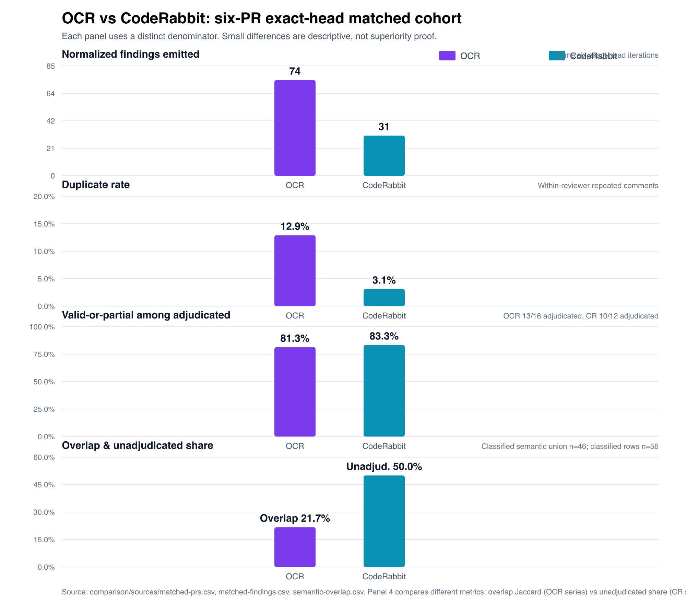
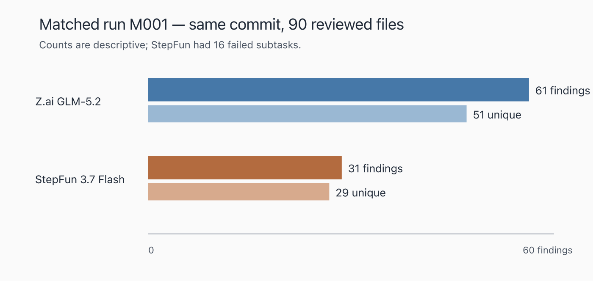

# Part I — Executive Decision Brief

> This brief stands alone. A reader who stops after Part I has the complete decision-relevant picture. Part II is the formal research paper.

## Systems under study

Two AI code-review systems run in parallel on pull requests across three repositories:

| System | Short name | How it runs | Coverage |
|---|---|---|---|
| **CodeRabbit** (`coderabbitai[bot]`) | CR | GitHub-integrated bot; reviews PRs automatically on push and on manual request | PR-only |
| **Alibaba OpenCodeReview** (`github-actions[bot]`, inline markers `*-ocr-inline`) | OCR | Runs both as a GitHub Action on PRs and as a local CLI on worktrees before/after remediation | Local + PR |

Both produce inline review comments. Per the attribution rule established across all source reports, all comments posted under human-looking identities are treated as **LLM-authored actions**, not personal human adjudications.

## Six headline findings

### 1. The reviewers are complementary, not ranked

On six same-PR, exact-head-SHA pairs, both reviewers produced unique validated fixes. Adjudicated valid-or-partial shares were statistically indistinguishable: OCR **13/16 (81.3%)** and CodeRabbit **10/12 (83.3%)**—a difference of one finding. Ten semantic overlap groups yielded a Jaccard similarity of **21.7%** on the classified union, leaving substantial reviewer-only coverage on both sides. [`[CMP]`](comparison/report.md)

### 2. GLM-5.2/Z.ai produced more findings; StepFun was more concentrated

In the only exact matched rerun pair (M001), GLM-5.2/Z.ai emitted **61 raw / 51 deduplicated findings** versus StepFun's **31 / 29** over the same commit (`b8ee0896`) and 90-file denominator, starting 9m55s apart. Strict validity was similar (**57.4% vs 54.8%**). GLM was more verbose (93.5 vs 76.4 words/finding), more redundant (**16.4% vs 6.5%** duplicate rate), and had **29.5% stale-context findings versus 0%**. StepFun had denser high+medium usefulness (**54.8% vs 41.0%**) but also **16 provider-concurrency subtask failures** that may have suppressed finding volume. This is a volume-versus-concentration difference, not a causal quality winner. No attributable Ollama quality run exists. [`[OCR-PQ]`](ocr/provider-quality/report.md)

### 3. Output-side duplicates are within-run semantic, not GitHub reposts

Matched OCR duplicates were **11/85 (12.9%)**: one exact and ten semantic, all within selected run windows. Existing same-head exact-key filters in the code and Jefe CI workflows held strict cross-batch repost rates low (**1.6%** and **1.8%**) but do not address in-run semantic duplication. Luther PR #130 (merged 2026-07-13) reduced >5-minute exact reposts from 18 to 0, but the overall exact rate barely moved (**7.5%→7.2%**) with only n=69 post-change comments. The global `~/.opencodereview/rule.json` contains no anti-duplicate instruction and is not loaded by CI workflows. [`[OCR-DUP]`](ocr/duplicates/report.md)

### 4. Availability failures are operationally significant for both systems

CodeRabbit left **256 retained throttle comments** on 256 PRs out of 1,024 touched. OCR had **28/145 retained local attempts** that were not full successes (25 partial, 3 hard failure). A critical distinction: OCR's **97.9% usable-output rate** masks an **80.7% full-success rate**—partial output can silently omit reviewed files. [`[CR-T]`](coderabbit/throttling/report.md) · [`[OCR-R]`](ocr/reliability/report.md)

### 5. Provider and policy changes during the study confound causal claims

CodeRabbit's policy tightened from undisclosed fair-use (May 2026) to explicit adaptive bands with a Pro+ floor dropping from 130+ to 90+ seven-day reviews. OCR cycled through **Ollama → Z.ai → StepFun** providers with bidirectional returns. Neither transition's causal effect on reliability or quality is identifiable. [`[CR-T]`](coderabbit/throttling/report.md) · [`[OCR-R]`](ocr/reliability/report.md) · [`[OCR-PQ]`](ocr/provider-quality/report.md)

### 6. Costs are subscription-dominated and not quantifiable per defect

No invoices, quota ledgers, or labor records were available for any provider. Current list prices are documented with caveats. The measurable burden is operational: 28/145 OCR attempts were not fully successful, and 256 CodeRabbit throttle events required operator awareness. [`[OCR-R]`](ocr/reliability/cost-evidence.md) · [`[CR-T]`](coderabbit/throttling/policy-extracts.md)

## What to do now

| Priority | Action | Evidence basis |
|---|---|---|
| **P0** | Build stable finding fingerprints (head SHA + path/symbol + normalized invariant) to support all downstream dedup and delta logic | 12.9% within-run duplicates; 10 semantic overlaps across providers in M001 [`[CMP]`](comparison/report.md) · [`[OCR-PQ]`](ocr/provider-quality/report.md) |
| **P0** | Add in-run exact dedup so a single run cannot post the same normalized finding twice | Existing same-head filter covers cross-run reposts but not within-run semantic dups [`[OCR-DUP]`](ocr/duplicates/report.md) |
| **P0** | Record reviewed-head/range manifests with selected/completed/failed files, provider/model, and rule hash for every run | Partial output omits files silently; M001 coverage confounded by 16 failed subtasks [`[OCR-R]`](ocr/reliability/report.md) · [`[OCR-PQ]`](ocr/provider-quality/report.md) |
| **P0** | Suppress unchanged fingerprints on reruns and update/resolve existing comments instead of reposting | 11/85 OCR comments were within-run duplicates; stale-context 29.5% on GLM [`[CMP]`](comparison/report.md) · [`[OCR-PQ]`](ocr/provider-quality/report.md) |
| **P0** | Track retry lineage (`parent_run_id`, provider transition, changed inputs) | Provider cycling Ollama→Z.ai→StepFun with bidirectional returns [`[OCR-R]`](ocr/reliability/report.md) |
| **P0** | Make reruns delta-oriented (diff against last reviewed state) | Large cumulative reruns produced stale findings; PR 236 triage rejected all findings [`[OCR]`](ocr/report.md) |
| **P1** | Add upstream semantic clustering across subtasks and providers | 16.4% GLM duplicate/rephrase rate; 10 repeated `importActual` root cause emissions [`[OCR-PQ]`](ocr/provider-quality/report.md) |
| **P2** | Build a shared OCR + CodeRabbit finding ledger and mechanism-specific metrics | Reviewer overlap was only 21.7% Jaccard; each found unique validated defects [`[CMP]`](comparison/report.md) |

## Key evidence table

| Evidence domain | Primary metric | Value | Source |
|---|---|---|---|
| Matched quality (OCR vs CR) | Valid-or-partial among adjudicated | OCR 81.3%; CR 83.3% | `[CMP]` |
| Matched overlap | Jaccard on classified union | 21.7% | `[CMP]` |
| Matched volume | Normalized findings | OCR 74; CR 31 | `[CMP]` |
| Matched duplication | Duplicate source comments | OCR 12.9%; CR 3.1% | `[CMP]` |
| Provider pair (M001) | Raw / deduplicated findings | GLM 61/51; StepFun 31/29 | `[OCR-PQ]` |
| Provider pair (M001) | Strict validity | GLM 57.4%; StepFun 54.8% | `[OCR-PQ]` |
| Provider pair (M001) | Stale-context rate | GLM 29.5%; StepFun 0% | `[OCR-PQ]` |
| Provider pair (M001) | Failed subtasks | StepFun 16; GLM 0 (5 file-read errors) | `[OCR-PQ]` |
| Within-run duplicates | Duplicate rate in matched cohort | 11/85 = 12.9% | `[OCR-DUP]` |
| Cross-batch repost rate | Code / Jefe strict | 1.6% / 1.8% | `[OCR-DUP]` |
| Luther PR #130 effect | >5-min exact reposts | 18 → 0 (overall 7.5%→7.2%) | `[OCR-DUP]` |
| CR availability | Retained throttle comments | 256 on 256 PRs / 1,024 | `[CR-T]` |
| OCR reliability | Full success | 117/145 (80.7%) | `[OCR-R]` |
| OCR reliability | Partial (subtask failure) | 25/145 (17.2%) | `[OCR-R]` |
| OCR usability | Usable output (success + partial) | 142/145 (97.9%) | `[OCR-R]` |
| CR precision (standalone) | Adjudicated | 22/25 (88.0%) | `[CR]` |
| OCR precision (standalone) | Fully valid | 27/36 (75.0%) | `[OCR]` |
| Local vs PR overlap | Jaccard (PR 2462 near-match) | 0.000 | `[OCR]` |

## Operating risks

1. **Silent coverage gaps.** Partial OCR runs report findings while omitting failed subtask files. A partial run that produced 11 findings while one subtask failed cannot establish complete recall. Without a coverage gate, reviewers receive false assurance of thoroughness. [`[OCR-R]`](ocr/reliability/report.md)

2. **Safety-sensitive false positives.** Both reviewers produced technically rejected recommendations whose proposed remedies could create hazards: OCR rejected a PATH symlink change; CodeRabbit withdrew a Windows reparse-point removal that could traverse a target unsafely. Automatic acceptance is unsafe. [`[CR]`](coderabbit/report.md) · [`[CMP]`](comparison/report.md)

3. **Stale-context accumulation.** GLM-5.2 attached valid root claims to wrong paths in 29.5% of M001 findings. Large cumulative reruns reviewed obsolete code: Jefe PR #236 triage rejected an entire 30+ finding batch as stale, invalid, or out of scope. [`[OCR-PQ]`](ocr/provider-quality/report.md) · [`[OCR]`](ocr/report.md)

4. **Mutable evidence.** GitHub comment bodies, PR summaries, and plan displays are editable in place. A one-for-one replacement was observed on July 14: code #2567 lost its throttle heading while Jefe #303 gained one. Current-body retrieval is a lower bound, not a census. [`[CR-T]`](coderabbit/throttling/report.md)

5. **Unadjudicated findings.** Half the matched-classified sample (28/56, 50.0%) has no linked disposition. No superiority claim is justified while this gap exists. [`[CMP]`](comparison/report.md)

6. **Provider instability.** OCR cycled providers at least five times in five days. Each switch adds comparability cost, deduplication burden, and potential for repeated review of the same changed lines under different model behavior. [`[OCR-R]`](ocr/reliability/report.md)

# Part II — Formal Research Paper

## Abstract

This report integrates seven documentary research reports on AI-assisted code review across three repositories (`vybestack/llxprt-code`, `vybestack/llxprt-jefe`, `vybestack/llxprt-luther`) using two systems: CodeRabbit (PR-only bot) and Alibaba OpenCodeReview (local CLI + PR GitHub Action). The matched-cohort evidence centers on a six-PR exact-head comparison controlling reviewed commit SHA. OCR emitted 74 normalized findings (12.9% duplicate rate) versus CodeRabbit's 31 (3.1%); adjudicated valid-or-partial shares were statistically indistinguishable (81.3% vs 83.3%, differing by one finding). Ten overlap groups yielded a Jaccard similarity of 21.7%, supporting complementarity. A second matched comparison (M001) evaluated two OCR providers on the same commit and file denominator: GLM-5.2/Z.ai produced 61 raw findings (57.4% strict valid, 29.5% stale-context) versus StepFun's 31 (54.8% strict valid, 0% stale-context), but StepFun had 16 provider-concurrency subtask failures that may have suppressed volume. Within-run semantic duplication (12.9% of matched OCR findings) is distinct from GitHub reposting; existing same-head exact-key filters held cross-batch repost rates low (1.6–1.8%) but do not address in-run semantic duplicates. Operationally, CodeRabbit experienced 256 retained throttle events across 1,024 touched PRs under tightening adaptive policy, while OCR's 145 retained local runs showed 80.7% full success and 17.2% partial output that can silently omit files. Cost analysis separates fixed subscription, marginal cash, quota opportunity, retry, and triage labor without inventing totals. Recommendations are organized into a prioritized architecture: P0 stable finding fingerprints, in-run exact dedup, reviewed-head manifests, unchanged-fingerprint suppression, comment update/resolve, retry lineage, and delta reruns; P1 upstream semantic clustering; P2 shared finding ledger.

## Research Questions

1. **RQ1 (Quality):** On the same PRs reviewed at the same head SHA, how do CodeRabbit and OCR differ in finding volume, duplication, semantic overlap, validity, and usefulness?

2. **RQ2 (Specialization):** What defect categories does each reviewer find uniquely, and where does each produce rejected or low-value findings?

3. **RQ3 (Provider Quality):** On the same commit and file denominator, how do GLM-5.2/Z.ai and StepFun/Step-3.7-Flash differ in finding volume, overlap, validity, verbosity, specificity, and duplicate burden?

4. **RQ4 (Duplicates):** What duplicate mechanisms exist (output-side semantic vs GitHub reposting), how effective are existing mitigations, and where are the gaps?

5. **RQ5 (Local vs PR):** Does local OCR execution add independent review value beyond PR-posted OCR?

6. **RQ6 (Reliability):** How reliably does OCR produce complete review output, and what role do provider transitions play?

7. **RQ7 (Availability):** How did CodeRabbit throttling evolve, and what explains it?

8. **RQ8 (Cost):** What are the fixed, marginal, and operational cost components of running both reviewers?

## Evidence and Methods

### Integration approach

This report synthesizes seven pre-existing documentary reports. Each independently retrieved and classified GitHub evidence using authenticated `gh` commands, local execution artifacts, and official vendor documentation. No new GitHub queries, test runs, or application commands were executed for this synthesis. All metrics trace to their source report and underlying CSV/evidence files.

### The seven canonical reports

| Tag | Report | Path | Focus |
|---|---|---|---|
| `[CMP]` | Exact-head matched comparison | [`comparison/report.md`](comparison/report.md) | Six-PR matched cohort: same PR, same head SHA |
| `[CR]` | CodeRabbit PR-review retrospective | [`coderabbit/report.md`](coderabbit/report.md) | 36 purposive CodeRabbit findings across 16 PRs |
| `[CR-T]` | CodeRabbit throttling and workflow demand | [`coderabbit/throttling/report.md`](coderabbit/throttling/report.md) | 1,024 touched PRs, 256 throttle events, policy/config timeline |
| `[OCR]` | OCR PR and local review retrospective | [`ocr/report.md`](ocr/report.md) | 36 purposive PR + 23 local OCR findings |
| `[OCR-R]` | OCR operational reliability | [`ocr/reliability/report.md`](ocr/reliability/report.md) | 145 retained local runs, provider sequence, cost model |
| `[OCR-PQ]` | OCR provider-period finding quality | [`ocr/provider-quality/report.md`](ocr/provider-quality/report.md) | Exact matched pair M001: GLM-5.2 vs StepFun on same commit |
| `[OCR-DUP]` | OCR duplicate mechanisms and mitigations | [`ocr/duplicates/report.md`](ocr/duplicates/report.md) | Within-run semantic vs cross-batch repost; filter effectiveness |

### Attribution rule

All comments posted under human-looking identities are treated as **LLM-authored actions**, not personal human adjudications. This is an analytical attribution rule applied consistently across all reports.

### Source weighting

| Evidence | Authority | Directness | Rigor | Weight |
|---|---:|---:|---:|---|
| GitHub root comments, replies, PR metadata via `gh` | 5/5 | 5/5 | 4/5 | Primary |
| `original_commit_id` and timestamps | 5/5 | 5/5 | 5/5 | Controls matching |
| Explicit fix/dismiss/withdraw replies | 5/5 | 5/5 | 4/5 | Controls disposition |
| Analyst normalization and usefulness coding | 2/5 | 4/5 | 3/5 | Transparent derived layer |

---

## System Roles in the Workflow

Both systems act as **hypothesis generators**, not adjudicators. The workflow requires source-backed dispositions for every material change. The operator's remediation commits and replies are LLM-authored actions that accept, defer, or reject findings.

| Role | CodeRabbit | OCR |
|---|---|---|
| Trigger | Automatic on push; manual `@coderabbit review` | GitHub Action on PR events; local CLI invoked manually |
| Output | Inline review comments, summary, walkthrough | Inline comments (`*-ocr-inline`), sticky summary |
| Coverage scope | Cumulative PR diff | Configurable file/range selection; PR CI or local worktree |
| Provider | CodeRabbit-hosted model (undisclosed) | Ollama, Z.ai, or StepFun (operator-configurable) |
| Rate limiting | Per-developer adaptive allowance | Provider HTTP 429/529; provider concurrency ceiling |

The two systems run independently and post comments under different bot identities. Neither system's output gates the other's. Both contribute hypotheses that the operator must verify against current source before acting. [`[CR]`](coderabbit/report.md) · [`[OCR]`](ocr/report.md)

---

## Comparative Quality and Specialization

### Matched-cohort quality (RQ1)

The `[CMP]` report corrected the principal weakness of `[CR]` and `[OCR]`—those were independent purposive samples from different PRs, making cross-reviewer comparison invalid. The matched cohort selected **six PRs** (two per repository) where both reviewers completed substantive root inline findings on the same `original_commit_id`.

| Property | Value |
|---|---|
| Matched PRs | 6 (2 per repository) |
| Match quality | All exact-head |
| Raw findings | OCR 85; CodeRabbit 32 |
| Normalized findings | OCR 74; CodeRabbit 31 |
| Classified sample | 56 rows (OCR 33; CodeRabbit 23) |
| Semantic overlap groups | 10 (8 exact, 2 semantic) |
| Unadjudicated rows | 28/56 (50.0%) |

#### Volume and duplication

```text
Normalized findings emitted (selected exact-head iterations)
OCR         74 | ##########################################################################
CodeRabbit  31 | ###############################

Duplicate source comments removed
OCR         11/85 | ########### 12.9%
CodeRabbit   1/32 | #            3.1%
```

OCR emitted 2.39× as many normalized findings and had a 4.2× higher duplicate rate. The within-PR normalized count differences were `+3, +16, +10, −2, +10, +6` (mean +7.17, median +8). This is a yield description, not evidence that more findings were more correct. [`[CMP]`](comparison/report.md)

#### Semantic overlap

| Measure | Value |
|---|---|
| Semantic union | 46 (33 + 23 − 10) |
| Overlap / union | 10/46 = **21.7% (Jaccard)** |
| OCR rows in overlap | 10/33 (30.3%) |
| CodeRabbit rows in overlap | 10/23 (43.5%) |
| OCR-only sample rows | 23/33 (69.7%) |
| CodeRabbit-only sample rows | 13/23 (56.5%) |

#### Validity

| Reviewer | Valid | Partial | Invalid | Unadjudicated | Valid-or-partial among adjudicated |
|---|---:|---:|---:|---:|---:|
| OCR | 11/33 (33.3%) | 2/33 (6.1%) | 3/33 (9.1%) | 17/33 (51.5%) | **13/16 (81.3%)** |
| CodeRabbit | 8/23 (34.8%) | 2/23 (8.7%) | 2/23 (8.7%) | 11/23 (47.8%) | **10/12 (83.3%)** |

The 81.3% and 83.3% values differ by one adjudicated finding. They are selection-sensitive paired descriptive observations, not estimates of reviewer precision. [`[CMP]`](comparison/report.md)

#### Specialization summary

| Strength area | Stronger evidence from | Supporting cases |
|---|---|---|
| Test efficacy / test quality | CodeRabbit | `trust: true` docs security [C001]; actual-module export tests `[CR]` |
| API fallback / pagination | CodeRabbit | Sub-issue pagination [C018]; API fallback [C019] `[CMP]` |
| Platform-specific safety | CodeRabbit | Case-insensitive metadata-dir [C011]; Windows reparse-point withdrawal [C012] |
| Merge-method safety | CodeRabbit | Hardcoded squash [C020] |
| Lifecycle / resource cleanup | OCR | OAuth guard contamination [O001]; transport/timer leak `[OCR]` |
| State ordering | OCR | Dead cancellation Jefe #275 `[OCR]` |
| Ownership / concurrency | OCR | Lease ownership Luther #133 `[OCR]`; concurrency classification [O032] |
| Error semantics | OCR | Missing-run → `Some("")` [O023]; fatal transition [O027] |
| Selectivity / low duplication | CodeRabbit | 3.1% vs 12.9% duplicate rate |
| Breadth of categories | OCR | 8 categories represented in PR sample |

Both reviewers also produced rejected findings. CodeRabbit recommended a speculative Windows reparse-point removal; OCR produced claims against stale architecture (PR #236 triage rejected an entire batch). [`[CR]`](coderabbit/report.md) · [`[OCR]`](ocr/report.md)

### Comparative visualization



*Each panel uses a distinct denominator (labeled in subtitle). Small percentage differences are descriptive, not evidence of superiority. Source: [`figures/comparison-metrics.csv`](figures/comparison-metrics.csv).*

---

## StepFun versus GLM-5.2

### Exact matched pair M001 (RQ3)

The `[OCR-PQ]` report constructed the only defensible exact rerun pair in the evidence base. Both runs reviewed the same llxprt-code commit (`b8ee0896`) over the same 90-file denominator, starting 9m55s apart.

| Attribute | GLM-5.2 / Z.ai | StepFun / Step-3.7-Flash |
|---|---|---|
| Run | QZC | QSC |
| Repository | llxprt-code | llxprt-code |
| Commit | `b8ee0896…e5c` | `b8ee0896…e5c` |
| Start | 2026-07-13 22:14:42 | 2026-07-13 22:24:37 |
| Reported files | 90 | 90 |
| Terminal status | success | completed with errors |
| Provider subtask failures | 0 | **16** |
| Pre-result file-read errors | **5** | 1 |

**StepFun had 16 provider-concurrency subtask failures while GLM-5.2 had five pre-result file-read errors.** The GLM run reported terminal `success` despite five file-read errors; the StepFun run reported `completed with errors` due to 16 failed subtasks. The pair is matched on repository, commit, near-time, and reported file denominator, but not demonstrably on completed-file coverage.

### Finding volume and overlap

| Measure | GLM-5.2 / Z.ai | StepFun / Step-3.7-Flash |
|---|---:|---:|
| Findings | 61 | 31 |
| Deduplicated claims | 51 | 29 |
| Distinct finding paths | 36 | 19 |
| Overlapping semantic groups | 10 | 10 |
| Claim-side overlap | 10/51 (19.6%) | 10/29 (34.5%) |

The deduplicated union is 70 claims and Jaccard overlap is **10/70 = 14.3%**. Low overlap means the outputs emphasized different issues; it does not prove either found more true defects. [`[OCR-PQ]`](ocr/provider-quality/report.md)

### Validity, usefulness, and action

| Measure | GLM-5.2 | StepFun |
|---|---:|---:|
| Strict valid | **35/61 (57.4%)** | **17/31 (54.8%)** |
| Valid + partial | 57/61 (93.4%) | 27/31 (87.1%) |
| High + medium usefulness | 25/61 (41.0%) | 17/31 (54.8%) |
| Deduplicated claims fixed | 16/51 (31.4%) | 10/29 (34.5%) |
| Duplicate/rephrased emissions | 10/61 (16.4%) | 2/31 (6.5%) |
| Stale/misattributed context | 18/61 (29.5%) | 0/31 (0.0%) |
| Words/finding | 93.5 | 76.4 |
| Positive line number | 43/61 (70.5%) | 29/31 (93.5%) |

### Interpretation

Strict validity differed by only 2.5 percentage points. GLM's supported share was 6.3 points higher, but many partial findings were defensive or assumption-heavy. StepFun's four invalid findings form a larger percentage because its denominator is half as large. Finding-level action slightly favors GLM because repeated versions of a fixed claim each count as actioned; after deduplication, StepFun is 3.1 points higher.

GLM-5.2 was **22.5% more verbose per finding** and emitted 2.41× as much total finding prose. Its largest redundancy cluster repeated the `importActual`/`afterEach` root cause eight times, often on mismatched paths. GLM repeatedly attached valid root claims to `bunfig.toml`, `package.json`, or other paths whose `existing_code` belonged elsewhere—a material triage defect. StepFun had two file-level line-zero findings but no confirmed mismatched code/path. [`[OCR-PQ]`](ocr/provider-quality/report.md)

### Causal limits

The retained evidence supports a **volume-versus-concentration difference, not a quality winner.** GLM surfaced more hypotheses and more unique claims, but at higher verbosity, repetition, and context-misattribution cost. StepFun's shorter report was denser in useful claims and cleaner in location specificity, but its 16 failed subtasks can themselves explain part of the lower finding volume. Endpoint, model family, period, and workload remain entangled. **No attributable Ollama GLM-5.2 quality run exists** in the evidence window. [`[OCR-PQ]`](ocr/provider-quality/report.md)



*Figure 2. Exact matched pair M001. The chart describes emitted and deduplicated finding volume; it does not adjust for StepFun's 16 failed subtasks.*

## Duplicate Mechanisms and Mitigations

### Two distinct duplicate phenomena (RQ4)

The `[OCR-DUP]` evidence distinguishes two separate phenomena that the term "duplicate" conflates:

1. **Output-side within-run semantic duplication.** A single review run posts multiple comments that are semantically equivalent or rephrased versions of the same invariant, often on different paths. This is the dominant duplicate source in the matched cohort.

2. **GitHub reposting.** Separate review runs (triggered by pushes, retries, or provider switches) post the same finding again to the same PR at the same or different head. This is a cross-run repost.

### Within-run duplicates in the matched cohort

In the six-PR exact-head comparison, OCR produced **11 duplicate source comments out of 85 (12.9%)**. These comprised one exact duplicate and ten semantic duplicates, all within selected run windows. CodeRabbit had one duplicate out of 32 (3.1%). [`[CMP]`](comparison/report.md) · [`[OCR-DUP]`](ocr/duplicates/report.md)

### Cross-batch reposting and filter effectiveness

The code and Jefe CI workflows include **same-head exact-key filters**: before posting inline comments, the workflow queries existing OCR inline comments on the current head SHA and builds a key set from (path, line, normalized body). If a key already exists, the comment is skipped.

| Repository | Strict cross-batch repost rate | Mechanism |
|---|---:|---|
| llxprt-code | 1.6% | `existingInlineKeys.has(inlineCommentKey(c))` skip |
| llxprt-jefe | 1.8% | Same filter, ported from code |

These filters were **effective at preventing strict reposts** (identical path + line + body at the same head). However, they operate on exact text keys and do not address in-run semantic duplication—the ten semantic duplicates in the matched cohort would all pass an exact-key check because they differ in wording, path, or line. [`[OCR-DUP]`](ocr/duplicates/report.md)

### Luther PR #130 and its effect

Luther's OCR workflow (`ocr-pr-review.yml`) lacked the same-head filter until PR #130 (merged 2026-07-13 04:07:12Z), which ported the code workflow's robust version including the exact-key filter, concurrency controls (`--concurrency 2`), and rate-limit classification.

| Measure | Before PR #130 | After PR #130 |
|---|---:|---:|
| >5-minute exact reposts | 18 | **0** |
| Overall exact rate | 7.5% | 7.2% |
| Post-change n | — | 69 |

PR #130 eliminated >5-minute exact reposts entirely. However, the overall exact rate barely moved (7.5%→7.2%) because within-batch duplicates dominate and the post-change sample is small (n=69). This is consistent with the code/Jefe finding: exact-key filters suppress cross-batch reposts but leave within-run semantic duplicates untouched. [`[OCR-DUP]`](ocr/duplicates/report.md)

### Repository workflows and configuration

| Repository | Workflow file | Same-head filter | Concurrency control | Config status |
|---|---|---|---|---|
| llxprt-code | `.github/workflows/ocr-review.yml` | Yes (exact-key skip) | GitHub Actions concurrency group | Active since ~Jul 7 |
| llxprt-jefe | `.github/workflows/ocr-review.yml` | Yes (ported from code) | GitHub Actions concurrency group | Active since ~Jul 8 |
| llxprt-luther | `.github/workflows/ocr-pr-review.yml` | Yes (PR #130, Jul 13) | `--concurrency 2` + group | Active since Jul 13 |

All three workflows also include marker-comment deduplication: if the sticky OCR review summary comment is posted more than once (e.g., due to a batch-post failure), duplicates are deleted, keeping only the first.

### Global rule.json and CI

The global `~/.opencodereview/rule.json` defines review instructions (severity calibration, category priorities, lint/complexity policy enforcement, test-scoping guidance) and include/exclude file patterns. It contains **no anti-duplicate instruction**—nothing tells the model to avoid posting semantically equivalent findings or to check whether a similar finding already exists.

Furthermore, this global rule file is **not loaded by the CI workflows**. The GitHub Actions workflows construct the OCR rule from environment variables and inline configuration defined in the workflow YAML itself, not from the user's home directory. The local CLI loads `~/.opencodereview/rule.json`; CI does not. This means any anti-duplicate instruction added to the global rule would affect local runs but not PR CI reviews. [`[OCR-DUP]`](ocr/duplicates/report.md)

### Provider-quality duplicate comparison

The M001 exact pair provides a controlled duplicate comparison: GLM-5.2 had a **16.4%** duplicate/rephrase rate versus StepFun's **6.5%**. GLM's largest redundancy cluster repeated the `importActual`/`afterEach` root cause eight times. This is output-side within-run duplication under matched inputs, confirming that duplicate burden varies by provider/model and is not solely a function of the review tool's posting logic. [`[OCR-PQ]`](ocr/provider-quality/report.md)

---

## Local versus PR OCR

### Evidence base (RQ5)

| Evidence unit | Raw n | Meaning |
|---|---:|---|
| PR retrospective sample | 36 | Balanced, adjudicated six-PR sample |
| Retained local sample | 23 | All parseable findings in three selected local artifacts |
| PR 2462-associated local run | 4 | One retained local output; exact SHA/range unknown |
| PR 2462 later same-day PR set | 3 | Unique actionable final-head findings |
| PR 2462 local-vs-PR overlap | **0** | Jaccard 0.000 over union n=7 |

### Key finding

The PR 2462 near-match found **4 local-only findings and 3 PR-only findings with zero semantic overlap** (Jaccard 0.000). However, input equivalence is unproven: the local artifact lacks the reviewed SHA, range, prompt/rules, model/provider, and worktree state. This is not an experiment comparing model determinism or recall. [`[OCR]`](ocr/report.md) · [`[OCR-R]`](ocr/reliability/report.md)

### Why local and PR OCR catch different things

| Mechanism | Confidence | Evidence |
|---|---|---|
| Different SHA or diff range | High | PR summaries record heads; local L1 does not; PR 236 triage names different heads |
| Cumulative PR diff vs focused remediation delta | High | PRs span 15–100 files; local issue-2544 run focused on 12 remediation files |
| Rerun timing and mutable summaries | High | Historical inline comments persist while one summary is edited; code PR 2547 had 425 OCR-authored inline records but a 39-finding current summary |
| Different file selection or failed subtasks | Medium | Local artifacts report selected file counts; issue-2544 reports a subtask error |
| Stale or insufficient architecture context | Medium-high | PR 236 triage cites removed fields, shared-helper misreads |
| Prompt, rules, provider, and model | Low / unestablished | Retained evidence does not prove configuration equivalence |

### Interpretation

Local OCR can add hypotheses beyond PR OCR (as the zero-overlap sample illustrates), but it is not always independent recall. It can duplicate, rephrase, or review different code at a different stage. PR OCR is suited to cumulative integration coverage; local post-remediation OCR is suited to focused changed-state review. Their raw counts should not be merged. [`[OCR]`](ocr/report.md) · [`[OCR-R]`](ocr/reliability/report.md)

---

## Operational Reliability and Provider Timeline

### OCR reliability metrics (RQ6)

| Outcome | Count | Rate |
|---|---:|---:|
| Full success | 117 | 80.7% |
| Partial (subtask failure) | 25 | 17.2% |
| Hard failure | 3 | 2.1% |
| Usable output (success + partial) | 142 | 97.9% |

A 97.9% usable-output rate coexists with an 80.7% full-success rate. Partial output means the run completed with some output but one or more subtask errors, so it can omit files. The issue-2544 local artifact produced 11 findings while one subtask failed—its finding volume cannot establish complete recall. [`[OCR-R]`](ocr/reliability/report.md)

### Failure taxonomy

| Class | Hard-failure n | Partial causal n | Evidence status |
|---|---:|---:|---|
| Partial/subtask failure | — | 25 | Explicit `completed_with_errors` / `subtask_error` |
| Provider HTTP 429 / rate limit | 0 | **19** | Explicit StepFun/Z.ai LLM completion errors |
| Authentication/config | **3** | 0 | Terminal all-file review failure / config-key message |
| Network/server (HTTP 529) | 0 | **6** | Z.ai overload within partial output |
| Timeout/termination | 0 | 0 | Not observed in canonical events |
| Malformed/model/tool | 0 | 0 | Not observed |
| Missing/lost output | 0 | 0 | Empty launch companions not counted as independent attempts |
| Unknown | 0 | 0 | All canonical events classified |

### Provider sequence

| Bound | Observation | Confidence |
|---|---|---|
| Jun 27 | Ollama config: cloud endpoint, GLM-5.2 | High for config; medium for active-use timing |
| Jul 10 18:36 | Z.ai GLM-5.2 "rate-limited" snapshot | High |
| Jul 11 22:34 | Z.ai pre-StepFun snapshot | High |
| Jul 12 19:48–20:00 | Z.ai backup followed by explicit StepFun run | High provider; medium exact boundary |
| Jul 13 15:43 | Z.ai returned/rate-limited snapshot | High |
| Jul 13 21:21 | StepFun snapshot | High |
| Jul 14 04:56 | StepFun credential change; mapped Pro→Max from user chronology | Medium-high |
| Jul 14 12:46 | Current config returned to Z.ai | High |

### Provider-attributed results (descriptive, not causal)

| Provider | Success | Partial | Hard failure | Total |
|---|---:|---:|---:|---:|
| Z.ai | 66 (82.5%) | 13 (16.3%) | 1 (1.3%) | 80 |
| StepFun | 26 (65.0%) | 12 (30.0%) | 2 (5.0%) | 40 |
| Unattributed pre-snapshot | 25 (100.0%) | 0 | 0 | 25 |

**No attributable retained Ollama run exists** in the Jul 10–14 window. Provider/tier comparative reliability is not identifiable: assignment was not randomized, workloads differ, intervals are small and inferred, and provider load varied. [`[OCR-R]`](ocr/reliability/report.md)

### Reliability over time


*Retained local attempts by provider interval, 2026-07-10–14. Source: [`ocr/reliability/run-events.csv`](ocr/reliability/run-events.csv).*

---

## CodeRabbit Availability and Policy

### Aggregate demand and availability (RQ7)

| Repo | Touched PRs | Commits | Follow-up update proxy | Completion signals* | Explicit blocks |
|---|---:|---:|---:|---:|---:|
| code | 834 | 6,747 | 5,913 | 284 | 114 |
| Jefe | 123 | 645 | 522 | 127 | 89 |
| Luther | 67 | 208 | 141 | 48 | 53 |
| **Total** | **1,024** | **7,600** | **6,576** | **459** | **256** |

\*Conservative: root inline findings grouped by PR and original SHA, or explicit completion replies. Not a vendor billing event count. [`[CR-T]`](coderabbit/throttling/report.md)

### Throttle events over time


*Top panel shows aggregate PR events vs successful reviews vs throttles. Lower panels break out by repository. Final week (Jul 13) is partial (two days). Source: [`coderabbit/throttling/chart-timeseries.csv`](coderabbit/throttling/chart-timeseries.csv).*

### Policy evolution

| Evidence date | Free/OSS | Paid Pro/Pro+ | Semantics |
|---|---|---|---|
| 2025-11-05 (archived pricing) | Pro free for OSS | Lite $12/Pro $24 monthly per developer | "Unlimited" PRs (marketing; throughput omitted) |
| 2026-05-02 (archived docs) | Free 3, OSS 2 | Pro 5, Pro+ 10 per hour | Per developer; refilling bucket model |
| 2026-06-13 (archived docs) | Free 3, OSS 1–10 | Pro 5, Pro+ 10 per hour | Adaptive fair-use; each incremental/manual/full review consumes allowance |
| 2026-06-28 (archived docs) | Free 1, OSS 1–10 | Pro floor 60+, **Pro+ floor 130+** weekly | Rolling windows; 95th-percentile adaptive |
| 2026-07-14 (current docs) | Free 1, OSS 1–10 | Pro floor 60+, **Pro+ floor 90+** weekly | Tighter Pro+ band; org-shared overflow credits at $0.25/file |

### What explains throttling

| Candidate explanation | Evidence fit | Judgment |
|---|---|---|
| User/agent activity surge | High: PR/week, commits/PR, dominant identity, cross-repo clusters | **Primary, high confidence** |
| Adaptive policy change | High temporal/documentary fit; Pro+ floor tightened | **Co-primary/modifier, medium-high** |
| Repository config | Short code interruption; nested Luther file too late | **Local modifier, medium for code only** |
| Paid plan upgrade | Mutable Pro→Pro+ display | **Not established; low confidence** |

The most defensible model is interaction: high per-developer automated demand consumed a rolling allowance; vendor adaptive policy reduced refill availability at sustained volume; code root config changed how quickly one repository consumed that allowance. [`[CR-T]`](coderabbit/throttling/report.md)

---

## Economics

### Cost-type separation (RQ8)

| Cost type | Definition | Measurable? |
|---|---|---|
| **Fixed subscription** | Amount paid to obtain a plan | Current list prices documented; actual transaction amounts unknown |
| **Marginal cash** | Incremental provider charge per review | For included quota, may be zero until quota/add-on boundaries; no billing ledger |
| **Quota opportunity** | Included usage consumed by one review, reducing later capacity | Not quantified; no quota ledger |
| **Retry cost** | Additional review attempts after partial/failure | 28/145 OCR attempts not fully successful; CR retry count unknown |
| **Triage/remediation labor** | Time spent detecting partial coverage, retrying, switching providers, deduplicating, triaging | Not assigned a monetary rate |

### Current list prices (accessed 2026-07-14, caveats apply)

> These are current public list prices, **not asserted transaction amounts**. Actual subscription terms, billing cycles, and purchase dates are not documented.

| Provider | Official evidence | Current public amount | Applicability caveat |
|---|---|---:|---|
| Ollama | [Pricing](https://ollama.com/pricing) | Pro US$20/mo or US$200/yr; Max US$100/mo | User says top consumer subscription; likely Max; exact amount unknown |
| Z.ai | [Overview](https://docs.z.ai/devpack/overview) | Starts at US$18/mo; Lite/Pro/Max tiers | User says older top-tier annual; actual price unknown |
| StepFun | [Step Plan](https://platform.stepfun.com/docs/zh/step-plan/overview) | Flash Pro ¥199/mo; Flash Max ¥699/mo | Current list only; user says prior Pro / current Max |
| CodeRabbit | [Pricing](https://www.coderabbit.ai/pricing) | Pro $24/mo annual / $30/mo; Pro+ $48/mo annual / $60/mo | Only PR creators charged; included allowance + optional $0.25/file credits |

### Measurable operational burden

Without money, the observable burden is: 28/145 OCR attempts (19.3%) were not full successes—25 partial and 3 hard failures. For CodeRabbit, 256 retained throttle comments on 256 PRs represent at minimum 256 blocked iterations requiring operator awareness and potential retry. [`[OCR-R]`](ocr/reliability/report.md) · [`[CR-T]`](coderabbit/throttling/report.md)

---

## Discussion

### Complementarity is better supported than superiority

Low overlap (Jaccard 21.7% across reviewers; 14.3% across providers) plus unique validated fixes on both sides supports using both reviewers when review cost permits. The evidence does not support ranking one reviewer above the other because: (1) the adjudicated valid-or-partial shares differ by one finding, (2) half the classified sample is unadjudicated, and (3) prompts, models, review timing, reruns, PR size, file selection, and action visibility differ. [`[CMP]`](comparison/report.md)

### Volume is not precision

OCR's larger batches increased coverage opportunities and duplicate/noise exposure simultaneously. GLM-5.2's 61 findings in M001 came with 16.4% duplication and 29.5% stale-context. CodeRabbit's greater selectivity reduced triage burden but also meant fewer total coverage opportunities. StepFun's 31 findings were denser in useful claims (54.8% high+medium vs 41.0%) but 16 failed subtasks may have suppressed volume. Neither strategy is inherently superior. [`[CMP]`](comparison/report.md) · [`[OCR-PQ]`](ocr/provider-quality/report.md)

### Duplicate mechanisms require layered mitigation

Exact-key filters address cross-batch reposting but not within-run semantic duplication. Luther PR #130's effect (>5-minute reposts 18→0, overall 7.5%→7.2%) illustrates that strict repost suppression has high leverage for one mechanism and low leverage for the other. A semantic clustering layer operating on normalized claim + path/symbol + invariant is needed to address in-run duplicates. [`[OCR-DUP]`](ocr/duplicates/report.md)

### Availability must be tracked separately from quality

A blocked CodeRabbit review says nothing about the quality of completed reviews. A partial OCR run may still produce useful findings while omitting files. Conflating availability with quality biases assessment in both directions. [`[CR]`](coderabbit/report.md) · [`[OCR-R]`](ocr/reliability/report.md)

### Partial coverage is the hidden reliability risk

OCR's 97.9% usable-output rate masks an 80.7% full-success rate. A partial run that reports 11 findings while silently omitting one subtask's files creates a false sense of complete coverage. Making partial status fail a coverage gate—unless every failed file is retried or explicitly waived—is the single highest-leverage reliability improvement. [`[OCR-R]`](ocr/reliability/report.md)

### Stale context is a first-class quality cost

GLM-5.2's 29.5% stale-context rate in M001 means even a correct claim costs triage time when location metadata is wrong. Delta-oriented reruns that diff against the last reviewed state would reduce both stale findings and cumulative-rerun duplicate accumulation. [`[OCR-PQ]`](ocr/provider-quality/report.md)

### Mutable evidence is a systemic problem

GitHub comment bodies can be edited in place. CodeRabbit's Pro→Pro+ plan display is mutable. OCR PR summaries are edited while historical inline comments persist. The one-for-one replacement observed on July 14 (code #2567 lost its heading while Jefe #303 gained one) directly demonstrates why current-body retrieval is a lower bound, not a census. [`[CR-T]`](coderabbit/throttling/report.md) · [`[OCR]`](ocr/report.md)

---

## Recommendations

### P0 — Foundational (implement first)

1. **Stable finding fingerprints.** Build a canonical fingerprint from head SHA + normalized claim text + path/symbol + invariant. This is the substrate for all downstream dedup, delta, and suppression logic.

2. **In-run exact dedup.** Within a single review run, suppress any comment whose fingerprint matches one already posted in the same run. The existing exact-key filter handles cross-run reposts; this closes the within-run gap.

3. **Reviewed-head/range manifests.** Record repository, HEAD, merge base, exact diff range, clean/dirty status, uncommitted-diff hash, provider/model, config/rule hash, selected files, completed files, failed files, session ID, and elapsed time for every run.

4. **Unchanged-fingerprint suppression.** On reruns, suppress findings whose fingerprint already exists at the same head. Post only new or changed findings.

5. **Comment update/resolve.** Instead of reposting a finding that already has a thread, update or resolve the existing thread. This prevents duplicate comments and keeps disposition history in one place.

6. **Retry lineage.** Record `parent_run_id`, provider transition, and changed inputs for every retry so that cross-provider duplicate findings can be traced and deduplicated.

7. **Delta reruns.** Make remediation reruns delta-oriented (diff against last reviewed state) and explicitly label cumulative stale findings. This reduces stale-context findings and duplicate accumulation.

8. **Coverage gate.** Make partial status fail a coverage gate unless every failed file is retried or explicitly waived. Report `reviewed/selected` coverage, not only finding count.

### P1 — High value (implement after P0)

9. **Upstream semantic clustering.** Add a semantic clustering pass that groups semantically equivalent findings across subtasks and providers within a single run. GLM-5.2's eight repeated `importActual`/`afterEach` emissions illustrate why exact-key dedup alone is insufficient.

10. **Provider-specific concurrency budgets.** Implement exponential backoff with jitter for HTTP 429. Avoid increasing parallelism when the response reports a concurrency ceiling. Treat HTTP 529 overload separately from 429 quota/concurrency.

11. **Anti-duplicate instruction in CI rules.** Since the global `rule.json` is not loaded by CI, add an anti-duplicate instruction directly to the workflow-provided rule configuration. Instruct the model to avoid posting semantically equivalent findings and to reference existing threads.

### P2 — Strategic (implement when resources permit)

12. **Shared OCR + CodeRabbit finding ledger.** Maintain a cross-reviewer finding database keyed by fingerprint so that overlap is visible to triage and duplicate findings across reviewers are surfaced automatically.

13. **Mechanism-specific metrics.** Track and report duplicate burden by mechanism: within-run semantic, cross-batch exact repost, cross-reviewer overlap. Track stale-context rate, location correctness, and verbosity as first-class quality costs alongside strict validity.

14. **Blinded multi-rater adjudication.** For future provider comparisons, blind at least two adjudicators to provider labels and report inter-rater agreement. M001's single unblinded adjudication limits causal confidence.

---

## Threats to Validity

### Internal validity

- **Selection bias:** all samples are purposive or opportunistic, not randomized. Easy-to-fix or easy-to-refute findings are more likely to receive explicit replies.
- **Confounding:** reviewer prompts, models, providers, temperatures, tool access, review timing, PR size, file-selection policies, severity thresholds, and response-selection bias all differ and cannot be controlled. In M001, endpoint, model family, period, and workload remain entangled.
- **Mutable evidence:** GitHub comment bodies, PR summaries, plan displays, and bot wording are all editable. Retained evidence is a lower bound.
- **Survivorship bias:** OCR temporary-file retention is opportunistic; successful and failure logs may be overwritten or absent.
- **Coverage confounding:** M001's StepFun side had 16 failed subtasks; the pair is not demonstrably matched on completed-file coverage.
- **Observer attribution:** all human-looking comments are treated as LLM-authored. This is an analytical attribution rule, not an independently verified identity claim.

### External validity

- Six PRs (matched cohort), 16 PRs (CR retrospective), 6 PRs (OCR retrospective), one exact pair (provider quality), and 5 days (OCR reliability) cannot generalize to all PRs or all time periods.
- Three repositories under one dominant author identity (`acoliver`: 782/834 code, 119/123 Jefe, 67/67 Luther touched PRs) limit generalizability to other team structures.
- All evidence is from 2025-11 through 2026-07; vendor policies and model capabilities evolve continuously.

### Construct validity

- "Valid-or-partial" is an analyst-coded construct, not a ground-truth label.
- "Usefulness" is analyst-coded even when validity is unknown.
- "Duplicate rate" collapses within-run semantic and cross-batch repost mechanisms; the `[OCR-DUP]` analysis separates these but historical comparisons did not.
- Reported severity and category are model-generated labels, not independent adjudication.

### Conclusion validity

- The 81.3% vs 83.3% valid-or-partial difference is one finding and must not be treated as statistically significant.
- M001 is a single pair; no causal claims about provider superiority are supported.
- No supported confidence exists for causal claims that one reviewer or one provider is intrinsically superior.

---

## Conclusion

This synthesis of seven documentary reports across three repositories yields seven evidence-backed conclusions:

1. **CodeRabbit and OCR are complementary, not ranked.** On six exact-head same-PR pairs, both produced unique validated fixes. Adjudicated valid-or-partial shares were indistinguishable (81.3% vs 83.3%, differing by one finding). Jaccard overlap was 21.7%, leaving substantial reviewer-only coverage.

2. **GLM-5.2/Z.ai was broader and more verbose; StepFun was denser and cleaner.** In exact matched pair M001, GLM produced 61 findings (57.4% strict valid, 29.5% stale-context) versus StepFun's 31 (54.8% strict valid, 0% stale-context). StepFun's 16 failed subtasks confound volume comparison. No causal winner; no attributable Ollama quality run.

3. **Within-run semantic duplication is the dominant duplicate mechanism.** Matched OCR duplicates were 12.9%, overwhelmingly semantic within-run. Existing same-head exact-key filters suppressed cross-batch reposts (1.6–1.8%) but leave in-run semantic duplicates untouched. Luther PR #130 eliminated >5-minute reposts but barely moved overall rate.

4. **Availability failures are operationally significant.** CodeRabbit throttled 256/1,024 touched PRs. OCR had 28/145 retained runs not fully successful, with partial output that can silently omit files.

5. **Provider and policy transitions were rapid and confounded.** OCR cycled Ollama → Z.ai → StepFun with bidirectional returns. CodeRabbit's policy tightened from undisclosed fair-use to explicit adaptive bands. Neither transition's causal effect on reliability or quality is identifiable.

6. **Reviewer specialization is real but not absolute.** CodeRabbit showed strengths in test efficacy, API fallback/pagination, platform-specific safety, and merge-method safety. OCR showed strengths in lifecycle/resource cleanup, state ordering, ownership/concurrency, and error semantics. Both produced rejected findings.

7. **Cost is subscription-dominated and not quantifiable per defect.** No invoices, quota ledgers, or labor records were available. Current list prices are documented with caveats.

The central operational lesson is that both reviewers should be retained as complementary hypothesis generators with a prioritized architecture: stable finding fingerprints and in-run exact dedup (P0), upstream semantic clustering (P1), and a shared cross-reviewer finding ledger (P2).

---

## References

### Canonical reports (relative paths from `research/reviews/`)

| Tag | Report | Path |
|---|---|---|
| `[CMP]` | Exact-head matched comparison | [`comparison/report.md`](comparison/report.md) |
| `[CR]` | CodeRabbit PR-review retrospective | [`coderabbit/report.md`](coderabbit/report.md) |
| `[CR-T]` | CodeRabbit throttling and workflow demand | [`coderabbit/throttling/report.md`](coderabbit/throttling/report.md) |
| `[OCR]` | OCR PR and local review retrospective | [`ocr/report.md`](ocr/report.md) |
| `[OCR-R]` | OCR operational reliability and provider transitions | [`ocr/reliability/report.md`](ocr/reliability/report.md) |
| `[OCR-PQ]` | OCR provider-period finding quality | [`ocr/provider-quality/report.md`](ocr/provider-quality/report.md) |
| `[OCR-DUP]` | OCR duplicate mechanisms and mitigations | [`ocr/duplicates/report.md`](ocr/duplicates/report.md) |

### Primary data sources

- Matched PRs: [`comparison/sources/matched-prs.csv`](comparison/sources/matched-prs.csv)
- Matched findings: [`comparison/sources/matched-findings.csv`](comparison/sources/matched-findings.csv)
- Semantic overlap: [`comparison/sources/semantic-overlap.csv`](comparison/sources/semantic-overlap.csv)
- CR sampled findings: [`coderabbit/sources/sampled-findings.csv`](coderabbit/sources/sampled-findings.csv)
- CR rate-limit events: [`coderabbit/throttling/rate-limit-events.csv`](coderabbit/throttling/rate-limit-events.csv)
- CR policy extracts: [`coderabbit/throttling/policy-extracts.md`](coderabbit/throttling/policy-extracts.md)
- CR config history: [`coderabbit/throttling/config-history.csv`](coderabbit/throttling/config-history.csv)
- OCR PR findings: [`ocr/sources/sampled-findings.csv`](ocr/sources/sampled-findings.csv)
- OCR run events: [`ocr/reliability/run-events.csv`](ocr/reliability/run-events.csv)
- OCR provider timeline: [`ocr/reliability/provider-timeline.csv`](ocr/reliability/provider-timeline.csv)
- OCR cost evidence: [`ocr/reliability/cost-evidence.md`](ocr/reliability/cost-evidence.md)
- Provider-quality matched pair: [`ocr/provider-quality/matched-reruns.csv`](ocr/provider-quality/matched-reruns.csv)
- Provider-quality findings: [`ocr/provider-quality/provider-findings.csv`](ocr/provider-quality/provider-findings.csv)
- Provider-quality summary: [`ocr/provider-quality/quality-summary.csv`](ocr/provider-quality/quality-summary.csv)
- Duplicate collection: [`ocr/duplicates/_collect.py`](ocr/duplicates/_collect.py)

### Official public URLs

- CodeRabbit pricing: <https://www.coderabbit.ai/pricing>
- CodeRabbit plans documentation: <https://docs.coderabbit.ai/management/plans>
- CodeRabbit auto-review configuration: <https://docs.coderabbit.ai/configuration/auto-review>
- Ollama pricing: <https://ollama.com/pricing>
- Z.ai overview: <https://docs.z.ai/devpack/overview>
- StepFun Step Plan: <https://platform.stepfun.com/docs/zh/step-plan/overview>
- StepFun Step-3.7-Flash: <https://platform.stepfun.com/docs/zh/guides/models/step-3.7-flash>

---

## Appendices

### Appendix A: Matched-cohort finding inventory

The 56 classified findings are enumerated in [`comparison/sources/matched-findings.csv`](comparison/sources/matched-findings.csv) with columns: `finding_id`, `cohort_id`, `repository`, `pr_number`, `reviewer`, `reviewed_sha`, `category`, `validity`, `action`, `action_quality`, `usefulness`, `overlap_group`. Finding IDs O001–O033 (OCR) and C001–C023 (CodeRabbit) are referenced throughout this report.

### Appendix B: Overlap group details

The 10 overlap groups (G01–G10) are enumerated in [`comparison/sources/semantic-overlap.csv`](comparison/sources/semantic-overlap.csv). Eight are exact overlaps; two are semantic. Dispositions range from both-validated-and-fixed (G08–G10) through both-unadjudicated (G02–G06) to shared-dismissal (G07).

### Appendix C: Provider pair M001 confidence assessment

| Conclusion | Confidence | Reason |
|---|---|---|
| GLM report was more verbose | High | Direct full-prose counts, same commit/denominator |
| GLM report was more redundant | Medium-high | Manual claim grouping is transparent; one pair |
| StepFun locations were cleaner | Medium-high | Large direct difference; manual stale classification |
| StepFun had denser usefulness | Medium | Full adjudication, but one unblinded rater and partial coverage |
| Strict technical validity was similar | Medium | Full pair adjudication; subjective borderline cases |
| GLM found more unique true defects | Low / not established | More claims, but no exhaustive ground truth and unequal coverage |
| Either model family is causally superior | Not supported | One pair; endpoint/model confounding; unequal coverage |

### Appendix D: CodeRabbit periodized block rates

| Repo | P0 pre-limit | P1 first blocks | P2 adaptive | P3 incrementals off | P4 cap 3 |
|---|---:|---:|---:|---:|---:|
| code | 0.0% | 17.1% | 34.3% | 0.0% | 48.9% |
| Jefe | 0.0% | 25.0% | 75.0% | 33.3% | 55.0% |
| Luther | 0.0% | 59.4% | 53.7% | 37.5% | 47.4% |

Block rate = blocks / (blocks + conservative completion signals). Period boundaries are config-driven for code; Luther and Jefe periods are aligned to the same calendar boundaries. [`[CR-T]`](coderabbit/throttling/period-summary.csv)

### Appendix E: OCR reliability by provider interval

| Period | Attempts | Success | Partial | Hard failure | Usable output |
|---|---:|---:|---:|---:|---:|
| Pre-attribution | 28 | 28 (100.0%) | 0 | 0 | 28 (100.0%) |
| Z.ai first interval | 55 | 53 (96.4%) | 1 (1.8%) | 1 (1.8%) | 54 (98.2%) |
| StepFun first interval | 18 | 10 (55.6%) | 6 (33.3%) | 2 (11.1%) | 16 (88.9%) |
| Z.ai return | 12 | 5 (41.7%) | 7 (58.3%) | 0 | 12 (100.0%) |
| StepFun Pro | 15 | 11 (73.3%) | 4 (26.7%) | 0 | 15 (100.0%) |
| StepFun Max | 10 | 6 (60.0%) | 4 (40.0%) | 0 | 10 (100.0%) |
| Z.ai fallback | 7 | 4 (57.1%) | 3 (42.9%) | 0 | 7 (100.0%) |

[`[OCR-R]`](ocr/reliability/reliability-by-period.csv)

### Appendix F: Duplicate mechanism taxonomy

| Mechanism | Definition | Observed rate | Current mitigation | Gap |
|---|---|---|---|---|
| Within-run semantic | Same invariant rephrased on different paths in one run | 10/85 (11.8% of OCR raw) | None | No semantic clustering |
| Within-run exact | Identical text repeated in one run | 1/85 (1.2% of OCR raw) | Marker-comment dedup | Residual within-batch risk |
| Cross-batch exact repost | Same finding reposted at same head by a later run | 1.6% (code), 1.8% (Jefe) | Same-head exact-key filter | Does not cover Luther pre-PR #130 period |
| Cross-reviewer overlap | Both reviewers find same invariant independently | 10/46 (21.7% Jaccard) | None | No shared finding ledger |

### Appendix G: Required addenda to standalone reports

> **OCR report addendum:** The 75.0% fully-valid and 91.7% fixed headline came from a response-rich OCR-only sample and must not be read as evidence that OCR is better than CodeRabbit. Matched-cohort results show 81.3% valid-or-partial among 16 adjudicated rows, with 17/33 unadjudicated.

> **CodeRabbit report addendum:** The 88.0% adjudicated precision remains valid for its unmatched purposive sample, but must not be used as a head-to-head advantage over OCR. Matched-cohort results show 83.3% valid-or-partial among 12 adjudicated rows, with 11/23 unadjudicated.

### Appendix H: Visual artifacts

| Artifact | Path | Description |
|---|---|---|
| CR activity over time (PNG) | [`coderabbit/throttling/activity-over-time.png`](coderabbit/throttling/activity-over-time.png) | Weekly PRs, updates, completed reviews, throttles by repository |
| CR activity over time (SVG) | [`coderabbit/throttling/activity-over-time.svg`](coderabbit/throttling/activity-over-time.svg) | Vector rendering of above |
| OCR reliability over time (PNG) | [`ocr/reliability/reliability-over-time.png`](ocr/reliability/reliability-over-time.png) | Daily outcomes by provider interval |
| OCR reliability over time (SVG) | [`ocr/reliability/reliability-over-time.svg`](ocr/reliability/reliability-over-time.svg) | Vector rendering of above |
| Comparison performance (PNG) | [`figures/comparison-performance.png`](figures/comparison-performance.png) | Four-panel OCR vs CR matched-cohort metrics |
| Comparison performance (SVG) | [`figures/comparison-performance.svg`](figures/comparison-performance.svg) | Vector rendering of above |
| Provider finding volume (SVG) | [`ocr/provider-quality/matched-finding-volume.svg`](ocr/provider-quality/matched-finding-volume.svg) | M001 GLM vs StepFun finding volume |
| Comparison metrics (CSV) | [`figures/comparison-metrics.csv`](figures/comparison-metrics.csv) | Source data for comparison chart |
