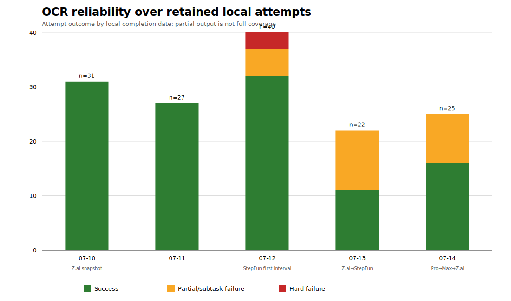

# OpenCodeReview operational reliability and provider transitions

**Repositories:** `vybestack/llxprt-code`, `vybestack/llxprt-jefe`, `vybestack/llxprt-luther`
**Retained run window:** 2026-07-10–2026-07-14 (-03:00)
**Evidence access:** 2026-07-14
**Canonical data:** [run events](run-events.csv), [provider timeline](provider-timeline.csv), [period metrics](reliability-by-period.csv)

## Executive summary

### Observations

- **145 deduplicated retained local OCR attempts** were identifiable: **117 full successes (80.7%)**, **25 partial/subtask failures (17.2%)**, and **3 hard failures (2.1%)**. Success or partial output existed for **142/145 (97.9%)**, but partial output is not full coverage.
- All three hard failures were **authentication/config failures**. Among the 25 partial runs, **19 carried provider HTTP 429/rate-limit markers** and **6 carried Z.ai HTTP 529 overload markers**. No retained canonical event met the strict operational definitions for timeout/termination, malformed/model/tool failure, missing/lost output, or unknown.
- Provider-attributed results were: Z.ai **66/80 success (82.5%)**, **13/80 partial (16.3%)**, **1/80 hard failure (1.3%)**; StepFun **26/40 success (65.0%)**, **12/40 partial (30.0%)**, **2/40 hard failure (5.0%)**; unattributed pre-snapshot **25/25 success**. Percentages are descriptive, not causal comparisons.
- Evidence supports the sequence **Ollama/GLM-5.2 → Z.ai/GLM-5.2 → StepFun/Step-3.7-Flash**, followed by operational returns between Z.ai and StepFun, a StepFun credential/account transition bounded at 2026-07-14 04:56, and a later Z.ai fallback. The user-supplied account chronology is Ollama top consumer subscription, older top-tier annual Z.ai subscription with higher limits, StepFun Pro, then StepFun Max/larger account. “Stepful” is treated as a typo for **StepFun**.
- The retained StepFun Max-attributed interval had **6/10 success and 4/10 partial**, while the prior StepFun Pro interval had **11/15 success and 4/15 partial**. This does not show that Max was less reliable: n is small, workloads differ, boundaries are inferred, and provider load varied.

### Interpretation

OCR frequently returned some output even during provider stress, but the distinction between “completed” and “complete coverage” is operationally material. A 97.9% usable-output rate can coexist with an 80.7% full-success rate. Provider/account switching was a practical retry mechanism, not proven reliability improvement: the intervals are confounded by repository, diff size, concurrency, time, and selective retention.

## Methods

The audit used direct execution artifacts in `$TMPDIR`, session metadata and selected phrase corroboration from `~/.opencodereview/sessions`, redacted current/backup configuration metadata, and existing OCR research. Same-stem log/JSON companions and session copies were not double-counted. Preview, PID, exit, status, extracted finding, CI-research, and test artifacts were excluded as independent attempts. Full rules are in [methodology](methodology.md), commands in [commands](commands.md), and sources in [evidence index](evidence-index.md).

The session store contained **3,154 JSONL files / 18,323,743,955 bytes**, including **1,081 empty files**. Session files are not equivalent to runs; their volume and emptiness underscore why execution logs are the canonical unit.

## Evidence inventory

| Evidence | Scale/use | Main limitation |
|---|---|---|
| Direct OCR output | 145 canonical attempts, row-level SHA-256 | Opportunistic temporary retention |
| Session JSONL | 3,154 files; repository/time corroboration | 1,081 empty; subtasks/sessions are not one-to-one with runs |
| Config snapshots | 11 current/backup files from Jun 27–Jul 14 | Snapshot time bounds but need not equal switch time |
| Existing local/PR research | 23 local and 36 PR sampled findings | Inputs and selection schemes differ |
| Official vendor sources | Current plan/rate/limit documentation | Current public terms are not historical invoices |

## Provider/account timeline

| Bound | Observation | Confidence |
|---|---|---|
| Jun 27 | Ollama config: cloud endpoint, GLM-5.2 | High for configuration; medium for active-use timing |
| Jul 10 18:36 | Z.ai GLM-5.2 “rate-limited” snapshot | High |
| Jul 11 22:34 | Z.ai pre-StepFun snapshot | High |
| Jul 12 19:48–20:00 | Z.ai backup followed by explicit StepFun run | High provider; medium exact boundary |
| Jul 13 15:43 | Z.ai returned/rate-limited snapshot | High |
| Jul 13 21:21 | StepFun snapshot | High |
| Jul 14 04:56 | StepFun credential change; mapped Pro→Max from user chronology | Medium-high |
| Jul 14 12:46 | Current config returned to Z.ai | High |

See [provider-timeline.csv](provider-timeline.csv). Configuration and logs prove provider/model changes; account tier names are user facts. No exact acquisition price or purchase date is inferred.

## Reliability over time

| Period | Attempts | Success | Partial | Hard failure | Usable output |
|---|---:|---:|---:|---:|---:|
| Pre-attribution | 28 | 28 (100.0%) | 0 | 0 | 28 (100.0%) |
| Z.ai first retained interval | 55 | 53 (96.4%) | 1 (1.8%) | 1 (1.8%) | 54 (98.2%) |
| StepFun first interval | 18 | 10 (55.6%) | 6 (33.3%) | 2 (11.1%) | 16 (88.9%) |
| Z.ai return | 12 | 5 (41.7%) | 7 (58.3%) | 0 | 12 (100.0%) |
| StepFun Pro | 15 | 11 (73.3%) | 4 (26.7%) | 0 | 15 (100.0%) |
| StepFun Max | 10 | 6 (60.0%) | 4 (40.0%) | 0 | 10 (100.0%) |
| Z.ai fallback | 7 | 4 (57.1%) | 3 (42.9%) | 0 | 7 (100.0%) |

**Observation:** daily retained attempts were 31, 27, 40, 22, and 25; daily full-success shares fell as partial outputs appeared from Jul 12 onward.
**Interpretation:** this pattern is consistent with provider pressure, but increasing workload/diff size and changing providers prevent causal attribution.

## Failure taxonomy

| Class | Hard-failure n | Partial causal n | Evidence status |
|---|---:|---:|---|
| Partial/subtask failure | — | 25 | Explicit `completed_with_errors` / `subtask_error` |
| Provider HTTP 429/rate limit | 0 | 19 | Explicit StepFun/Z.ai LLM completion errors |
| Authentication/config | 3 | 0 | Terminal all-file review failure/config-key message |
| Network/server | 0 | 6 | HTTP 529 Z.ai overload within partial output |
| Timeout/termination | 0 | 0 | No strict operational terminal marker in canonical events |
| Malformed/model/tool | 0 | 0 | No strict terminal marker |
| Missing/lost output | 0 | 0 | Empty launch/nohup companions were not independent attempts |
| Unknown | 0 | 0 | All canonical events classified |

The zero counts mean **not observed under this retention/classification**, not impossible. Empty files could represent launch companions or lost output, but counting them independently would double-count known runs and inflate failures.

## Local versus PR review impact

### Observations

The existing research contains **23 parseable local findings** versus **36 purposively selected PR findings**. These are different denominators, not a recall contest. The near-matched PR 2462 comparison found **4 local-only and 3 PR-only findings, zero overlap, union n=7, Jaccard 0.000**. Inputs were not identical: local SHA/range/config/worktree state are missing, and the PR side was a later final-head set.

Local runs create additional review *volume* because operators invoke OCR before/after remediation, over focused file/range selections, and on worktree states that PR automation may never see. PR OCR often reviews a cumulative committed diff and can persist historical inline comments while mutating one summary. Therefore local and PR outputs can differ due to stage, SHA/range, file selection, prompt/config/provider, and failed subtasks.

### Interpretation

- Local OCR can add hypotheses beyond PR OCR, as the zero-overlap sample illustrates, but it is **not always independent recall**. It can duplicate, rephrase, or review different code.
- Partial runs lower coverage in a way raw finding counts hide. The issue-2544 local artifact produced 11 findings while one subtask failed; its finding volume cannot establish complete recall.
- Retries/provider switches may increase total findings and duplicates. Without immutable manifests of reviewed/failed files, additional volume cannot be separated into useful recall versus repeated review.

## Cost model

Current official public prices are captured in [cost evidence](cost-evidence.md): Ollama Pro US$20/month or US$200/year and Max US$100/month; current StepFun Flash Pro ¥199/month and Flash Max ¥699/month (with quarterly/annual alternatives); Z.ai documents plans starting at US$18/month but the user's older annual top-tier price is not documented. These are current list prices, **not asserted transaction amounts**.

For an included-quota subscription, one OCR retry may have no immediate marginal cash charge, while still consuming quota and creating retry/triage opportunity cost. The measurable burden is **28/145 attempts (19.3%) not fully successful**. Exact cost per review cannot be computed because invoices, quota ledgers, add-on purchases, and labor time are absent.

## Findings

### Observations

1. Full success was 117/145; partial output was common enough (25/145) to require first-class handling.
2. HTTP 429 was the dominant observed partial cause (19/25), followed by HTTP 529 overload (6/25).
3. Provider transitions were rapid and bidirectional; configuration backup names preserve rate-limit context.
4. The larger StepFun account did not eliminate partials in its short retained interval.
5. Hard auth/config failures clustered in the first StepFun interval (2) plus one Z.ai interval failure.

### Interpretations

1. OCR's terminal success semantics and operational review completeness should be separated.
2. Concurrency-aware scheduling is likely more valuable than blind immediate retries when logs say concurrency limits were reached.
3. Multi-provider fallback improves option value but adds comparability and deduplication costs.
4. Reliability comparisons by provider/tier are not identifiable from these data because assignment was not randomized and workloads differ.

## Recommendations

1. Emit an immutable run manifest: repository, HEAD/worktree diff hash, base/range, selected files, completed files, failed files, provider/model/tier label, config/rule hash, session ID, elapsed time, and source artifact hash.
2. Make partial status fail the coverage gate unless every failed file is retried or explicitly waived. Report `reviewed/selected` coverage, not only finding count.
3. Implement provider-specific concurrency budgets and exponential backoff with jitter for 429; avoid increasing parallelism when the response reports a concurrency ceiling.
4. Treat 529 overload separately from 429 quota/concurrency and permit delayed cross-provider retry with the same immutable input manifest.
5. Record retry lineage (`parent_run_id`, provider transition, changed inputs) and deduplicate normalized claim/path/symbol across local and PR output.
6. Archive raw redacted status JSON for every run; avoid relying on `$TMPDIR` retention or mutable PR summaries.
7. Evaluate providers prospectively using matched manifests and stratification by repository, file count, and token volume. Report full success, partial coverage, hard failure, latency, findings, and triage burden.
8. Monitor subscription quota and marginal add-on spend separately from operational labor; do not label included-quota retries “free.”

## Confidence

| Claim | Confidence | Basis |
|---|---|---|
| 145-event retained metrics | High for dataset; low for population | Reproducible canonical rules; strong survivorship bias |
| Failure-cause counts | High | Direct execution error/status markers |
| Provider sequence | High | Multiple config snapshots and explicit logs |
| Exact transition times | Medium | Bounded by snapshot/run timestamps, not audit events |
| Pro→Max mapping at key change | Medium-high | Credential change plus authoritative user chronology |
| Provider/tier comparative reliability | Low | Small, confounded, nonrandom intervals |
| Local and PR can yield different findings | High for samples | 23/36 research and PR-2462 zero-overlap evidence |
| Local review adds independent recall generally | Low / not established | Inputs unmatched; duplicates and stage changes possible |

## Limitations and evidence gaps

- Temporary and session retention creates survivorship, overwrite, and selection bias; the denominator of all invocations is unknown.
- No canonical Ollama run was attributable in the retained Jul 10–14 event window, so Ollama reliability cannot be quantified.
- Exact provider switch commands, first/last active times, account purchase dates, invoices, usage dashboards, quota resets, and add-ons were unavailable.
- Repository attribution uses session/path/layout clues; no rows are unknown after inference, but some are not independently tied to a commit/worktree.
- All canonical events are local. PR CI reliability is not estimated; existing PR findings inform output comparison only.
- Empty logs were not counted as missing output absent a unique invocation identity.
- Model temperature, OCR version, prompts, rules, concurrency settings, token workload, and exact reviewed SHA/range are often absent.
- Official pages are current as accessed and may not reflect historical plan terms.

## Artifact map

- [run-events.csv](run-events.csv) — 145 canonical attempts with source hashes
- [provider-timeline.csv](provider-timeline.csv) — transitions and confidence
- [reliability-by-period.csv](reliability-by-period.csv) — raw n and percentages
- [chart-timeseries.csv](chart-timeseries.csv) — chart source
- [SVG](reliability-over-time.svg) / [PNG](reliability-over-time.png) / [generator](generate-reliability-chart.py)
- [methodology.md](methodology.md), [evidence-index.md](evidence-index.md), [source-extracts.md](source-extracts.md), [cost-evidence.md](cost-evidence.md)
- [commands.md](commands.md), [validation.py](validation.py), [file-inventory.txt](file-inventory.txt)
